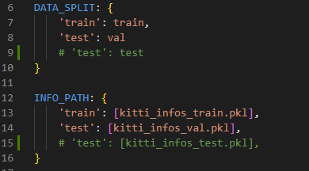
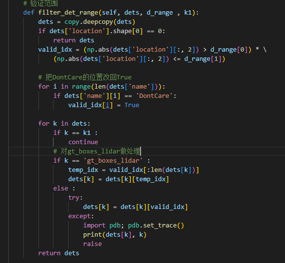
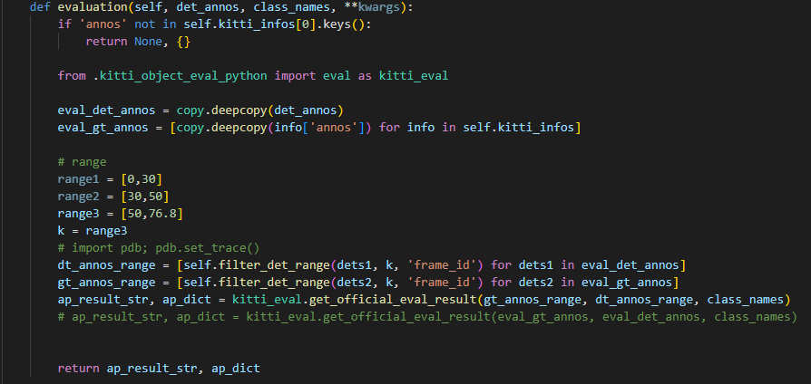
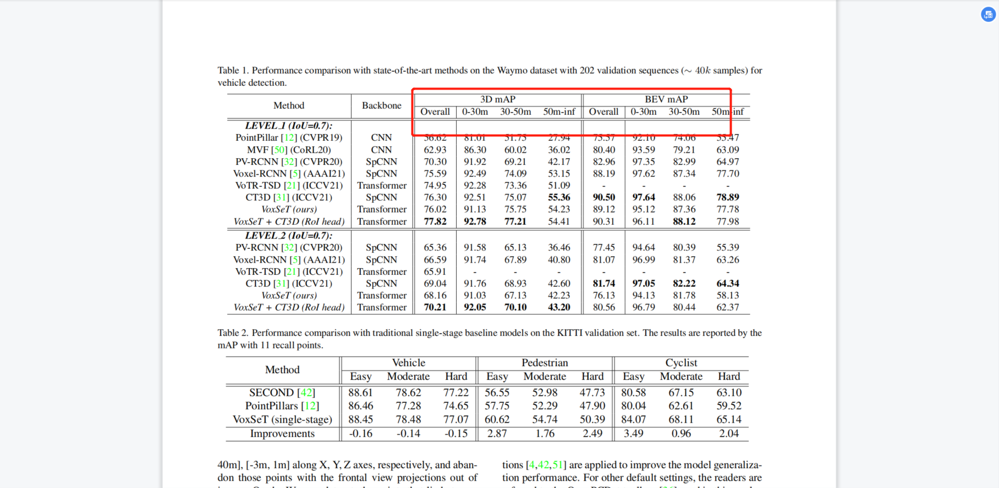

# 7.7 在验证集上测试

# 验证集与测试集

使用的是OpenPCDet框架

更改`OpenPCDet/tools/cfgs/dataset_configs/kitti_dataset.yaml`中的数据集划分

验证时，使用8，14行的val数据

测试时，使用9，15行的test数据

`CUDA_VISIBLE_DEVICES=0 python -m torch.distributed.launch --nproc_per_node=1 test.py --cfg_file ...`

指定好参数文件就可以进行验证出结果了

# 测试不同range

如果改变了验证方式，例如：在KITTI上测试不同range下性能

在`OpenPCDet/pcdet/datasets/kitti/kitti_dataset.py`里进行修改

修改`evaluation()`方法里k的值即可

重新进行`CUDA_VISIBLE_DEVICES=0 python -m torch.distributed.launch --nproc_per_node=1 test.py --cfg_file ...`测试

一次测一个range

论文中Waymo数据上的range测试

> 更新: 2024-08-14 21:01:32  
> 原文: <https://3dcv.yuque.com/org-wiki-3dcv-mm1l0t/ysgfp9/fk8a4n_mye3ga>