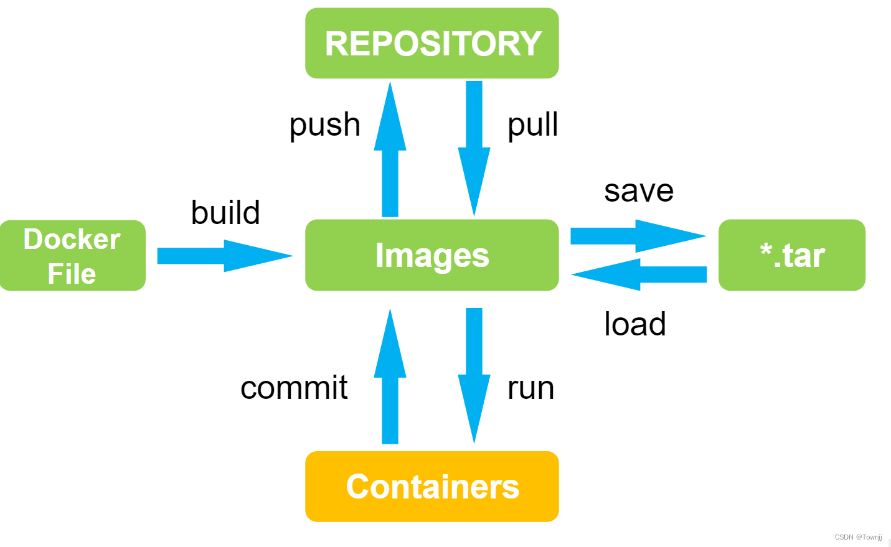
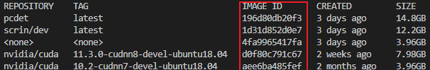
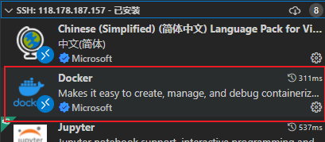
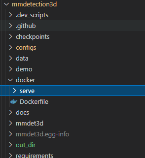

# 7.8 Docker的使用

# 什么是Docker

Docker的容器就相当于是一个虚拟机，但它比虚拟机更便携。

Docker 容器 镜像 Dockerfile的关系

仓库：指的[Docker hub ](https://hub.docker.com/)里面，在docker hub里面可以下载镜像和上传镜像（类似github）

Docker file直接用于build镜像文件，镜像文件可以`run` 来生成容器，在容器里就相当于虚拟机，可以进行代码的运行。

# 如何使用

# 用户如何使用docker

在3090 和 2080Ti 服务器上均已配置好docker，但是默认情况下docker 的操作需要sudo权限，但是大家正常是没有sudo权限的，为了大家正常使用docker，这里需要 配置 rootless

## Docker 设置 rootless 无需 ROOT 权限

**用于在无 root 权限时的 Docker 使用，任何希望使用 Docker 的用户都需要配置**

**<u>第一次使用时需要以下命令（注意：只有本用户会生效）</u>**

确保是ssh直接登录 ，不能通过其他用户跳转进行安装

> curl -fsSL https://get.docker.com/rootless | sh
>
> systemctl --user start docker
>
> systemctl --user enable docker
>
> docker context use rootless

> curl -fsSL https://get.docker.com/rootless | sh  这句运行完报错如下：
>
> # Installing stable version 20.10.17
>
> # Executing docker rootless install script, commit: b2e29ef
>
> Aborting because rootful Docker is running and accessible. Set FORCE\_ROOTLESS\_INSTALL=1 to ignore.  则改为运行这句
>
> export FORCE\_ROOTLESS\_INSTALL=1 &\&curl -fsSL https://get.docker.com/rootless | sh

最后使用下面命令测试 (该命令会自动下载该镜像 第一次运行会比较慢)

> docker run --rm --gpus all nvidia/cuda:11.0-base nvidia-smi

1. 如果提示 systemd not detected, dockerd daemon needs to be started manually，请确保自己是SSH登录的，没有从其他用户跳转。

2. 如果docker的下载速度过慢可以尝试 换源

挂载卷：用于与容器之前共享宿主的文件

由于没有sudo权限  挂载卷只能挂载在宿主机的本地目录（~）

创建卷 （/home/wanghao/workspace 是宿主机路径 --name 是给名字这里给了code）

`docker volume create --name code --opt type=none --opt device=/home/wanghao/workspace --opt o=bind`

用 `docker images` 查看当前有的镜像

使用如下命令创建容器，并挂载卷

`docker run -it --name pcdet --gpus=all --shm-size 6g -v code:/root/code 196d80d /bin/bash`

\*\*tips : \*\*

1. **要指定gpus**
2. **共享内存shm-size 6g要设置，不然可能会导致无法进行多卡训练**
3. **196d80d 是上面查询的镜像的 `IMAGE ID`，在命令中只需要输入前一小部分即可**
4. **可以使用vscode 的 扩展插件 docker，方便管理**

常用语句

> # 查看所有容器
>
> docker ps-a
>
> # 创建卷 名字 code 映射到本地目录 /home/wanghao/workspace
>
> docker volume create --name code --opt type=none --opt device=/home/wanghao/workspace --opt o=bind
>
> # 创建一个容器
>
> docker run -it --name pcdet1 --gpus=all -v code:/root/code 787cd5a1f5c1 /bin/bash
>
> # 进入容器两种都可以
>
> docker exec -it pcdet /bin/bash
>
> docker attach pcdet
>
> # 启动环境 类似开关虚拟机
>
> docker start xxxx
>
> docker stop xxxx
>
> docker restart xxxx
>
> # 把 xxx\_container 打包成 名叫 xxx\_image 的镜像
>
> docker commit xxx\_container xxx\_image
>
> # 镜像打包
>
> docker save -o /root/xxx.tar &lt;name&gt;
>
> # 镜像 加载 注意重定向方向 <
>
> docker load < xxx.tar

## docker file的使用

例如：mmdetection3d的目录结构如下

`cd mmdetection3d/docker`

`docker build .`

`docker build -t pcdet .`

-t 是指定生成的镜像名字

tips : 第一次生成镜像会下载一系列包，会比较慢

> 更新: 2023-05-05 14:03:58  
> 原文: <https://3dcv.yuque.com/org-wiki-3dcv-mm1l0t/ysgfp9/nohbiv_ga8m8p>
