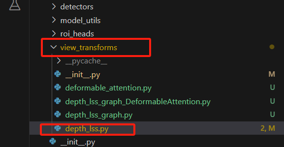
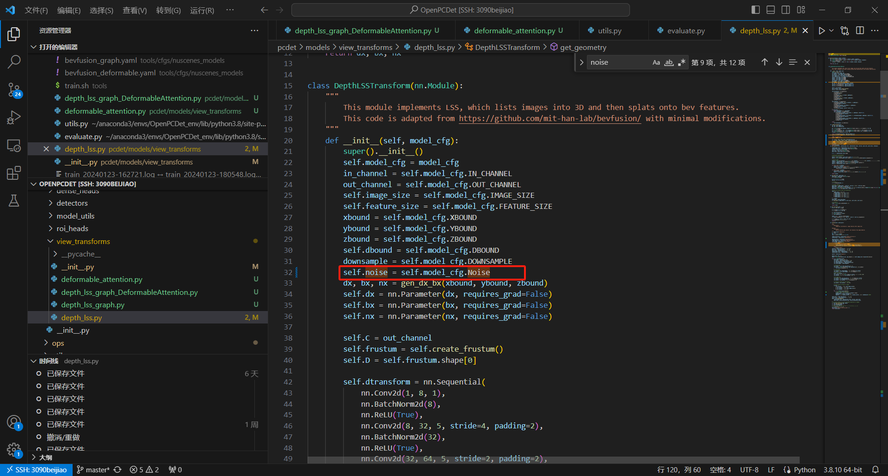
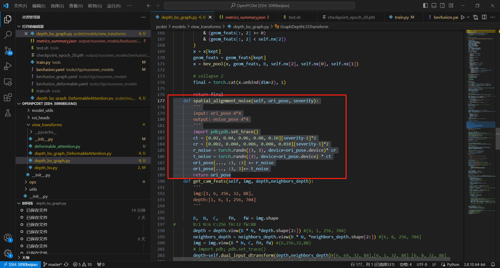
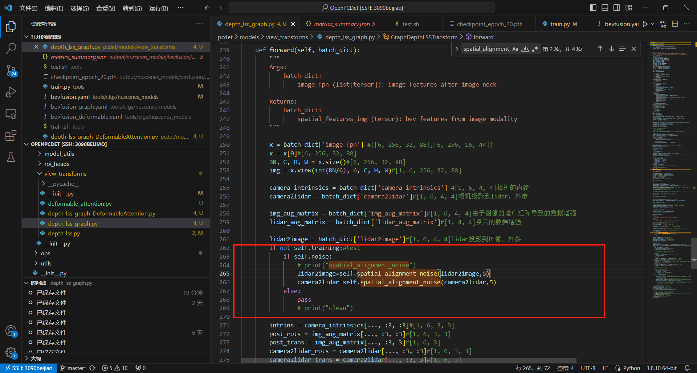
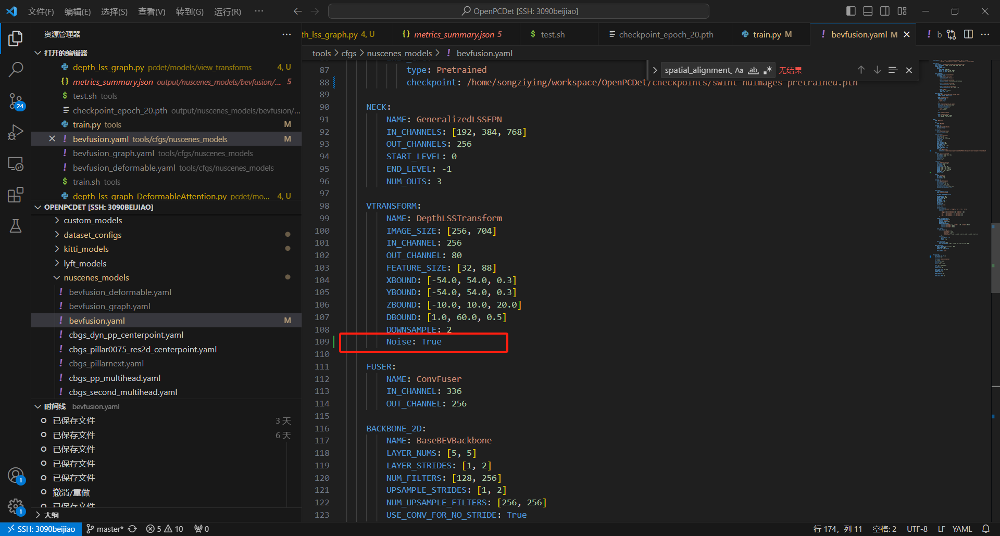

# 如何能加spatial_alignment_noise

首先，这个spatial_alignment_noise来自**<Benchmarking Robustness of 3D Object Detection to Common Corruptions in Autonomous Driving,CVPR2023>**

**code 首页: **[**https://github.com/thu-ml/3D_Corruptions_AD**](https://github.com/thu-ml/3D_Corruptions_AD)

**code 具体：**[**https://github.com/thu-ml/3D_Corruptions_AD/blob/6316eabc2497570406abe8e1fccccb98b8744b95/TransFusion/mmdet3d/datasets/pipelines/LiDAR_corruptions.py#L314**](https://github.com/thu-ml/3D_Corruptions_AD/blob/6316eabc2497570406abe8e1fccccb98b8744b95/TransFusion/mmdet3d/datasets/pipelines/LiDAR_corruptions.py#L314)

**论文的噪声code具体如下：**

```python
def spatial_alignment_noise(ori_pose, severity):
    '''
    input: ori_pose 4*4
    output: noise_pose 4*4
    '''
    ct = [0.02, 0.04, 0.06, 0.08, 0.10][severity-1]*2
    cr = [0.002, 0.004, 0.006, 0.008, 0.010][severity-1]*2
    r_noise = np.random.normal(size=(3, 3)) * cr
    t_noise = np.random.normal(size=(3)) * ct
    ori_pose[:3, :3] += r_noise
    ori_pose[:3, 3] += t_noise
    return ori_pose
```


**<font style="color:#DF2A3F;">但是上面的不能直接使用到bevfusion（openpcdet中）</font>**，是因为shape不一致。


**<font style="color:#DF2A3F;">正确使用spatial_alignment_noise如下：</font>**

1.**具体操作位置**，我们在bevfusion的view_transforms/depth_lss.py中增加。




2.**在class DepthLSSTransform(nn.Module):中增加**

```python
       self.noise = self.model_cfg.Noise
```



3.在大概177行的位置插入

```python
def spatial_alignment_noise(self, ori_pose, severity):
        '''
        input: ori_pose 4*4
        output: noise_pose 4*4
        '''
        import pdb;pdb.set_trace()
        ct = [0.02, 0.04, 0.06, 0.08, 0.10][severity-1]*2
        cr = [0.002, 0.004, 0.006, 0.008, 0.010][severity-1]*2
        r_noise = torch.randn((3, 3), device=ori_pose.device)* cr
        t_noise = torch.randn((3), device=ori_pose.device) * ct
        ori_pose[..., :3, :3] += r_noise
        ori_pose[..., :3, 3]+= t_noise
        return ori_pose
```



4. 在大约262行插入，重点在于在lidar2image = batch_dict['lidar2image']和camera2lidar = batch_dict['camera2lidar']的下面

```python
if not self.training:#test
            if self.noise:
                # print("spatial_alignment_noise")
                lidar2image=self.spatial_alignment_noise(lidar2image,5)
                camera2lidar=self.spatial_alignment_noise(camera2lidar,5)
            else:
                pass
                # print("clean")
```



5.修改bevfusion.yaml

增加        

```python
Noise: True
```

来控制是否有noise，**当为ture便是噪声，重点说明仅仅在测试的时候加了噪声**




> 更新: 2024-01-31 13:49:18  
> 原文: <https://3dcv.yuque.com/org-wiki-3dcv-mm1l0t/ysgfp9/dr6bgpai9aepuqik>