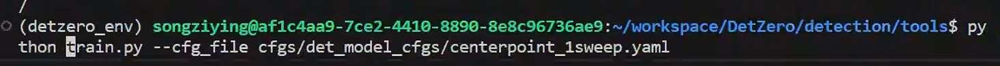

# Segment fault (core dump)

执行训练程序遇到，命令如下

`python train.py --cfg_file cfgs/det_model_cfgs/centerpoint_1sweep.yaml`

<font style="color:rgb(77, 77, 77);">Segmentation fault (core dumped)，以下称为段错误，多为内存不当操作造成，例如：</font>空指针<font style="color:rgb(77, 77, 77);">、野指针的读写操作，数组越界访问，破坏常量等。对每个指针声明后进行初始化为NULL是避免这个问题的好办法。排除此问题的最好办法则是调试。</font>

由于其不是python中的问题，常是我们调用c++的接口报的。所以在python中debug是找不到问题的，也没有具体的详细报错信息。

# 定位问题

## 使用faulthandler

用于帮助定位到python中是哪行代码报错了

直接在train.py的最一开始插入如下代码

```python
import faulthandler
faulthandler.enable()
```

正常运行程序

`python train.py --cfg_file cfgs/det_model_cfgs/centerpoint_1sweep.yaml`

输出了更多的报错信息，可以追溯到具体是python程序中的哪行代码出了问题。

[参考](https://blog.csdn.net/ARPOSPF/article/details/130248065)

## 使用gdb

gdb是什么?  gdb是<font style="color:rgb(68, 68, 68);">GUN发布的强大debug程序，常用于debug c/c++。  --></font>[参考](https://c.biancheng.net/view/8123.html)

控制台输入

`gdb python`

等待gdb启动 遇到提示输入`c`继续

启动后，输入如下来启动我们的程序：

`run train.py --cfg_file cfgs/det_model_cfgs/centerpoint_1sweep.yaml`

等待报错 Segmentation fault，如下：

```python
Thread 1 "python" received signal SIGSEGV, Segmentation fault. 0x00007ffff6c3b9ea in 
std::basic_string<char, std::char_traits<char>, std::allocator<char> >::
basic_string(std::string const&) () from /lib/x86_64-linux-gnu/libstdc++.so.6
```

可以看到最终报错的文件是libstdc++.so.6，是c++标准库的文件，大概率不是这里的问题而是调用它的程序出了问题，使用backtrace (bt) 往前追一下。

在gdb中输入`bt`，可以向前查找每一次的调用，可以帮我们寻找潜在问题。如下：

```python
#0  0x00007ffff6c3b9ea in std::basic_string<char, std::char_traits<char>, 
std::allocator<char> >::basic_string(std::string const&) () from 
/lib/x86_64-linux-gnu/libstdc++.so.6
#1  0x00007fff52055e48 in c10::RegisterOperators::inferSchemaFromKernels_
(c10::OperatorName const&, c10::RegisterOperators::Options const&) () from
/mnt/afs/user/songziying/.conda/envs/detzero_env/lib/python3.8/site-packages/
torch/lib/libtorch_cpu.so
```

这一行是`libtorch_cpu.so`，该文件是torch的库，由于排除过torch的问题，所以暂时不考虑。再往前追...

在#10时，发现是一次`torch_scatter`的调用导致的问题 (忘了截图记录了)，推测是torch\_scatter安装出现了问题，重新安装符合本环境版本的`torch_scatter`。

重新安装后解决问题!

# 总结

目前跑pytorch代码遇到过几次段错误，都是由包的版本不匹配造成的，但是由于找不到具体的信息无法轻松定位是哪个包的问题，使用gdb可以快速定位问题。

# 参考

[【Q\&A】Python代码调试之解决Segmentation fault (core dumped)问题](https://blog.csdn.net/ARPOSPF/article/details/130248065)


> 更新: 2023-11-10 17:23:21  
> 原文: <https://3dcv.yuque.com/org-wiki-3dcv-mm1l0t/ysgfp9/lrq5dguftai60tos>