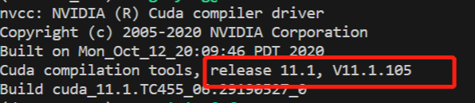
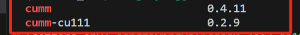
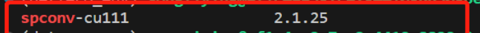
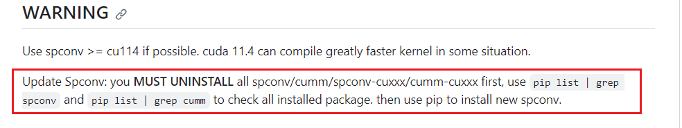

# cannot import name 'CUDAEvent' from'cumm.core_cc.tensorview_bind' (unknown location)

记录一次cumm报错

无法导入cudaxxx 推测是 cumm、spconv和cuda版本不匹配造成的。

# 检查版本

## 1 CUDA

`nvcc -V`



确定为cuda 11.1

## 2 CUMM

`pip list | grep cumm`



发现有两个cumm 一个是cuda版本一个是非cuda版本  (<font style="color:#DF2A3F;">cu111指的就是cuda 11.1版本</font>)

## 3 spconv

`pip list | grep spconv`



spconv-cu111 是cuda11.1没有问题 (<font style="color:#DF2A3F;">cu111指的就是cuda 11.1版本</font>)

# 分析

根据SpConv的[库主页](https://github.com/traveller59/spconv#warning)解释:



每次装spconv需要卸载干净cumm，才能自动正确适配cuda版本的cumm。

目前环境装了两种cumm，推测是spconv安装时cumm没有卸载干净，被适配了非cuda版本的cumm，所以才会无法导入cuda相关的cumm库 ('cannot import name 'CUDAEvent' from'cumm....') 。

# 解决方案

卸载干净cumm、cumm-cu111和spconv-cu111

```python
pip uninstall cumm
pip uninstall cumm-cu111
pip uninstall spconv-cu111
```

重新安装 spconv-cu111，它自动适配正确的cumm。

`pip install spconv-cu111`

再次运行之前的程序，it worked!


> 更新: 2023-11-09 18:08:43  
> 原文: <https://3dcv.yuque.com/org-wiki-3dcv-mm1l0t/ysgfp9/vx1cxbhwagw5crg9>