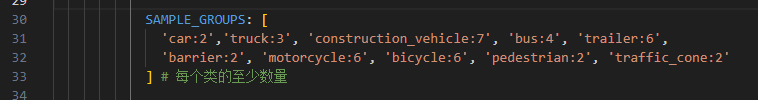
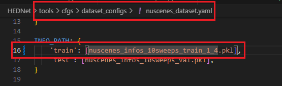
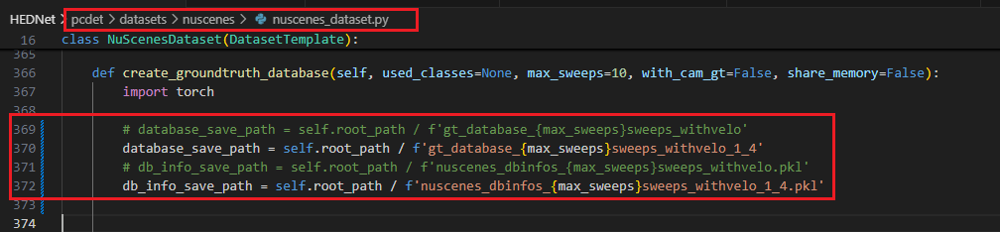

# OpenPCDet中的gt_sample数据增强

cfg中的SAMPLE\_GROUPS表示训练时每一帧的每个类的至少数量，（多则不增强，少则补全）

比如说这帧中的**原始的**类别数量为 car=15 truck=2 ...

则经过该数据**增强后**该帧的类别数量为 car=15 truck=3 ...

# 数据增强的细节

## 文件的生成

以nuscenes为例，需要`gt_database_10sweeps_withvelo`文件夹和`nuscenes_dbinfos_10sweeps_withvelo.pkl`

数据集目录为下：

:::info
|-data/nuscenes

|--gt\_database\_10sweeps\_withvelo

|--nuscenes\_dbinfos\_10sweeps\_withvelo.pkl

|--nuscenes\_infos\_10sweeps\_train.pkl

:::

`nuscenes_dbinfos_10sweeps_withvelo.pkl`里存储的是从训练集中取得的gt信息，并且这里的训练集是从`nuscenes_infos_10sweeps_train.pkl`中取得的信息，文件命名规则是`infoindex_classname_numidx.bin`e.g.(1285\_car\_2.bin)

也就是说如果使用子集时 需要重写生成`gt_database_10sweeps_withvelo`和`nuscenes_dbinfos_10sweeps_withvelo.pkl`

## 子集GT DB的生成

假设目前已经生成了子集的即`nuscenes_infos_10sweeps_train_1_4.pkl` 为1/4子集

修改以下两处：

执行

`python -m pcdet.datasets.nuscenes.nuscenes_dataset --func create_nuscenes_infos --cfg_file tools/cfgs/dataset_configs/nuscenes_dataset.yaml --version v1.0-trainval`

> 更新: 2024-12-08 17:40:31  
> 原文: <https://3dcv.yuque.com/org-wiki-3dcv-mm1l0t/ysgfp9/vawnnigk20zzvqq6>