# TCSVT DGFusion投稿流程相关 by JFY

## 0.投稿+cover letter
使用新系统投稿，递交cover letter内容如下，使用word编辑，进系统的时候转换成pdf。

**Caiyan Jia****(Corresponding Author 1)/Ziying Song(Corresponding Author 2)****/****Feiyang**** ****Jia**

Institution: Beijing Key Laboratory of Traffic Data Mining and Embodied Intelligence, Beijing Jiaotong University

Address: No.3 Shang Yuan Village, Haidian District, Beijing 100044, China

Telephone: (+86) 15801683903 / 18395622998 / 18709501049

Email: [cyjia@bjtu.edu.cn](mailto:cyjia@bjtu.edu.cn) / [22110110@bjtu.edu.cn](mailto:22110110@bjtu.edu.cn) / [feiyangjia@bjtu.edu.cn](mailto:feiyangjia@bjtu.edu.cn)

----------------------------------------------------------------------------------------------------------------------

**Dear Editor,**

We are submitting our manuscript, "**DGFusion: Dual-guided Fusion for Robust**** ****Multi-Modal 3D Object Detection**" for publication in **IEEE Transactions on Circuits and Systems for Video Technology**. Our research focuses on improving the performance of 3D object detection in the field of autonomous driving, with special emphasis on the challenges posed by hard instance. In the following section, we elaborate on three issues, **Manuscript Highlights, Cite **and** Statement**.

**1****. Manuscript Highlights**

This paper presents DGFusion, an innovative dual-guided multimodal fusion framework that significantly advances 3D object detection for autonomous driving systems. Addressing the persistent challenge of detecting distant, small, and occluded objects - a critical limitation compromising perception system safety - our approach fundamentally rethinks conventional unimodal guidance paradigms. While existing Point-guide-Image and Image-guide-Point methods often fail to adequately handle hard instances due to modality information density gap, DGFusion introduces a novel dual-guidance architecture that synergistically combines both paradigms for optimal cross-modal feature fusion. The framework's core innovation lies in its Difficulty-aware Instance Pair Matcher (DIPM), which intelligently categorizes objects by detection difficulty to enable adaptive feature enhancement. Comprehensive evaluation on the nuScenes benchmark demonstrates DGFusion's superior performance, particularly in challenging scenarios involving varying ego-distances, object sizes, occlusion conditions, and small-scale training data. 

**2. Cite**

It is noteworthy that **8** influential studies published in your prestigious journal have been cited in our research. These works are not only highly relevant to the field of 3D object detection for autonomous driving, but also demonstrate significant correlation with our DGFusion. Our experiments gives** comparisons with 3 of them**.

| **R****ef.****(****1).**** **Yang L, Zhang X, Li J, et al. _<u>Mix-teaching: A simple, unified and effective semi-supervised learning framework for monocular 3d object detection</u>_[J]. IEEE Transactions on Circuits and Systems for Video Technology, 2023, 33(11): 6832-6844. **---The monocular detection task performed on the KITTI dataset in ****R****ef.****(1)**** ****provides us with inspiration for hard class detection.** |
| --- |
| **R****ef.****(****2).** Hou M, Lyu C, Wang G, et al. PolarBEVU: _<u>Multi-Camera 3D Object Detection in Polar Bird</u>__<u>’</u>__<u>s-Eye View via Unprojection</u>_[J]. IEEE Transactions on Circuits and Systems for Video Technology, 2025. **---We use some of the experimental results in ref.****(2)**** ****as a comparison term in Table ****I/II****.**_ _ |
| **R****ef.****(****3****).** Song Z, Jia C, Yang L, et al. _<u>GraphAlign++: An accurate feature alignment by graph matching for multi-modal 3D object detection</u>_[J]. IEEE Transactions on Circuits and Systems for Video Technology, 2023, 34(4): 2619-2632. **---We use some of the experimental results in ****R****ef.****(3)**** ****as a comparison term in Table ****I/II/I****V. ****R****ef.****(3)**** ****performs the same task as us, which focuses on solving the feature alignment problem in multimodal 3D object detection.** |
| **R****ef.****(****4****).** Deng J, Zhou W, Zhang Y, et al. _<u>From multi-view to hollow-3D: Hallucinated hollow-3D R-CNN for 3D object detection</u>_[J]. IEEE Transactions on Circuits and Systems for Video Technology, 2021, 31(12): 4722-4734. **---The detection tasks performed on KITTI and Waymo datasets in ****R****ef.****(4)**** ****provide inspiration for hard class detection (especially Waymo).** |
| **R****ef.****(****5****).** Fan B, Zhang K, Tian J. HCPVF: _<u>Hierarchical cascaded point-voxel fusion for 3D object detection</u>_[J]. IEEE Transactions on Circuits and Systems for Video Technology, 2023. **---Ref.****(5)**** ****and our DGF are both schemes for 3D object detection. Ref.****(5)**** ****is based on the fusion of point cloud and voxel, focusing on balancing the accuracy and speed of 3D object detection. DGF focuses on h****ar****d instance detection.** |
| **R****ef.****(****6****).** Yang Y, Liu J, Huang T, et al. _<u>RaLiBEV: Radar and LiDAR BEV fusion learning for anchor box free object detection systems</u>_[J]. IEEE Transactions on Circuits and Systems for Video Technology, 2024. **---Ref.****(6)**** ****and our DGF are both solutions for 3D object detection, and both focus on the robustness problem. Ref.****(6)**** ****is based on the fusion of LiDAR and Radar, focusing on achieving robust detection in bad weather. DGF focuses on alleviating head instance detection in multimodal 3D object detection.** |
| **R****ef.****(****7****).** Sheng H, Cai S, Zhao N, et al. _<u>PDR: Progressive depth regularization for monocular 3D object detection</u>_[J]. IEEE Transactions on Circuits and Systems for Video Technology, 2023, 33(12): 7591-7603. **---Ref.****(7)**** ****proposed a strategy of using three consecutive stages to perform depth estimation separately****, which**** ****provides inspiration for Difficulty-aware Instance Pair Matcher (DIPM).** |
| **R****ef.****(****8****).** Wang H, Wang F, Wang M, et al. _<u>Rethinking How to Capture Long-range Dependency in 3D Object Detection</u>_[J]. IEEE Transactions on Circuits and Systems for Video Technology, 2025. **---We use some of the experimental results in ****R****ef.****(8)**** ****as a comparison term in Table ****I/II****.** |

**3. Statement**

(1). This work is original, unpublished, and not under consideration elsewhere. 

(2). All 9 authors approve the submission, accepting full responsibilities. 

(3). All 9 authors declare no competing interest.

Thank you for reviewing our manuscript. We appreciate your consideration and look forward to reviewers' comments. 

**Sincerely yours,**

**Caiyan Jia, Ziying Song, Feiyang Jia et al.**

## 1.2025.4.1 submitted
没什么好说的，就是等待

## 2.2025.4.2 under review
没什么好说的，就是等待

## 3.2025.9.11 MAJOR REVISION
系统上状态叫做REVISION 1，decision lettet如下

Decision letter (Initial Submission)

**Decision to undergo a MAJOR REVISION - TCSVT-23114-2025, DGFusion: Dual-guided Fusion for Robust Multi-Modal 3D Object Detection**

**From:**

pa.tripathi@ieee.org

**To:**

feiyangjia@bjtu.edu.cn

**CC:**

shanl@ieee.org, feiyangjia@bjtu.edu.cn, cyjia@bjtu.edu.cn, 24125249@bjtu.edu.cn, shaoqing.xu@connect.um.edu.mo, xsq0226@buaa.edu.cn, qimingxia96@163.com, liulin010811@gmail.com, yangleils@outlook.com, gongyan2020@foxmail.com, 22110110@bjtu.edu.cn

10-Sep-2025  
  
Mr. Feiyang Jia  
Beijing Jiaotong University School of Computer and Information Technology  
Beijing Jiaotong University,No.3,Shangyuan Village, Haidian District, Beijing, China  
Beijing  
China  
100044  
  
Paper:TCSVT-23114-2025 DGFusion: Dual-guided Fusion for Robust Multi-Modal 3D Object Detection  
  
Dear Mr. Jia:  
  
I am writing to you concerning the above referenced manuscript, which you submitted to the IEEE Transactions on Circuits and Systems for Video Technology.  
  
Based on the enclosed set of reviews, I am recommending that the manuscript undergo a MAJOR REVISION and be resubmitted for consideration by the IEEE Transactions on Circuits and Systems for Video Technology.  
  
When you are ready to submit your revision, visit the following link:  
（链接删掉了）  
  
We understand that the reason why you select the IEEE TCSVT for your manuscript is that your manuscript has a good match with this journal----Many related papers should have already been published in this journal. Therefore, before your new submission, you have to answer two questions clearly in your revised manuscript and responses: a) what are the 3-5 papers published in the IEEE Transactions on Circuits and Systems for Video Technology, which are most closely related to your manuscript; b) what is distinctive / new about your current manuscript related to these previously published papers.  
  
Enclosed are the comments by the Associate Editor and reviewers of your paper. Please make sure to address ALL of the Associate Editor and reviewers' comments in your revised manuscript and to submit a document explaining in detail how these comments were addressed.  
  
Your revised manuscript must be submitted no later than FIVE (5) weeks from the date of this letter together with a reply to the Associate Editor and reviewers' comments to be further considered for publication in the IEEE Transactions on Circuits and Systems for Video Technology. If we do not receive your revised manuscript and reply within this specified time, your manuscript will be considered withdrawn.    
  
You should submit a revised manuscript for consideration by the IEEE Transactions on Circuits and Systems for Video Technology only if you are confident that you can fully satisfy all the Associate Editor and reviewers' concerns. Please also note that, under the IEEE Transactions on Circuits and Systems for Video Technology editorial policy, revised papers that require a further revision will be rejected.  
  
If the Associate Editor or reviewers have requested that the paper be revised to address problems with the use of the English language, you will also need to provide documentation of English editing (receipt from an editing service or letter from a colleague who has assisted with editing).  
  
A professional editing service is available for authors looking to refine and polish the content of their papers for a fee: http://www.aje.com/en. However, the authors are free to select another professional editing service.  
  
When submitting your revised manuscript, you will be able to respond to the comments made by the Associate Editor and reviewers. In order to expedite the processing of the revised manuscript, please be as specific as possible in your response to the Associate Editor and reviewers.  
  
If you have any questions regarding the review process or are experiencing technical difficulties, please contact Pankaj Tripathi at pa.tripathi@ieee.org.  
  
Thank you for your submission to IEEE Transactions on Circuits and Systems for Video Technology. We look forward to receiving your revised manuscript.  
  
Sincerely,  
  
Shan Liu  
Editor-in-Chief, IEEE Transactions on Circuits and Systems for Video Technology  
  
AE Comments:  
  
Associate Editor: 1  
Comments to the Author:  
In general the reviewers like the innovative design of dual-guided paradigm and sufficient experiments to demonstrate its advantages. There are some questions and suggestions given by reviewers, regarding more elaborations on taxonomy, some questions about figures and tables, theoretical basis of strategies used, carefully polishing the paper including grammar/spelling errors and inconsistencies in terminology, etc. Hopefully these concerns could be addressed in further revisions.  
  
Senior Area Editor: 2  
Comments to Author:  
(There are no comments. Please check to see if comments were included as a file attachment with this e-mail or as an attachment in your Author Center.)  
  
Reviewer Comments:  
  
Reviewer: 1  
  
Comments to the Author  
In this paper, the authors propose DGFusion for robust multimodal 3D object detection. This framework innovatively constructs a Dual-guided Paradigm, which integrates the advantages of two paradigms: ‘point-guided-image’ and ‘image-guided-point’. Additionally, a Difficulty-aware Instance Pair Matcher (DIPM) and a dual-guided module are designed to address the detection challenges of hard instances, such as long-distance, small-size, and occluded objects. The strengths of this paper are as follows:    
(1) The research problem aligns with the real-world requirements of autonomous driving technology;    
(2) The method is reasonably designed and clearly described;    
(3) The disclosed experimental details are sufficient to support follow-up research.  
  
However, the following issues still need to be revised:    
1. Figure 1 serves as the core illustration of the phenomenon under study. First, please supplement the source of Figure 1(a). Furthermore, regarding the data presented in Figure 1(b), how were these data statistically derived? Please add relevant explanations to enhance the credibility of the figure.      
2. In Table 3, what is the basis for dividing the ranges of "Distance-Specific Evaluation" and "Size-Specific Evaluation"? Can objects beyond 40 meters be classified as long-distance objects? Can objects with a volume of less than 10 cubic meters be defined as small objects?    
3. In Table 4, the authors mention that the mAP of DGFusion is higher than that of BEVFusion on the few-shot dataset, but no in-depth analysis is provided. It is recommended that the authors supplement explanations for why DGFusion exhibits stronger robustness in few-shot scenarios.    
4. Please carefully polish the full paper and correct any grammar and spelling errors. Examples include:    
(1) In the Abstract, the second sentence should use "remain" instead of "remains" to ensure correct verb agreement.    
(2) On Page 2, Line 52, "empirical" is misspelled as "impirical".    
5. The authors should check and correct inconsistencies in terminology throughout the paper. Examples include:    
(1) Inconsistent spelling of "multimodal" (e.g., "Multimodal", "multi modal", and the misspelling "multi-mudal" on Page 7, Line 26).    
(2) Confused use of "Object" and "Instance", which may cause reading difficulties. "Object Detection" is a well-established research field and its terminology should remain consistent. In this paper, "Instance" is used to refer to concepts such as "hard instance" or "PGI/IGP". Both terms ("Object" and "Instance") need to be reviewed for consistency.    
6. I consider the following references relevant to this paper; please add them as appropriate:    
(1) Wang L, Xie T, Zhang X, et al. Auto-points: Automatic learning for point cloud analysis with neural architecture search[J]. IEEE Transactions on Multimedia, 2023, 26: 2878-2893.    
(2) Gu Z, Ma J, Huang Y, et al. HGSFusion: Radar-camera fusion with hybrid generation and synchronization for 3D object detection[C]//Proceedings of the AAAI Conference on Artificial Intelligence. 2025, 39(3): 3185-3193.    
(3) Huang X, Xu Z, Wu H, et al. L4dr: Lidar-4D radar fusion for weather-robust 3D object detection[C]//Proceedings of the AAAI Conference on Artificial Intelligence. 2025, 39(4): 3806-3814.  
  
Reviewer: 2  
  
Comments to the Author  
In this manuscript, the authors propose a robust multimodal 3D object detection method named DGFusion, which aims to alleviate the hard instance problem. Experimental results demonstrate that the proposed Dual-guided paradigm can make up for the deficiencies of the single-guided paradigm. After a thorough reading of this manuscript, I consider the research work to be complete and detailed. However, there are still some concepts in the current manuscript that cause confusion.  
  
(1) First, I am interested in IGP and PGI, as they have never been mentioned in previous works. I believe this emerging taxonomy requires further elaboration. For instance, in Tables 1 and 2, I observe that the number of PGI is consistently higher than that of IGP. Additionally, are there more studies related to IGP? What are the classical research works on IGP? It is suggested that the authors supplement this information in the manuscript.  
(2) In Figure 3, why is the actual operation of IGPE and PGIE asymmetric?  
(3) I have noticed the two strategies in Table 6; what is their theoretical basis? It is suggested that the authors supplement this in the manuscript.  
(4) In Table 4, larger categories (e.g., Truck and Bus) show more significant improvements. How, then, to highlight the advantages of the proposed method in handling hard instances? It is suggested that the authors supplement relevant explanations in the manuscript.  
  
Reviewer: 3  
  
Comments to the Author  
This manuscript presents a 3D object detection method based on the Dual-guided paradigm, named DGFusion. DGFusion is designed to alleviate the detection challenges associated with distant, small, or occluded objects. The core component of DGFusion is the DIPM, which is used to generate pairs of easy and difficult instances. In general, the manuscript features sufficient experiments and a clear narrative. However, the following issues need to be addressed:  
  
1. According to the abstract and Figure 1, DGFusion achieves a 1.0 improvement in AP and a 0.8 improvement in NDS compared to BEVFusion. Is this performance enhancement related to the BEV generation method?  
2. How is the LiDAR visualization in Figure 1(a) obtained? It is argued that the 'easy for camera' category is more critical—why are closer objects not labeled as 'easy for camera'? Additionally, in Figure 1(b), why is there no detailed labeling for the regions where the number of point clouds exceeds 1?  
3. What would be the performance of DGFusion if it only adopts the IGP paradigm or PGI paradigm individually?  
4. It is observed from Table 4 that Truck and Bus are the categories with the highest improvement rates. However, both are large-sized objects—what is the reason for this phenomenon?  
  
Missing Key References Question (Optional) (List important references missing from the paper):  
  
Reviewer: 1  
Missing key ref :  
  
Reviewer: 2  
Missing key ref :  
  
Reviewer: 3  
Missing key ref :

## 4.2025.9.24 Submitted(Revision 1)+大修两周回复
完整response如下，注意：

完全按照邮件的要求来制作response文件的内容。主要是一对一回复。引用问题是邮件的套话，但是在第一次回复中也进行了解答。就是潜规则，要引用所投期刊的5个文章。

直接从word粘贴过来的，包含格式。

每个大标题之间用分页符。

字体用的是times。

截图来自track-change-version的pdf，就是改了的地方标红，ieee的要求。

**Responses of #TCSVT-23114-2025**

Feiyang Jia, Caiyan Jia, Ailin Liu, Shaoqing Xu, Qiming Xia,

Lin Liu, Lei Yang, Yan Gong, Ziying Song

**Dear Editor****s and Reviewers,**

We sincerely thank you for your time and efforts in handling and reviewing our manuscript, entitled "**DGFusion: Dual-guided Fusion for Robust**** ****Multi-Modal 3D Object Detection**" **(****ID: ****TCSVT-23114-2025)**. After carefully considering all the comments received, we have revised the manuscript accordingly. 

In what follows, we will provide detailed one-to-one responses to **Associate Editor**** ****1**, **Reviewers 1**, **Reviewers 2**, **Reviewers 3** and **Cite questions**. In the committed ‘Main Document - Tracked Changes’ version, **all revision changes are highlighted in ****red**.

All 9 authors approve the manuscript of the revision version, accepting full responsibilities.

We are looking forward to hearing from you at your earliest convenience. 

**Sincerely**** ****yours****, **

**Feiyang Jia**** (on behalf of all authors)**

  

**# For Associate Editor 1**

**Comment:** In general the reviewers like the innovative design of dual-guided paradigm and sufficient experiments to demonstrate its advantages. There are some questions and suggestions given by reviewers, regarding more elaborations on taxonomy, some questions about figures and tables, theoretical basis of strategies used, carefully polishing the paper including grammar/spelling errors and inconsistencies in terminology, etc. Hopefully these concerns could be addressed in further revisions.

**Response:** 

(1) We appreciate and have accepted all the comments raised by the reviewers. The concerns in the comments mainly pertain to the IGP/PGI/DG paradigm, the content related to Figures 1/3, the content associated with Tables 1/2/3/4/6, the addition of citations, and some descriptive errors. We have addressed all the comments and updated the manuscript accordingly. **Please check** **# For Reviewer 1**, **# For Reviewer 2****, and ****#**** For Reviewer 3 for details**.

(2) We have provided further explanations regarding the TCSVT-published papers cited in our manuscript, which are highly relevant to our research topic. **Please check # Cite questions for details**.  

**# For Reviewer 1**

**Comment**** ****1****:**** **Figure 1 serves as the core illustration of the phenomenon under study. First, please supplement the source of Figure 1(a). Furthermore, regarding the data presented in Figure 1(b), how were these data statistically derived? Please add relevant explanations to enhance the credibility of the figure. 

**Response 1:** We appreciate all your valuable comments. The source of Figure 1(a) and the Python SDK used for Figure 1(b) have been added on Page 1, and we have added further explanation about the data source of Figure 1(b). Moreover, in response to **<u>Reviewer 3 Comment 2</u>**, we have revised Figure 1(b), which now shows the scenarios when the number of point clouds is 1-5 and greater than 5.

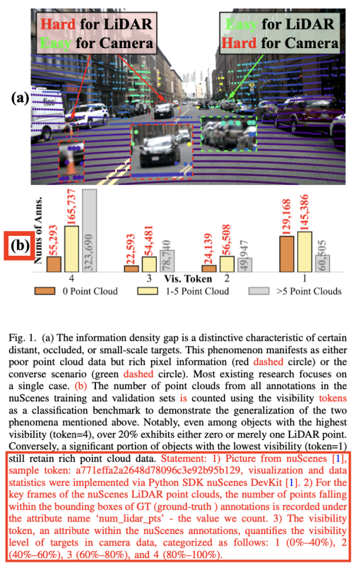

**Sec.I, Page 1**

****

**Comment**** ****2****:**** **In Table 3, what is the basis for dividing the ranges of "Distance-Specific Evaluation" and "Size-Specific Evaluation"? Can objects beyond 40 meters be classified as long-distance objects? Can objects with a volume of less than 10 cubic meters be defined as small objects? 

**Response 2:**** **We have supplemented the theoretical basis for the experimental settings of each of the three categories in Table 3. According to our definition — which directly addresses your questions — objects beyond 40 meters are classified as long-distance objects, and objects with a volume of less than 10 cubic meters are defined as small objects.

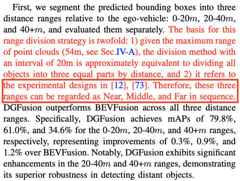

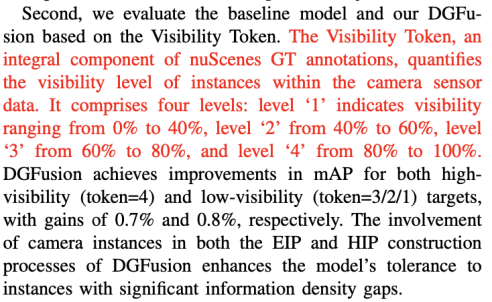

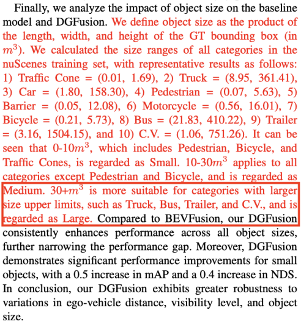

**Sec.IV.C.(1), Page 8**

**Comment**** ****3****:**** **In Table 4, the authors mention that the mAP of DGFusion is higher than that of BEVFusion on the few-shot dataset, but no in-depth analysis is provided. It is recommended that the authors supplement explanations for why DGFusion exhibits stronger robustness in few-shot scenarios.

**Response 3:** We have noticed that all reviewers have raised similar comments, as shown in **<u>Reviewer 1 Comment 3, Reviewer 2 Comment 4, and Reviewer 3 Comment 4</u>**. Therefore, we have rewritten the section "Small-Scale Evaluation". All issues mentioned by different reviewers are addressed, and the content is reorganized logically for a unified response. The revised part is shown in Pages 9-10 and emphasizes the following conclusions.

(1) DGFusion shows strong performance in all small-scale (small sample size) scenarios, mainly benefiting from the EIP/HIP evaluation strategy and DIPM.

(2) The performance of DGFusion on Car and Truck reflects that different categories have different requirements for the "training saturation state", and the design of DGFusion has taken such requirements into account.

(3) The comparison between the 10% and 25% scales reflects that a limited increase in data volume does not necessarily lead to improved model performance. We analyze the reasons and provide possible future research directions.

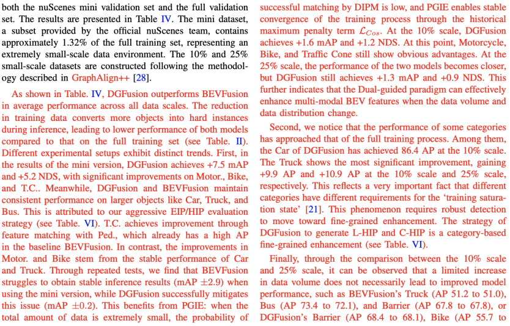

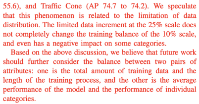

**Sec.IV.C.(2), Page 9 and Page 10**

****

**Comment**** ****4****:**** **Please carefully polish the full paper and correct any grammar and spelling errors. Examples include:  

(1) In the Abstract, the second sentence should use "remain" instead of "remains" to ensure correct verb agreement.  

(2) On Page 2, Line 52, "empirical" is misspelled as "impirical".  

**Response 4:** Thank you for your detailed corrections. We have corrected the aforementioned descriptive errors, and thoroughly reviewed and revised the grammar throughout the manuscript.

****

**Comment**** ****5****:**** **The authors should check and correct inconsistencies in terminology throughout the paper. Examples include:  

(1) Inconsistent spelling of "multimodal" (e.g., "Multimodal", "multi modal", and the misspelling "multi-mudal" on Page 7, Line 26).  

(2) Confused use of "Object" and "Instance", which may cause reading difficulties. "Object Detection" is a well-established research field and its terminology should remain consistent. In this paper, "Instance" is used to refer to concepts such as "hard instance" or "PGI/IGP". Both terms ("Object" and "Instance") need to be reviewed for consistency.  

**Response 5:** We have standardized the usage of these terms/phrases, including multi-modal, single-modal, modules, hard instance detection, and object detection, to resolve inconsistencies. 

****

**Comment**** ****6****:**** **6. I consider the following references relevant to this paper; please add them as appropriate:  

(1) Wang L, Xie T, Zhang X, et al. Auto-points: Automatic learning for point cloud analysis with neural architecture search[J]. IEEE Transactions on Multimedia, 2023, 26: 2878-2893.  

(2) Gu Z, Ma J, Huang Y, et al. HGSFusion: Radar-camera fusion with hybrid generation and synchronization for 3D object detection[C]//Proceedings of the AAAI Conference on Artificial Intelligence. 2025, 39(3): 3185-3193.  

(3) Huang X, Xu Z, Wu H, et al. L4dr: Lidar-4D radar fusion for weather-robust 3D object detection[C]//Proceedings of the AAAI Conference on Artificial Intelligence. 2025, 39(4): 3806-3814.

**Response 6:**** **We have added the aforementioned references to the appropriate positions.

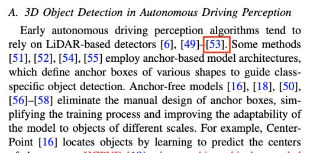

**Sec.II.A, Page 3**

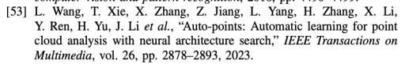

**Reference, Page 14**

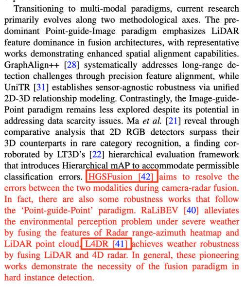

**Sec.II.C, Page 4**

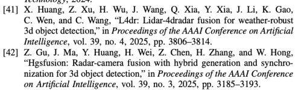

**Reference, Page 14**

**# For Reviewer 2**

**Comment**** ****1****:**** **First, I am interested in IGP and PGI, as they have never been mentioned in previous works. I believe this emerging taxonomy requires further elaboration. For instance, in Tables 1 and 2, I observe that the number of PGI is consistently higher than that of IGP. Additionally, are there more studies related to IGP? What are the classical research works on IGP? It is suggested that the authors supplement this information in the manuscript.

**Response 1:**** **We appreciate all your valuable comments. We have made the following revision for this comment. 

(1) We have added a new section entitled "Guided Paradigm" to the "Related Work" chapter, which is specifically dedicated to introducing the taxonomy we proposed. Currently, this section introduces the origins of IGP and more classic articles that follow the IGP paradigm.

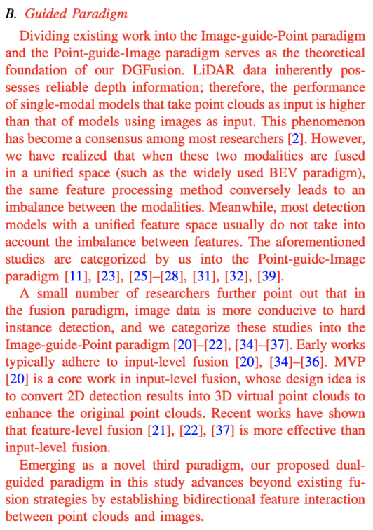

**Sec.II.B, Page 3**

(2) We have supplemented the models that follow the IGP paradigm in Tables 1 and 2.

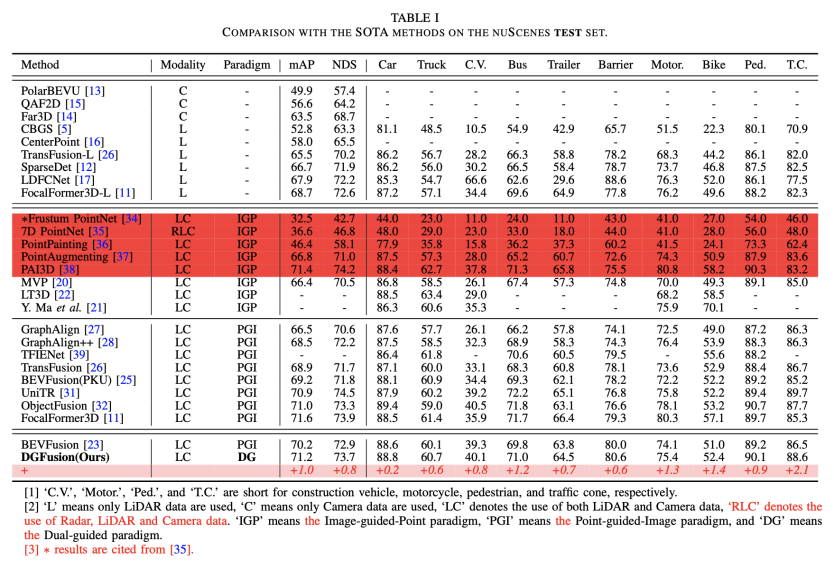

**Table 1, Page 9**

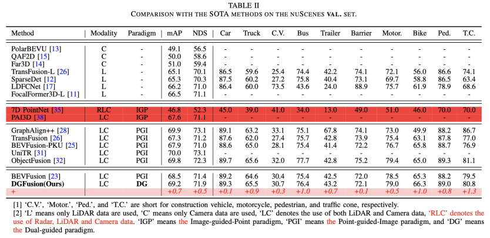

**Table 2, Page 10**

**Comment**** ****2****:**** **In Figure 3, why is the actual operation of IGPE and PGIE asymmetric?

**Response 2:**** **We have supplemented the discussion on Page 11 to justify the rationality of this design. From a practical operation perspective, the two are indeed asymmetric; while from an overall perspective, they are symmetric. 

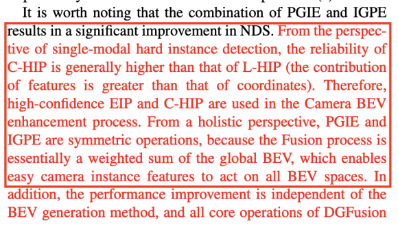

**Sec.IV.D.(1), Page 11**

****

**Comment**** ****3****:**** **I have noticed the two strategies in Table 6; what is their theoretical basis? It is suggested that the authors supplement this in the manuscript.

**Response 3:**** **We have made the following revision for answering your concerns. 

(1) We have supplemented the theoretical basis for Strategy (a) in Table 6.

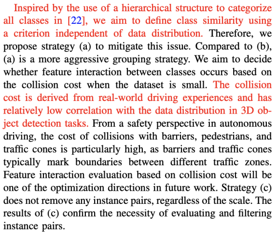

**Sec.IV.D.(2), Page 12**

(2) But, the source and specific theory of Strategy (b) have been clearly stated in the original version. Please see the following sentences highlighted in blue.

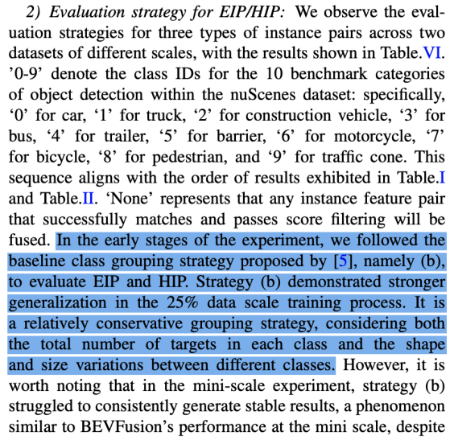

**Sec.IV.D.(2), Page 11**

****

**Comment**** ****4****:**** **In Table 4, larger categories (e.g., Truck and Bus) show more significant improvements. How, then, to highlight the advantages of the proposed method in handling hard instances? It is suggested that the authors supplement relevant explanations in the manuscript.

**Response 4:**** **Please refer to the **<u>Reviewer 1 </u>****<u>Response 3</u>**. All reviewers had questions about Table 4. Therefore, we provided a unified response and added an explanation of the hard instance performance in our revised version.**  
**

**# For Reviewer 3**

**Comment**** ****1****:**** **According to the abstract and Figure 1, DGFusion achieves a 1.0 improvement in AP and a 0.8 improvement in NDS compared to BEVFusion. Is this performance enhancement related to the BEV generation method?

**Response 1:**** **We appreciate your valuable comments. We have supplemented the discussion on this comment in the analysis of Table 5 (showed below) to demonstrate that the performance improvement is irrelevant to the generation method of BEV.

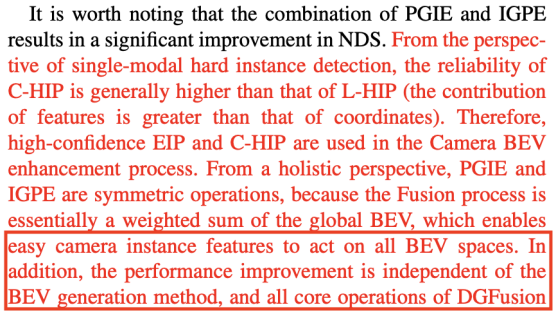

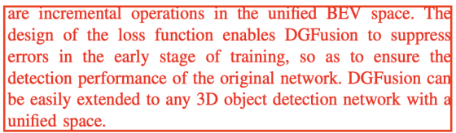

**Sec.IV.D.(1), Page 11**

****

**Comment**** ****2****:**** **How is the LiDAR visualization in Figure 1(a) obtained? It is argued that the 'easy for camera' category is more critical—why are closer objects not labeled as 'easy for camera'? Additionally, in Figure 1(b), why is there no detailed labeling for the regions where the number of point clouds exceeds 1?

**Response 2:**** **We have made the following revision for answering your concerns.

(1) How is the LiDAR visualization in Figure 1(a) obtained? ------ We simply projected 3D clouds onto its corresponding image. Please check **<u>Review</u>****<u>er</u>****<u> 1 </u>****<u>Re</u>****<u>sp</u>****<u>onse </u>****<u>1</u>** for changes with similar comments.

(2) Why are closer objects not labeled as 'easy for camera'? ------ That is typically categorized as "both easy". For instance, the cars on the left and right sides of Figure 1(a) that are close to the ego-vehicle. This scenario has already been addressed by previous research, meaning that object detection solutions based on any modality can be well compatible with "both easy" cases. Our DGFusion focuses more on objects with information density gap. 

(3) In Figure 1(b), why is there no detailed labeling for the regions where the number of point clouds exceeds 1? ------ According to your question, we realized that it is not reasonable to only show anns. with 1 point. Because anns. with 1 point cannot be used as a representative of ‘Hard for LiDAR’. Thus, we have revised Figure 1(b), which now shows the scenarios when the number of point clouds is 1-5 and greater than 5. 

**Sec.I, Page 1**

****

**Comment 3: **What would be the performance of DGFusion if it only adopts the IGP paradigm or PGI paradigm individually?

**Response 3:** In Table 5 of the initial version, (c) and (d) represent the performance when only the PGI paradigm and only the IGP paradigm are applied, respectively. We have added supplementary explanations, which are intended to make future readers aware of this point.

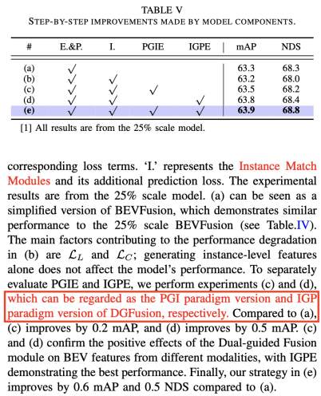

**Sec.IV.D.(1), Page 11**

**Comment**** ****4****:**** **It is observed from Table 4 that Truck and Bus are the categories with the highest improvement rates. However, both are large-sized objects—what is the reason for this phenomenon?

**Response 4:**** **Please refer to **<u>Reviewer 1 </u>****<u>Response 3</u>**. All reviewers had questions about Table 4. Therefore, we provided a unified response and added an explanation of the two trends represented by the outliers in the revised version.

**# Cite question**

**From Decision letter:** We understand that the reason why you select the IEEE TCSVT for your manuscript is that your manuscript has a good match with this journal----Many related papers should have already been published in this journal. Therefore, before your new submission, you have to answer two questions clearly in your revised manuscript and responses: **<u>a)</u>** what are the 3-5 papers published in the IEEE Transactions on Circuits and Systems for Video Technology, which are most closely related to your manuscript; **<u>b)</u>** what is distinctive / new about your current manuscript related to these previously published papers.

**Response:**** **It is noteworthy that **8** influential studies published in your prestigious journal have been cited in our research. We number these articles as **Ref.(1) to Ref.(8)** for subsequent responses. Please refer to the table below for the complete citation information and details. 

For **<u>Question a</u>**, all cited articles from TCSVT are closely related to our manuscript. They are summarized as follows.

**(1)**** ****All 8 articles** share the same main task as ours: 3D object detection in autonomous driving system.

(2) **Ref.(1) Mix-teaching**, **Ref.(3) GraphAlign++**, **Ref.(6) RaLiBEV**, and **Ref.(8) LDFCNet** focus on robust detection.

(3) **Ref.(2) PolarBEVU**, **Ref.(3) GraphAlign++**, and **Ref.(8) LDFCNet** are used in the experimental section.

(4) **Ref.(4) ****3D R-CNN**, **Ref.(5) HCPVF**, and **Ref.(7) PDR** are used for analyzing unimodal detection schemes.

For **<u>Question b</u>**, our article is fundamentally different from all the cited articles. The summary is as follows.

(1) From the perspective of model input, our **DGFusion** adopts the LiDAR-Camera fusion paradigm. In contrast, **Ref.(1) Mix-teaching**, **Ref.(2) PolarBEVU**, and **Ref.(7) PDR** are pure image paradigms; **Ref.(4) ****3D R-CNN**, **Ref.(5) HCPVF**, and **Ref.(8) LDFCNet** are pure LiDAR paradigms; and **Ref. (6) RaLiBEV** is a Radar-LiDAR fusion paradigm.

(2) **Ref.(3) GraphAlign++** mainly focuses on the misalignment issue of multi-modal features. Our **DGFusion** primarily addresses the hard instance detection problem caused by the information density difference between the two modalities, image and LiDAR.

**All articles are mentioned individually in the manuscript to highlight their importance.**

**Table: Cite Question Details**

| **R****ef.****(****1).**** **Yang L, Zhang X, Li J, et al. _**<u>Mix-teaching</u>**__<u>: A simple, unified and effective semi-supervised learning framework for monocular 3d object detection</u>_[J]. IEEE Transactions on Circuits and Systems for Video Technology, 2023, 33(11): 6832-6844. **Correlation****:** Both Ref. (1) and DGFusion focus on robust 3D object detection. Therefore, we introduce Ref. (1) in Sec. II.C as one of the representatives of robust detection models. **Differences****:** However, Ref. (1) is a monocular object detection model, while DGFusion is a LiDAR-Camera fusion model. |
| --- |
| **R****ef.****(****2).** Hou M, Lyu C, Wang G, et al. _**<u>PolarBEVU</u>**__<u>: </u>__<u>Multi-Camera 3D Object Detection in Polar Bird</u>__<u>’</u>__<u>s-Eye View via Unprojection</u>_[J]. IEEE Transactions on Circuits and Systems for Video Technology, 2025. **Correlation****:** Ref. (2) reports performance on nuScenes, so we include Ref. (2) as one of the monomodal models in the comparison lists of Table 1 and Table 2. **Differences****: **Whereas DGFusion is a LiDAR-Camera fusion model. |
| **R****ef.****(****3****).** Song Z, Jia C, Yang L, et al. _**<u>GraphAlign++</u>**__<u>: An accurate feature alignment by graph matching for multi-modal 3D object detection</u>_[J]. IEEE Transactions on Circuits and Systems for Video Technology, 2023, 34(4): 2619-2632. **Correlation****:** First, both Ref. (3) and DGFusion focus on robust 3D object detection. Therefore, we introduce Ref. (3) in Sec. II.C as one of the representatives of robust detection models. Second, Ref. (3) reports performance on nuScenes, and we categorize Ref. (3) as a PGI model. Thus, we include Ref. (3) as one of the PGI models in the comparison lists of Table 1 and Table 2. Finally, Ref. (3) also reports performance on small scale; the setup of our Table 4 refers to Ref. (3), and we cite its relevant data. **Differences****: **However, Ref. (3) mainly addresses the feature misalignment issue, while DGFusion primarily tackles the hard instance detection problem caused by the difference in information. |
| **R****ef.****(****4****).** Deng J, Zhou W, Zhang Y, et al. **(****3D R-CNN)** _<u>From multi-view to hollow-3D: Hallucinated hollow-3D R-CNN for 3D object detection</u>_[J]. IEEE Transactions on Circuits and Systems for Video Technology, 2021, 31(12): 4722-4734. **Correlation****:** We introduce Ref. (4) in Sec. II.A as one of the representatives of pure LiDAR anchor-free models. **Differences****: **Whereas DGFusion is a LiDAR-Camera fusion model. |
| **R****ef.****(****5****).** Fan B, Zhang K, Tian J. _**<u>HCPVF</u>**__<u>: </u>__<u>Hierarchical cascaded point-voxel fusion for 3D object detection</u>_[J]. IEEE Transactions on Circuits and Systems for Video Technology, 2023. **Correlation****:** We introduce Ref. (5) in Sec. II.A as one of the representatives of pure LiDAR anchor-free models. **Differences****: **Whereas DGFusion is a LiDAR-Camera fusion model. |
| **R****ef.****(****6****).** Yang Y, Liu J, Huang T, et al. _**<u>RaLiBEV</u>**__<u>: Radar and LiDAR BEV fusion learning for anchor box free object detection systems</u>_[J]. IEEE Transactions on Circuits and Systems for Video Technology, 2024. **Correlation****:** Both Ref. (6) and DGFusion focus on robust 3D object detection. Therefore, we introduce Ref. (6) in Sec. II.C as one of the representatives of robust detection models. **Differences****: **However, Ref. (6) is a LiDAR-Radar fusion model, while DGFusion is a LiDAR-Camera fusion model. |
| **R****ef.****(****7****).** Sheng H, Cai S, Zhao N, et al. _**<u>PDR</u>**__<u>: Progressive depth regularization for monocular 3D object detection</u>_[J]. IEEE Transactions on Circuits and Systems for Video Technology, 2023, 33(12): 7591-7603. **Correlation****:** We introduce Ref. (7) in Sec. II.A as one of the representatives of pure camera models. **Differences****: **Whereas DGFusion is a LiDAR-Camera fusion model. |
| **R****ef.****(****8****).** Wang H, Wang F, Wang M, et al. **(LDFCNet)** _<u>Rethinking How to Capture Long-range Dependency in 3D Object Detection</u>_[J]. IEEE Transactions on Circuits and Systems for Video Technology, 2025. **Correlation****:** First, both Ref. (8) and DGFusion focus on robust 3D object detection. Therefore, we introduce Ref. (8) in Sec. II.C as one of the representatives of robust detection models. Second, Ref. (8) reports performance on nuScenes, so we include Ref. (8) as one of the monomodal models in the comparison lists of Table 1 and Table 2. **Differences****: **Whereas DGFusion is a LiDAR-Camera fusion model. |

## 5.2025.9.25 Under Review (Revision 1)
没什么好说的，就是等待

## 6.2025.10.20 MINOR REVISION
[Skip to Main Content](https://ieee.atyponrex.com/submission/submissionBoard/5f4bb904-f565-4880-b7ec-f38c5fe2fa0e/decisionLetter?lastDecisionLetter=true#main)

[**IEEE Author Portal**](https://ieee.atyponrex.com/submission/dashboard)

Decision letter (Revision 2)

**Decision to ACCEPT - TCSVT-23114-2025.R2, DGFusion: Dual-guided Fusion for Robust Multi-Modal 3D Object Detection**

**From:**

pa.tripathi@ieee.org

**To:**

feiyangjia@bjtu.edu.cn

**CC:**

shanl@ieee.org, xguo@utdallas.edu, feiyangjia@bjtu.edu.cn, cyjia@bjtu.edu.cn, 24125249@bjtu.edu.cn, shaoqing.xu@connect.um.edu.mo, xsq0226@buaa.edu.cn, qimingxia96@163.com, liulin010811@gmail.com, yangleils@outlook.com, gongyan2020@foxmail.com, 22110110@bjtu.edu.cn

27-Oct-2025  
  
Mr. Feiyang Jia  
Beijing Jiaotong University School of Computer and Information Technology  
Beijing Jiaotong University,No.3,Shangyuan Village, Haidian District, Beijing, China  
Beijing  
China  
100044  
  
Paper:TCSVT-23114-2025.R2 DGFusion: Dual-guided Fusion for Robust Multi-Modal 3D Object Detection  
  
Dear Mr. Jia:  
  
Congratulations! Based on the recommendation of Associate Editor Dr. Xiaohu Guo, I am pleased to inform you that the above paper has been ACCEPTED as a Transactions Paper for publication with no further changes in an upcoming issue of the IEEE Transactions on Circuits and Systems for Video Technology.  
  
**PLEASE READ:  
****If you originally submitted via the IEEE Author Portal, please upload your files here: **[**https://ieee.atyponrex.com/journal/TCSVT**](https://ieee.atyponrex.com/journal/TCSVT)**  
****If you originally submitted via ScholarOne Manuscripts, please upload your files here: **[**https://mc.manuscriptcentral.com/tcsvt**](https://mc.manuscriptcentral.com/tcsvt)  
  
The IEEE Transactions on Circuits and Systems for Video Technology has a commitment to deliver valuable technical information to the video technology and systems community in a timely manner. To that end, the IEEE Transactions on Circuits and Systems for Video Technology, its editors, and staff are making every effort to ensure that the submission of finalized papers not be unduly protracted. We hope you will assist us by the careful preparation of your final submission.  
  
Please note that except for exigent circumstances of which you can notify us in writing in advance, we will expect to receive your final materials no later than TWO (2) weeks from the date of this letter. Delay will result in removal of the paper from the list of papers awaiting publication.  
  
You may not make any unauthorized changes to your manuscript at this time.  IEEE will perform a comparison of your accepted paper to your final submission, and any changes outside of what the editor has requested will need to be justified and approved before publication, causing delays. This includes any changes to the author list, content, or references.  
  
Please upload all files in a single session and make sure that your files are correct and complete upon submission. If there is an APPENDIX it must be uploaded as a SEPARATE document.  After you upload the files, you will receive confirmation that the final files have been received. Once your final files are submitted, you will not be able to make any changes until you receive the galley proofs from the IEEE.  
  
DO NOT MAKE CHANGES to your FINAL FILE, the file should be an EXACT copy of the ACCEPTED VERSION, if changes are made your paper will have to be reviewed again which will delay the process, and if AUTHORS are ADDED or REMOVED your paper can be REJECTED by the EIC.  
  
To assist publication, ALL of the following items are REQUIRED to process your paper:  
  
[ ] One PDF file of your final manuscript including text, abstract, figures and tables, all references and authors' bios w/photos in Double-Column Single-Spaced IEEE format. You should generate this PDF directly from your source file. (This file will be used to verify the consistency and correctness of any formatting conversions required in the processing of your source files for production.)  
  
NOTE: The Double-Column Single-Spaced IEEE format PDF file will provide the approximate publication length of the manuscript. It also serves as additional confirmation of your understanding that you are responsible for over-length page charges in the amount of $175 per page for all pages in the published version of the article that exceed 11 pages up to a maximum of 16 pages including photos and bios for a Transactions Papers, or in excess of 5 for a Transactions Letters to a maximum of 7 pages, or in excess of 14 for an Invited or Survey paper the page charge is the same up to a maximum of 20 pages including photos and bios.  Detailed information on these charges will accompany the galley proofs sent to you prior to publication.  
  
IMPORTANT: The following must appear on the first page of all PDF files when the final paper is submitted:  
  
"Copyright © 20xx IEEE. Personal use of this material is permitted. However, permission to use this material for any other purposes must be obtained from the IEEE by sending an email to pubs-permissions@ieee.org."  
  
NOTE: Authors are permitted to post their accepted papers, as long as they include the copyright notice above on the on the initial screen displaying IEEE copyrighted material. Upon publication, authors must replace the preprints with either (1) the full citation to the IEEE works with Digital Object Identifiers (DOI) or (2) the accepted versions only (not the IEEE-published versions) with the DOI.  
  
[ ]  One electronic copy of the finalized Double-Column Single-Spaced IEEE-formatted source file of the manuscript in LaTeX or MS Word formats. Any tables must be included in the source file, but figures may be provided separately (see below). However, all captions of figures and tables should be included in the source file. References should also be included, with citations embedded in the source file (do not supply separate BibTeX or Endnote files).  
  
[ ] If your figures are not already embedded in the source file of your manuscript, you will need to upload separate figure files, each named according to the corresponding figure numbers in the manuscript. The acceptable formats are EPS, Postscript, PDF, Powerpoint (ppt or pptx), and other device-independent graphics formats. Bitmapped graphics are not appropriate for figures containing text or symbols such as diagrams and graphs, and are acceptable only for photographs. We can NOT accept png and jpeg files due to compression artifacts.  
  
[ ]  Editable source files of the IEEE-style brief biosketches and portrait photos of all authors. The biosketches can be included at the end of your LaTeX or Word source file, or submitted as a separate file. For author photos, jpeg files are acceptable, and the naming convention used to identify each photo should be "authorfirstname_lastname.extension".  
  
[ ] Supplemental electronic material (Multimedia), to illustrate the concepts described by the authors, if applicable. Please read the "Reproducible Research" section below.  
  
=======Reproducible Research====================  
To allow maximum adoption of your work by other researchers, we encourage you to make the code and data used to produce your presented results (figures, tables, etc.) available online. An example of how this can be done is available at http://lcav.epfl.ch/reproducible_research/.  
  
IEEE Xplore can publish data sets, multimedia files and Matlab code along with your paper. For this purpose you can provide a single .rar file, or the links to such files in a README file that will appear on IEEE Xplore along with your paper. It is important to designate the .rar file as “multimedia_materials.rar.”  
  
For details, please see https://ieee-cas.org/pubs/tcsvt/submit-manuscript#sect6 under "Multimedia Materials."  
================================================  
  
VERY IMPORTANT: The source files ( .tex, .doc, .eps, .ps, .bib, .db, .tif, .jpeg, ...) may be uploaded as a single .rar archived file. Please do not attempt to upload files with extensions .shs, .exe, .com, .vbs, as they are restricted file types.  
  
When the above listed materials have been received it will be confirmed with an email. In due time, you will also be informed you when you can expect to receive galley proofs and the approximate date of publication.  
  
NOTE: By submitting the final files of your manuscript, you are acknowledging that you have read and  accepted the rules established for publication of manuscripts, including agreement to pay all over-length page charges, color charges, and any other charges and fees associated with publication of the manuscript. Such charges are not negotiable and cannot be suspended.  
  
===========OPEN ACCESS======================  
For Open Access (OA) manuscripts, the author is responsible for payment of open access fees at the discounted rate of $2,495 per article.  
  
The OA option, if selected, enables unrestricted public access to the article via IEEE Xplore. The OA option will be offered to the author at the time the manuscript is submitted. If selected, the OA fee must be paid before the article is published in the journal.  
==========================================  
  
A paper is placed in the publication queue after ALL of the required publication materials have been received. The IEEE CAS Society Publications Office typically processes papers based on the order that the complete publication materials have been received.  
  
In addition, note that the manuscript will be made available on IEEE Xplore within 4 weeks of the date that ALL of the required publication materials have been received. This will be a preprinted version that will later be replaced by the fully edited version after you have submitted the Revised proofs. Both preprinted and fully edited versions will have the same Digital Object Identifier (DOI), and will be equivalent as far as citations are concerned.  
  
If you have any further questions about our process or are experiencing technical difficulties, please contact Pankaj Tripathi at pa.tripathi@ieee.org. If you have questions about the production process, please contact Christie Inman at c.l.inman@ieee.org.  
  
Thank you for your contribution to the IEEE Transactions on Circuits and Systems for Video Technology.  
  
Sincerely,  
Shan Liu  
Editor-in-Chief, IEEE Transactions on Circuits and Systems for Video Technology  
  
AE Comments:  
  
Associate Editor  
Comments to the Author:  
Now all reviewers' comments are well addressed. The paper is ready to be accepted for publication. Congratulations!  
  
Reviewer Comments:  
  
Reviewer: 1  
  
Comments to the Author  
Accept  
  
Missing Key References Question (Optional) (List important references missing from the paper):  
  
Reviewer: 1  
Missing key ref :

## 7.2025.10.21 Submitted(Revision 2)+小修一天回复
整体格式跟R1一致。

**Responses of #TCSVT-23114-2025****.R1**

Feiyang Jia, Caiyan Jia, Ailin Liu, Shaoqing Xu, Qiming Xia,

Lin Liu, Lei Yang, Yan Gong, Ziying Song

**Dear Editor****s and Reviewers,**

We sincerely thank you for your time and efforts in handling and reviewing our manuscript, entitled "**DGFusion: Dual-guided Fusion for Robust Multi-Modal 3D Object Detection" (ID: TCSVT-23114-2025.R****1****)**. We have carefully read all the comments from this second round of review and thoroughly addressed each one.

In what follows, we will provide detailed one-to-one responses to **Associate Editor**** **and **Reviewers 1**. In the committed ‘Main Document - Tracked Changes’ version, **all revision changes are highlighted in ****red**.

All 9 authors approve the manuscript of the revision version, accepting full responsibilities.

We sincerely hope that the revised manuscript, incorporating the suggested revisions, will meet the journal’s requirements and be smoothly accepted. 

**Sincerely**** ****yours****, **

**Feiyang Jia**** (on behalf of all authors)**

**# For Associate Editor**

**Comment:** All reviewers are satisfied with this revision, except for some minor terminology confusion that was pointed out by one reviewer. After the correction, the paper should be ready to be accepted.

**Response:** 

(1) We were pleased to learn that the revisions we made in the first round (R1) were well-received by the reviewers—this feedback has further motivated us to refine the manuscript with greater care. And then, we appreciate and have accepted all the comments raised by the reviewers. The concerns in the comments mainly about terminology confusion. We have addressed all the comments and updated the manuscript accordingly. **Please check** **# For Reviewer 1**** for details**.

**(2) For Cite Question:** In our first response, we provided further details about the TCSVT paper cited in this article. The citation information has not been modified in this revision, so we will not provide further details in this response.  

**# For Reviewer 1**

**Comment**** ****1****:**** **On Page 6, Algorithm 1 uses two subscripts, "Enh" and "enha", both abbreviations for “enhanced."; Algorithm 2 should uniformly use "w" to denote weights, while also retaining instances like "wt_...". 

**Response 1:** Thank you for your detailed corrections. This comment has prompted us to carefully check Algorithm 1 and Algorithm 2. We have made the following revisions to make them more in line with the characteristics of pseudocode and significantly improve their readability:

(1) We have revised the variable names:  and .

(2) We have replaced all ‘=’ with arrows, and standardized all function names to be bold with the first letter capitalized.

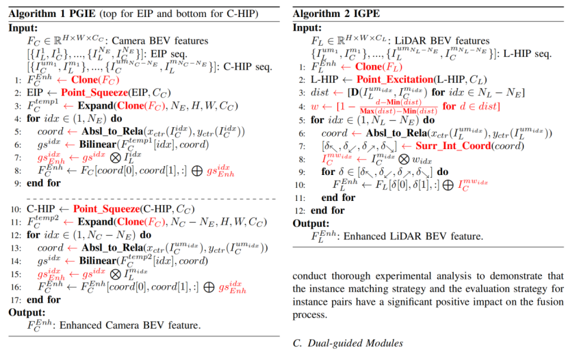

**Sec.III.C, Page 6**

**Comment**** ****2****:**** **Table VI directly references category names instead of class IDs. 

**Response 2:**** **We have modified the class IDs in Table VI to the corresponding class names.

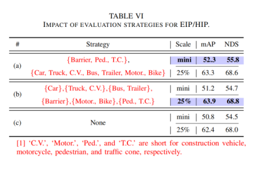

**Sec.IV.D.(2), Page 11**

## 8.2025.10.27 ACCEPT
后续的工作：authorgateway提交proof，交钱。

> 更新: 2025-11-20 21:44:45  
> 原文: <https://3dcv.yuque.com/org-wiki-3dcv-mm1l0t/ysgfp9/gl4gtn4t8i9xml67>