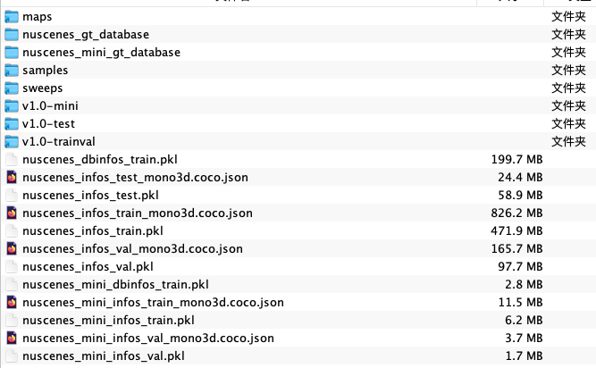
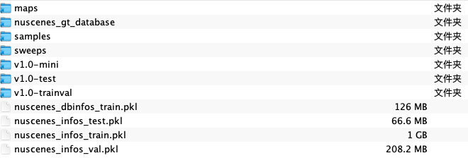

# mmdet3d nuscenes数据集生成及一些坑

1. 坑

（1）新旧版本的mmdet3d所生成的数据集文件（.pkl）是不一样的！看着文件命名一样，但是里面dict的key不一样。在低版本mmdet3d使用高版本生成的数据，会出现错误：

```plain
KeyError: "NuScenesDataset: 'infos'"
```

相关错误参见[github/mmdet3d/issue/769](https://github.com/open-mmlab/mmdetection3d/issues/769)。是否会有其他错误未知，但数据肯定是不能通用。

具体原因是因为新旧版本中tools/create_data.py内容不同：

```python
def nuscenes_data_prep(root_path,
                       info_prefix,
                       version,
                       dataset_name,
                       out_dir,
                       max_sweeps=10):
    """Prepare data related to nuScenes dataset.

    Related data consists of '.pkl' files recording basic infos,
    2D annotations and groundtruth database.

    Args:
        root_path (str): Path of dataset root.
        info_prefix (str): The prefix of info filenames.
        version (str): Dataset version.
        dataset_name (str): The dataset class name.
        out_dir (str): Output directory of the groundtruth database info.
        max_sweeps (int): Number of input consecutive frames. Default: 10
    """
    nuscenes_converter.create_nuscenes_infos(
        root_path, info_prefix, version=version, max_sweeps=max_sweeps)

    if version == 'v1.0-test':
        info_test_path = osp.join(root_path, f'{info_prefix}_infos_test.pkl')
        nuscenes_converter.export_2d_annotation(
            root_path, info_test_path, version=version)
        return

    info_train_path = osp.join(root_path, f'{info_prefix}_infos_train.pkl')
    info_val_path = osp.join(root_path, f'{info_prefix}_infos_val.pkl')
    nuscenes_converter.export_2d_annotation(
        root_path, info_train_path, version=version)
    nuscenes_converter.export_2d_annotation(
        root_path, info_val_path, version=version)
    create_groundtruth_database(dataset_name, root_path, info_prefix,
                                f'{out_dir}/{info_prefix}_infos_train.pkl')
```

```python
def nuscenes_data_prep(root_path,
                       info_prefix,
                       version,
                       dataset_name,
                       out_dir,
                       max_sweeps=10):
    """Prepare data related to nuScenes dataset.

    Related data consists of '.pkl' files recording basic infos,
    2D annotations and groundtruth database.

    Args:
        root_path (str): Path of dataset root.
        info_prefix (str): The prefix of info filenames.
        version (str): Dataset version.
        dataset_name (str): The dataset class name.
        out_dir (str): Output directory of the groundtruth database info.
        max_sweeps (int, optional): Number of input consecutive frames.
            Default: 10
    """
    nuscenes_converter.create_nuscenes_infos(
        root_path, info_prefix, version=version, max_sweeps=max_sweeps)

    if version == 'v1.0-test':
        info_test_path = osp.join(out_dir, f'{info_prefix}_infos_test.pkl')
        update_pkl_infos('nuscenes', out_dir=out_dir, pkl_path=info_test_path)
        return

    info_train_path = osp.join(out_dir, f'{info_prefix}_infos_train.pkl')
    info_val_path = osp.join(out_dir, f'{info_prefix}_infos_val.pkl')
    update_pkl_infos('nuscenes', out_dir=out_dir, pkl_path=info_train_path)
    update_pkl_infos('nuscenes', out_dir=out_dir, pkl_path=info_val_path)
    create_groundtruth_database(dataset_name, root_path, info_prefix,
                                f'{info_prefix}_infos_train.pkl')
```

新版本的update_pkl_infos处理包含了老版本的操作，同时新增了一些操作。

未知上述改动在哪个版本处为交界。但请注意这件事情，因为从头生成数据集很慢，基本上4h+。

（2）如果需要在同一目录生成full和mini版本，请在命令中给定不一样的--extra-tag，否则会将已有的pkl文件覆盖。

（3）同一目录下生成不同版本的数据集时，当使用同一tag，会共用nuscenes_gt_database目录，不会覆盖掉以前命令生成的内容，但是只要pkl文件是对的，这里是不影响nuscenes_gt_database的。使用不同的tag会使用新的目录，比如nuscenes_mini_gt_database（参考2.2）。

（4）旧版本生成时遇到的问题：[ModuleNotFoundError: No module named 'tools.data_converter'](https://github.com/open-mmlab/mmdetection3d/issues/2352)，新版本无此问题。

（5）如果使用其他用户数据的软连接，建议不要把nuscenes_gt_database也连接过来。


2. 旧版本mmdet3d

（1）环境参考[focalformer3D](https://github.com/NVlabs/FocalFormer3D/issues/8)：

mmcv-full                 1.4.0

mmdet                     2.14.0

mmdet3d                   0.17.1

（2）过程

```bash
# cd到指定位置
cd /YOUR_PATH/mmdetection3d
# 生成full版本
python tools/create_data.py nuscenes --root-path ./data/nuscenes --out-dir ./data/nuscenes --extra-tag nuscenes
# 生成mini版本
python tools/create_data.py nuscenes --root-path ./data/nuscenes --out-dir ./data/nuscenes --extra-tag nuscenes_mini --version v1.0-mini
```

以及mini版本运行时的控制台输入如下：

```plain
(mm3d_old) jiafeiyang@sugon-X640-G40:~/mmdetection3d$ python tools/create_data.py nuscenes --root-path ./data/nuscenes --out-dir ./data/nuscenes --extra-tag nuscenes --version v1.0-mini
======
Loading NuScenes tables for version v1.0-mini...
23 category,
8 attribute,
4 visibility,
911 instance,
12 sensor,
120 calibrated_sensor,
31206 ego_pose,
8 log,
10 scene,
404 sample,
31206 sample_data,
18538 sample_annotation,
4 map,
Done loading in 0.635 seconds.
======
Reverse indexing ...
Done reverse indexing in 0.1 seconds.
======
total scene num: 10
exist scene num: 10
train scene: 8, val scene: 2
[>>>>>>>>>>>>>>>>>>>>>>>>>>>>>>>>>>>>>>>>>>>>>>>>>>] 404/404, 12.1 task/s, elapsed: 33s, ETA:     0s
train sample: 323, val sample: 81
======
Loading NuScenes tables for version v1.0-mini...
23 category,
8 attribute,
4 visibility,
911 instance,
12 sensor,
120 calibrated_sensor,
31206 ego_pose,
8 log,
10 scene,
404 sample,
31206 sample_data,
18538 sample_annotation,
4 map,
Done loading in 0.545 seconds.
======
Reverse indexing ...
Done reverse indexing in 0.1 seconds.
======
[>>>>>>>>>>>>>>>>>>>>>>>>>>>>>>>>>>>>>>>>>>>>>>>>>>] 323/323, 3.6 task/s, elapsed: 90s, ETA:     0s
======
Loading NuScenes tables for version v1.0-mini...
23 category,
8 attribute,
4 visibility,
911 instance,
12 sensor,
120 calibrated_sensor,
31206 ego_pose,
8 log,
10 scene,
404 sample,
31206 sample_data,
18538 sample_annotation,
4 map,
Done loading in 0.444 seconds.
======
Reverse indexing ...
Done reverse indexing in 0.1 seconds.
======
[>>>>>>>>>>>>>>>>>>>>>>>>>>>>>>>>>>>>>>>>>>>>>>>>>>] 81/81, 3.2 task/s, elapsed: 26s, ETA:     0s
Create GT Database of NuScenesDataset
[>>>>>>>>>>>>>>>>>>>>>>>>>>>>>>>>>>>>>>>>>>>>>>>>>>] 323/323, 8.5 task/s, elapsed: 38s, ETA:     0s
load 3068 pedestrian database infos
load 4082 car database infos
load 773 traffic_cone database infos
load 147 bicycle database infos
load 1851 barrier database infos
load 451 truck database infos
load 337 bus database infos
load 174 construction_vehicle database infos
load 57 movable_object.pushable_pullable database infos
load 179 motorcycle database infos
load 13 movable_object.debris database infos
load 59 trailer database infos
load 25 human.pedestrian.personal_mobility database infos
(mm3d_old) jiafeiyang@sugon-X640-G40:~/mmdetection3d$ python tools/create_data.py nuscenes --root-path ./data/nuscenes --out-dir ./data/nuscenes --extra-tag nuscenes_mini --version v1.0-mini
======
Loading NuScenes tables for version v1.0-mini...
23 category,
8 attribute,
4 visibility,
911 instance,
12 sensor,
120 calibrated_sensor,
31206 ego_pose,
8 log,
10 scene,
404 sample,
31206 sample_data,
18538 sample_annotation,
4 map,
Done loading in 0.453 seconds.
======
Reverse indexing ...
Done reverse indexing in 0.1 seconds.
======
total scene num: 10
exist scene num: 10
train scene: 8, val scene: 2
[>>>>>>>>>>>>>>>>>>>>>>>>>>>>>>>>>>>>>>>>>>>>>>>>>>] 404/404, 12.1 task/s, elapsed: 33s, ETA:     0s
train sample: 323, val sample: 81
======
Loading NuScenes tables for version v1.0-mini...
23 category,
8 attribute,
4 visibility,
911 instance,
12 sensor,
120 calibrated_sensor,
31206 ego_pose,
8 log,
10 scene,
404 sample,
31206 sample_data,
18538 sample_annotation,
4 map,
Done loading in 0.547 seconds.
======
Reverse indexing ...
Done reverse indexing in 0.1 seconds.
======
[>>>>>>>>>>>>>>>>>>>>>>>>>>>>>>>>>>>>>>>>>>>>>>>>>>] 323/323, 5.4 task/s, elapsed: 59s, ETA:     0s
======
Loading NuScenes tables for version v1.0-mini...
23 category,
8 attribute,
4 visibility,
911 instance,
12 sensor,
120 calibrated_sensor,
31206 ego_pose,
8 log,
10 scene,
404 sample,
31206 sample_data,
18538 sample_annotation,
4 map,
Done loading in 0.426 seconds.
======
Reverse indexing ...
Done reverse indexing in 0.1 seconds.
======
[>>>>>>>>>>>>>>>>>>>>>>>>>>>>>>>>>>>>>>>>>>>>>>>>>>] 81/81, 4.8 task/s, elapsed: 17s, ETA:     0s
Create GT Database of NuScenesDataset
[>>>>>>>>>>>>>>>>>>>>>>>>>>>>>>>>>>>>>>>>>>>>>>>>>>] 323/323, 9.7 task/s, elapsed: 33s, ETA:     0s
load 3068 pedestrian database infos
load 4082 car database infos
load 773 traffic_cone database infos
load 147 bicycle database infos
load 1851 barrier database infos
load 451 truck database infos
load 337 bus database infos
load 174 construction_vehicle database infos
load 57 movable_object.pushable_pullable database infos
load 179 motorcycle database infos
load 13 movable_object.debris database infos
load 59 trailer database infos
load 25 human.pedestrian.personal_mobility database infos
```

full版生成时候忘记留了，参考mini的过程即可，只是每个set的数量不一样。

最终生成的结果：




3. 新版本

（1）环境使用官方命令安装：

mmcv                      2.1.0

mmdet                     3.3.0

mmdet3d                   1.4.0

（2）过程

命令与旧版本一致。控制台输入与旧版本也几乎一致。

最终生成的结果：




> 更新: 2024-04-10 17:23:50  
> 原文: <https://3dcv.yuque.com/org-wiki-3dcv-mm1l0t/ysgfp9/hg1is5bvxabm0t6e>