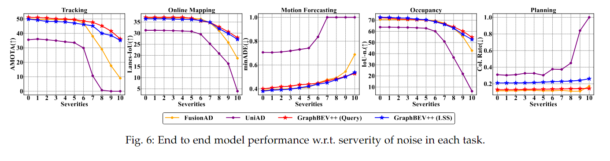
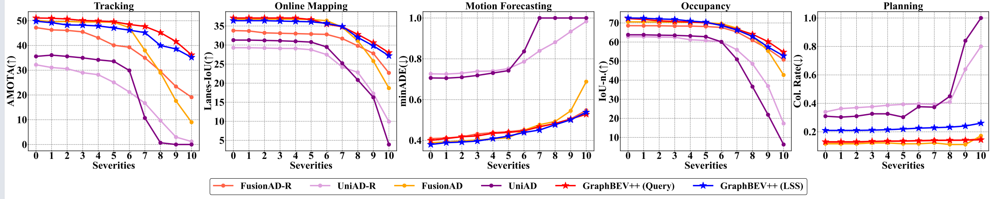
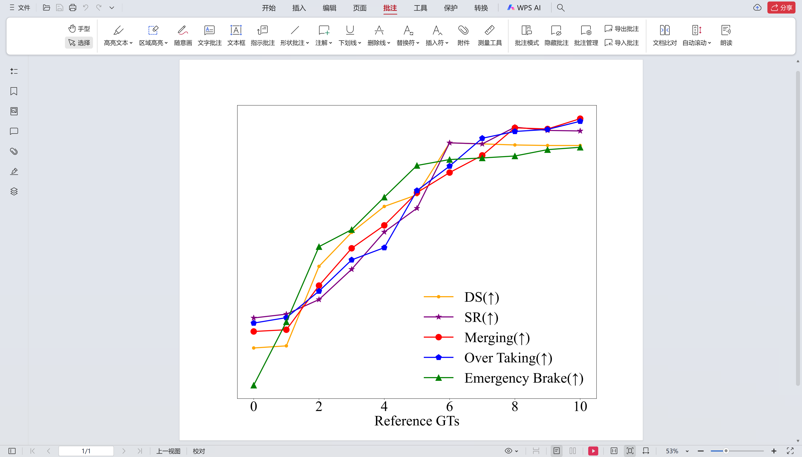
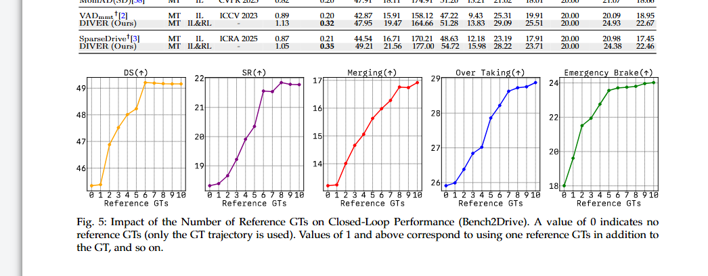

# GraphBEV++折线图



```python
# encoding=utf-8
import matplotlib.pyplot as plt
from pylab import *  # 支持中文
from matplotlib.font_manager import FontProperties
import numpy as np
from matplotlib.ticker import MultipleLocator


size_of_data = 17
size_of_legend = 65
size_of_others = 65
mpl.rcParams['font.sans-serif'] = ['Times New Roman']

plt.rc('font', family='Times New Roman')
fig, axs = plt.subplots(1, 5, figsize=(16.00*5, 16))


# 设置x轴数据
names = range(11)

# 设置y轴数据
# y0 NDS y1 mAP
# y0 = [64.6, 64.6, 64.5, 64.4, 64.2, 63.9, 62.3, 57.8, 52.5, 45.1, 35.9] # NDS clean~severity10 FusionAD
# y1 = [49.81, 49.7, 49.59, 49.45, 49.12, 48.73, 46.12, 38.08, 30.72, 23.11, 10.33]  # NDS clean~severity10 UniAD
# y2 =  # NDS clean~severity10 GraphBEV++
y3 = [50.2, 49.6, 49.7, 49.5, 49.5, 49.4, 47.2, 38.0, 29.0, 17.6, 9.0] # AMOTA FusionAD 
y4 = [35.6, 36.1, 35.6, 35.0, 34.2, 33.6, 29.9, 10.7, 0.7, 0.0, 0.0] # AMOTA UniAD
y31 = [51.1, 51.0, 50.7, 50.1, 49.9, 49.6, 48.5, 47.7, 45.2, 41.6, 36.2] # AMOTA Graphbev query
y32 = [49.8, 49.2, 48.3, 48.2, 47.9, 47.1, 46.2, 45.2, 40.0, 38.6, 35.2] # AMOTA Graphbev lss


y6 = [36.8, 36.8, 36.8, 36.8, 36.8, 36.7, 36.4, 34.7, 31.1, 25.8, 18.7] # Lane-IoU FusionAD
y7 = [31.30, 31.30, 31.22, 31.12, 30.98, 30.78, 29.50, 25.22, 20.84, 16.28, 3.91] # Lane-IoU UniAD
y61= [37.1, 37.1, 37.1, 37.1, 37.1, 36.7, 35.5, 34.8, 32.8, 30.6, 28.0] # Lane-IoU Graphbev query
y62 =[36.4 , 36.4, 36.4, 36.3, 36.2, 36.1, 35.7, 34.9, 32.0, 29.8, 27.2] # Lane-IoU Graphbev lss

y9 = [0.389, 0.392, 0.398, 0.402, 0.408, 0.413, 0.450, 0.477, 0.493, 0.545, 0.688] # minADE FusionAD
y10 = [0.7062, 0.7052, 0.7095, 0.7186, 0.7303, 0.7422, 0.8360, 1.0, 1.0, 1.0, 1.0000] # minADE UniAD
y91 = [0.40, 0.409, 0.418, 0.422, 0.435, 0.439, 0.447, 0.467, 0.483, 0.505, 0.528] # minADE Graphbev query
y92 = [0.38, 0.389, 0.392, 0.397, 0.409, 0.421, 0.439, 0.451, 0.477, 0.501, 0.538] # minADE Graphbev lss


y12 = [70.588, 70.550, 70.533, 70.388, 70.366, 70.143, 69.646, 67.300, 62.919, 55.378, 42.736] # Occ IoU FusionAD
y13 = [63.8, 63.8, 63.6, 63.5, 63.2, 62.8, 60.1, 50.9, 36.6, 21.9, 6.3] # Occ IoU UniAD
y121 = [72.3, 71.9, 71.1, 70.8, 70.5, 70.1, 68.9, 66.7, 64.1, 60.2, 54.7] # Occ IoU Graphbev query
y122 = [72.6, 72.5, 72.1, 71.88, 71.0, 70.43, 68.646, 66.300, 62.919, 57.378, 52.736] # Occ IoU Graphbev lss


y15 = [0.116, 0.116, 0.116, 0.122, 0.122, 0.116, 0.116, 0.122, 0.111, 0.111, 0.172] # col. rate avg FusionAD
y16 = [0.31, 0.30333333333333334, 0.31, 0.32666666666666666, 0.32666666666666666, 0.30333333333333334, 0.37666666666666665, 0.37333333333333335, 0.45, 0.84, 1.0] # col. rate avg UniAD
y151 = [0.13, 0.13, 0.13, 0.133, 0.134, 0.135, 0.137, 0.139, 0.141, 0.142, 0.144] # col. rate avg Graphbev query
y152 = [0.21, 0.21, 0.21, 0.212, 0.215, 0.22, 0.226, 0.229, 0.233, 0.241, 0.261] # col. rate avg Graphbev lss

axs[0].plot(names, y3, marker='.', ms=42, linewidth=8, label='FusionAD', color='orange')
axs[0].plot(names, y4, marker='.', ms=42, linewidth=8, label='UniAD', color='purple')
axs[0].plot(names, y31, marker='*', ms=42, linewidth=8, label='GraphBEV++ (Query)', color='r')
axs[0].plot(names, y32, marker='*', ms=42, linewidth=8, label='GraphBEV++ (LSS)', color='b')
# axs[0].plot(names, y5, marker='*', ms=42, linewidth=8, label='GraphBEV++', color='#ff8000')


axs[1].plot(names, y6, marker='.', ms=42, linewidth=8, label='FusionAD', color='orange')
axs[1].plot(names, y7, marker='.', ms=42, linewidth=8, label='UniAD', color='purple')
axs[1].plot(names, y61, marker='*', ms=42, linewidth=8, label='GraphBEV++ (Query)', color='r')
axs[1].plot(names, y62, marker='*', ms=42, linewidth=8, label='GraphBEV++ (LSS)', color='b')
# axs[1].plot(names, y8, marker='*', ms=42, linewidth=8, label='GraphBEV++', color='#ff8000')


axs[2].plot(names, y9, marker='.', ms=42, linewidth=8, label='FusionAD', color='orange')
axs[2].plot(names, y10, marker='.', ms=42, linewidth=8, label='UniAD', color='purple')
axs[2].plot(names, y91, marker='*', ms=42, linewidth=8, label='GraphBEV++ (Query)', color='r')
axs[2].plot(names, y92, marker='*', ms=42, linewidth=8, label='GraphBEV++ (LSS)', color='b')
# axs[2].plot(names, y11, marker='*', ms=42, linewidth=8, label='GraphBEV++', color='#ff8000')

axs[3].plot(names, y12, marker='.', ms=42, linewidth=8, label='FusionAD', color='orange')
axs[3].plot(names, y13, marker='.', ms=42, linewidth=8, label='UniAD', color='purple')
axs[3].plot(names, y121, marker='*', ms=42, linewidth=8, label='GraphBEV++ (Query)', color='r')
axs[3].plot(names, y122, marker='*', ms=42, linewidth=8, label='GraphBEV++ (LSS)', color='b')
# axs[3].plot(names, y14, marker='*', ms=42, linewidth=8, label='GraphBEV++', color='#ff8000')

axs[4].plot(names, y15, marker='.', ms=42, linewidth=8, label='FusionAD', color='orange')
axs[4].plot(names, y16, marker='.', ms=42, linewidth=8, label='UniAD', color='purple')
axs[4].plot(names, y151, marker='*', ms=42, linewidth=8, label='GraphBEV++ (Query)', color='red')
axs[4].plot(names, y152, marker='*', ms=42, linewidth=8, label='GraphBEV++ (LSS)', color='b')
# axs[4].plot(names, y17, marker='*', ms=42, linewidth=8, label='GraphBEV++', color='#ff8000')

# 设置全局样式
for ax in axs:
    ax.grid(True, linestyle='--', color='gray', linewidth=2)
    ax.set_xlim(-0.5, 10.5)  # 限定横轴的范围
    ax.set_ylim(auto=True)
    ax.tick_params(axis='y', labelsize=size_of_others)
    ax.tick_params(axis='x', labelsize=size_of_others)
    for label in ax.get_xticklabels():
        label.set_weight('bold')
    for label in ax.get_yticklabels():
        label.set_weight('bold')
    # ax.legend(loc='best', fontsize=size_of_legend, prop={'weight': 'bold', 'size': size_of_legend})  # 让图例生效
    ax.set_xticks(names, rotation=0)
    ax.set_xlabel(u"Severities", fontsize=size_of_others, fontweight='bold')  # X轴标签
    ax.spines['right'].set_color('k')
    ax.spines['top'].set_color('k')
    ax.spines['bottom'].set_color('k')
    ax.spines['left'].set_color('k')
    ax.spines['right'].set_linewidth(3)
    ax.spines['top'].set_linewidth(3)
    ax.spines['bottom'].set_linewidth(3)
    ax.spines['left'].set_linewidth(3)

plt.tight_layout(pad=7)  # 增加子图之间的填充
# 创建统一的图例并放置在图像下方
handles, labels = axs[2].get_legend_handles_labels()
axs[2].legend(handles, labels, loc='lower center', bbox_to_anchor=(0.5, -0.4), ncol=4, prop={'weight': 'bold', 'size': size_of_legend}, edgecolor='black', framealpha=1)
plt.subplots_adjust(bottom=0.25) # 底部边距
# 设置局部
title_group = ["Tracking", "Online Mapping", "Motion Forecasting", "Occupancy", "Planning"]
y_label_group = ["AMOTA(↑)", "Lanes-IoU(↑)", "minADE(↓)", "IoU-n.(↑)", "Col. Rate(↓)"]
for i, ax in enumerate(axs):
    ax.set_ylabel(y_label_group[i], fontsize=size_of_others, fontweight='bold')  # Y轴标签
    ax.set_title(title_group[i], fontsize=size_of_others, y=1.01, fontweight='bold')  # 标题
axs[1].yaxis.set_major_locator(MultipleLocator(5))
axs[3].yaxis.set_major_locator(MultipleLocator(10))

import os
os.makedirs('./img', exist_ok=True)
plt.savefig("./img/LineChart.pdf")
# plt.show()
```





```python
# encoding=utf-8
import matplotlib.pyplot as plt
from pylab import *  # 支持中文
from matplotlib.font_manager import FontProperties
import numpy as np
from matplotlib.ticker import MultipleLocator


size_of_data = 17
size_of_legend = 55
size_of_others = 60
mpl.rcParams['font.sans-serif'] = ['Times New Roman']

plt.rc('font', family='Times New Roman')
fig, axs = plt.subplots(1, 5, figsize=(16.00*5, 16))


# 设置x轴数据
names = range(11)

# 设置y轴数据
# y0 NDS y1 mAP
# y0 = [64.6, 64.6, 64.5, 64.4, 64.2, 63.9, 62.3, 57.8, 52.5, 45.1, 35.9] # NDS clean~severity10 FusionAD
# y1 = [49.81, 49.7, 49.59, 49.45, 49.12, 48.73, 46.12, 38.08, 30.72, 23.11, 10.33]  # NDS clean~severity10 UniAD
# y2 =  # NDS clean~severity10 GraphBEV++
y30 = [47.2, 46.3, 46.1, 45.5, 43.1, 40.1, 39.3, 35.0, 29.6, 23.4, 19.1] # AMOTA FusionAD RoarNet
y40 = [32.2, 31.1, 30.6, 29.0, 28.2, 25.1, 21.2, 16.7, 9.7, 3.0, 1.2] # AMOTA UniAD RoarNet
y3 = [50.2, 49.6, 49.7, 49.5, 49.5, 49.4, 47.2, 38.0, 29.0, 17.6, 9.0] # AMOTA FusionAD 
y4 = [35.6, 36.1, 35.6, 35.0, 34.2, 33.6, 29.9, 10.7, 0.7, 0.0, 0.0] # AMOTA UniAD
y31 = [51.1, 51.0, 50.7, 50.1, 49.9, 49.6, 48.5, 47.7, 45.2, 41.6, 36.2] # AMOTA Graphbev query
y32 = [49.8, 49.2, 48.3, 48.2, 47.9, 47.1, 46.2, 45.2, 40.0, 38.6, 35.2] # AMOTA Graphbev lss

y60 = [33.8, 33.7, 33.2, 33.1, 33.0, 32.9, 32.8, 31.7, 29.8, 27.8, 22.7] # Lane-IoU FusionAD RoarNet
y70 = [29.30, 29.30, 29.22, 29.12, 29.10, 28.78, 27.50, 24.22, 22.84, 17.28, 9.91] # Lane-IoU UniAD RoarNet
y6 = [36.8, 36.8, 36.8, 36.8, 36.8, 36.7, 36.4, 34.7, 31.1, 25.8, 18.7] # Lane-IoU FusionAD
y7 = [31.30, 31.30, 31.22, 31.12, 30.98, 30.78, 29.50, 25.22, 20.84, 16.28, 3.91] # Lane-IoU UniAD
y61= [37.1, 37.1, 37.1, 37.1, 37.1, 36.7, 35.5, 34.8, 32.8, 30.6, 28.0] # Lane-IoU Graphbev query
y62 =[36.4 , 36.4, 36.4, 36.3, 36.2, 36.1, 35.7, 34.9, 32.0, 29.8, 27.2] # Lane-IoU Graphbev lss

y90 = [0.409, 0.412, 0.418, 0.432, 0.438, 0.443, 0.451, 0.467, 0.483, 0.505, 0.548] # minADE FusionAD RoarNet
y100 = [0.7262, 0.7252, 0.7295, 0.7386, 0.7403, 0.7522, 0.7860, 0.8392, 0.8810, 0.9334, 0.9834] # minADE UniAD RoarNet
y9 = [0.389, 0.392, 0.398, 0.402, 0.408, 0.413, 0.450, 0.477, 0.493, 0.545, 0.688] # minADE FusionAD
y10 = [0.7062, 0.7052, 0.7095, 0.7186, 0.7303, 0.7422, 0.8360, 1.0, 1.0, 1.0, 1.0000] # minADE UniAD
y91 = [0.40, 0.409, 0.418, 0.422, 0.435, 0.439, 0.447, 0.467, 0.483, 0.505, 0.528] # minADE Graphbev query
y92 = [0.38, 0.389, 0.392, 0.397, 0.409, 0.421, 0.439, 0.451, 0.477, 0.501, 0.538] # minADE Graphbev lss

y120 = [68.588, 68.550, 68.533, 68.388, 68.366, 68.143, 67.646, 65.300, 60.919, 56.378, 50.736] # Occ IoU FusionAD RoarNet
y130 = [62.8, 62.8, 62.6, 62.5, 61.2, 60.8, 60.1, 55.9, 48.6, 36.9, 17.3] # Occ IoU UniAD
y12 = [70.588, 70.550, 70.533, 70.388, 70.366, 70.143, 69.646, 67.300, 62.919, 55.378, 42.736] # Occ IoU FusionAD RoarNet
y13 = [63.8, 63.8, 63.6, 63.5, 63.2, 62.8, 60.1, 50.9, 36.6, 21.9, 6.3] # Occ IoU UniAD
y121 = [72.3, 71.9, 71.1, 70.8, 70.5, 70.1, 68.9, 66.7, 64.1, 60.2, 54.7] # Occ IoU Graphbev query
y122 = [72.6, 72.5, 72.1, 71.88, 71.0, 70.43, 68.646, 66.300, 62.919, 57.378, 52.736] # Occ IoU Graphbev lss


y150 = [0.126, 0.126, 0.126, 0.132, 0.136, 0.136, 0.139, 0.142, 0.141, 0.141, 0.152] # col. rate avg FusionAD RoarNet
y160 = [0.34, 0.36333333333333334, 0.37, 0.37666666666666666, 0.38666666666666666, 0.39333333333333334, 0.39666666666666665, 0.39333333333333335, 0.41, 0.64, 0.80] # col. rate avg UniAD RoarNet
y15 = [0.116, 0.116, 0.116, 0.122, 0.122, 0.116, 0.116, 0.122, 0.111, 0.111, 0.172] # col. rate avg FusionAD
y16 = [0.31, 0.30333333333333334, 0.31, 0.32666666666666666, 0.32666666666666666, 0.30333333333333334, 0.37666666666666665, 0.37333333333333335, 0.45, 0.84, 1.0] # col. rate avg UniAD
y151 = [0.13, 0.13, 0.13, 0.133, 0.134, 0.135, 0.137, 0.139, 0.141, 0.142, 0.144] # col. rate avg Graphbev query
y152 = [0.21, 0.21, 0.21, 0.212, 0.215, 0.22, 0.226, 0.229, 0.233, 0.241, 0.261] # col. rate avg Graphbev lss

axs[0].plot(names, y30, marker='.', ms=42, linewidth=8, label='FusionAD-R', color='tomato')
axs[0].plot(names, y40, marker='.', ms=42, linewidth=8, label='UniAD-R', color='plum')
axs[0].plot(names, y3, marker='.', ms=42, linewidth=8, label='FusionAD', color='orange')
axs[0].plot(names, y4, marker='.', ms=42, linewidth=8, label='UniAD', color='purple')
axs[0].plot(names, y31, marker='*', ms=42, linewidth=8, label='GraphBEV++ (Query)', color='r')
axs[0].plot(names, y32, marker='*', ms=42, linewidth=8, label='GraphBEV++ (LSS)', color='b')
# axs[0].plot(names, y5, marker='*', ms=42, linewidth=8, label='GraphBEV++', color='#ff8000')


axs[1].plot(names, y60, marker='.', ms=42, linewidth=8, label='FusionAD-R', color='tomato')
axs[1].plot(names, y70, marker='.', ms=42, linewidth=8, label='UniAD-R', color='plum')
axs[1].plot(names, y6, marker='.', ms=42, linewidth=8, label='FusionAD', color='orange')
axs[1].plot(names, y7, marker='.', ms=42, linewidth=8, label='UniAD', color='purple')
axs[1].plot(names, y61, marker='*', ms=42, linewidth=8, label='GraphBEV++ (Query)', color='r')
axs[1].plot(names, y62, marker='*', ms=42, linewidth=8, label='GraphBEV++ (LSS)', color='b')
# axs[1].plot(names, y8, marker='*', ms=42, linewidth=8, label='GraphBEV++', color='#ff8000')

axs[2].plot(names, y90, marker='.', ms=42, linewidth=8, label='FusionAD-R', color='tomato')
axs[2].plot(names, y100, marker='.', ms=42, linewidth=8, label='UniAD-R', color='plum')
axs[2].plot(names, y9, marker='.', ms=42, linewidth=8, label='FusionAD', color='orange')
axs[2].plot(names, y10, marker='.', ms=42, linewidth=8, label='UniAD', color='purple')
axs[2].plot(names, y91, marker='*', ms=42, linewidth=8, label='GraphBEV++ (Query)', color='r')
axs[2].plot(names, y92, marker='*', ms=42, linewidth=8, label='GraphBEV++ (LSS)', color='b')
# axs[2].plot(names, y11, marker='*', ms=42, linewidth=8, label='GraphBEV++', color='#ff8000')

axs[3].plot(names, y120, marker='.', ms=42, linewidth=8, label='FusionAD-R', color='tomato')
axs[3].plot(names, y130, marker='.', ms=42, linewidth=8, label='UniAD-R', color='plum')
axs[3].plot(names, y12, marker='.', ms=42, linewidth=8, label='FusionAD', color='orange')
axs[3].plot(names, y13, marker='.', ms=42, linewidth=8, label='UniAD', color='purple')
axs[3].plot(names, y121, marker='*', ms=42, linewidth=8, label='GraphBEV++ (Query)', color='r')
axs[3].plot(names, y122, marker='*', ms=42, linewidth=8, label='GraphBEV++ (LSS)', color='b')
# axs[3].plot(names, y14, marker='*', ms=42, linewidth=8, label='GraphBEV++', color='#ff8000')

axs[4].plot(names, y150, marker='.', ms=42, linewidth=8, label='FusionAD-R', color='tomato')
axs[4].plot(names, y160, marker='.', ms=42, linewidth=8, label='UniAD-R', color='plum')
axs[4].plot(names, y15, marker='.', ms=42, linewidth=8, label='FusionAD', color='orange')
axs[4].plot(names, y16, marker='.', ms=42, linewidth=8, label='UniAD', color='purple')
axs[4].plot(names, y151, marker='*', ms=42, linewidth=8, label='GraphBEV++ (Query)', color='red')
axs[4].plot(names, y152, marker='*', ms=42, linewidth=8, label='GraphBEV++ (LSS)', color='b')
# axs[4].plot(names, y17, marker='*', ms=42, linewidth=8, label='GraphBEV++', color='#ff8000')

# 设置全局样式
for ax in axs:
    ax.grid(True, linestyle='--', color='gray', linewidth=2)
    ax.set_xlim(-0.5, 10.5)  # 限定横轴的范围
    ax.set_ylim(auto=True)
    ax.tick_params(axis='y', labelsize=size_of_others)
    ax.tick_params(axis='x', labelsize=size_of_others)
    for label in ax.get_xticklabels():
        label.set_weight('bold')
    for label in ax.get_yticklabels():
        label.set_weight('bold')
    # ax.legend(loc='best', fontsize=size_of_legend, prop={'weight': 'bold', 'size': size_of_legend})  # 让图例生效

    ax.set_xticks(names)
    ax.set_xlabel(u"Severities", fontsize=size_of_others, fontweight='bold')  # X轴标签
    ax.spines['right'].set_color('k')
    ax.spines['top'].set_color('k')
    ax.spines['bottom'].set_color('k')
    ax.spines['left'].set_color('k')
    ax.spines['right'].set_linewidth(3)
    ax.spines['top'].set_linewidth(3)
    ax.spines['bottom'].set_linewidth(3)
    ax.spines['left'].set_linewidth(3)

plt.tight_layout(pad=7)  # 增加子图之间的填充
# 创建统一的图例并放置在图像下方
handles, labels = axs[2].get_legend_handles_labels()
axs[2].legend(handles, labels, loc='lower center', bbox_to_anchor=(0.5, -0.35), ncol=6, prop={'weight': 'bold', 'size': size_of_legend}, edgecolor='black', framealpha=1)
plt.subplots_adjust(bottom=0.24) # 底部边距
# 设置局部
title_group = ["Tracking", "Online Mapping", "Motion Forecasting", "Occupancy", "Planning"]
y_label_group = ["AMOTA(↑)", "Lanes-IoU(↑)", "minADE(↓)", "IoU-n.(↑)", "Col. Rate(↓)"]
for i, ax in enumerate(axs):
    ax.set_ylabel(y_label_group[i], fontsize=size_of_others, fontweight='bold')  # Y轴标签
    ax.set_title(title_group[i], fontsize=size_of_others, y=1.01, fontweight='bold')  # 标题
axs[1].yaxis.set_major_locator(MultipleLocator(5))
axs[3].yaxis.set_major_locator(MultipleLocator(10))

import os
os.makedirs('./img', exist_ok=True)
plt.savefig("./img/LineChart.pdf")
# plt.show()
```


TAPMI DIVER



```python
# encoding=utf-8
import matplotlib.pyplot as plt
from pylab import *  # 支持中文
from matplotlib.font_manager import FontProperties
import numpy as np
from matplotlib.ticker import MultipleLocator


size_of_data = 17
size_of_legend = 40
size_of_others = 40
size_of_others1 = 30
mpl.rcParams['font.sans-serif'] = ['Times New Roman']

plt.rc('font', family='Times New Roman')
fig, axs = plt.subplots(1, 1, figsize=(20.00, 14.80))


names = range(11)


y3 = [45.34, 45.38, 46.88, 47.52, 48.01, 48.23, 49.21, 49.19, 49.17, 49.16, 49.16] 
y4 = [18.32, 18.39, 18.66, 19.22, 19.91, 20.35, 21.56, 21.54, 21.85, 21.79, 21.78] 
y31 = [13.21, 13.24, 14.01, 14.66, 15.06, 15.63, 15.98, 16.28, 16.76, 16.74, 16.92] 
y32 = [25.91, 25.99, 26.38, 26.84, 27.02, 27.86, 28.22, 28.63, 28.73, 28.76, 28.88] 
y62 =[18.01 , 19.61, 21.51, 21.94, 22.76, 23.56, 23.71, 23.75, 23.80, 23.96, 24.02] 

def normalize(y):
    return (y - np.min(y)) / (np.max(y) - np.min(y))

y3_n, y4_n, y31_n, y32_n, y62_n = map(normalize, [y3, y4, y31, y32, y62])


all_data = np.concatenate([y3, y4, y31, y32, y62])
global_min, global_max = np.min(all_data), np.max(all_data)

def global_norm(y):
    return (y - global_min) / (global_max - global_min)

y3_g, y4_g, y31_g, y32_g, y62_g = map(global_norm, [y3, y4, y31, y32, y62])


def standardize(y):
    return (y - np.mean(y)) / np.std(y)

y3_s, y4_s, y31_s, y32_s, y62_s = map(standardize, [y3, y4, y31, y32, y62])


axs.plot(names, y3_s, marker='.', ms=size_of_data, linewidth=3, label='DS(↑)', color='orange')
axs.plot(names, y4_s, marker='*', ms=size_of_data, linewidth=3, label='SR(↑)', color='purple')
axs.plot(names, y31_s, marker='o', ms=size_of_data, linewidth=3, label='Merging(↑)', color='r')
axs.plot(names, y32_s, marker='p', ms=size_of_data, linewidth=3, label='Over Taking(↑)', color='b')
axs.plot(names, y62_s, marker='^', ms=size_of_data, linewidth=3, label='Emergency Brake(↑)', color='green')

plt.text(0.1, y3_s[0], y3[0], fontsize=size_of_others1, color='orange')
plt.text(0.1, y4_s[0]+0.1, y4[0], fontsize=size_of_others1, color='purple')
plt.text(0.1, y31_s[0], y31[0], fontsize=size_of_others1, color='r')
plt.text(0.1, y32_s[0], y32[0], fontsize=size_of_others1, color='b')
plt.text(0.1, y62_s[0], y62[0], fontsize=size_of_others1, color='green')


plt.text(10, y3_s[10], y3[10], fontsize=size_of_others1, color='orange')
plt.text(10, y4_s[10], y4[10], fontsize=size_of_others1, color='purple')
plt.text(10, y31_s[10]+0.1, y31[10], fontsize=size_of_others1, color='r')
plt.text(10, y32_s[10], y32[10], fontsize=size_of_others1, color='b')
plt.text(10, y62_s[10]-0.1, y62[10], fontsize=size_of_others1, color='green')


plt.legend(loc='lower right',fontsize=size_of_legend,frameon=False)

axs.yaxis.set_visible(False)


# axs.spines['bottom'].set_visible(True)   # 显示底部
# axs.spines['top'].set_visible(False)     # 去掉上边
# axs.spines['right'].set_visible(False)   # 去掉右边
# axs.spines['left'].set_visible(False)    # 去掉左边


plt.xlabel('Reference GTs', fontsize=size_of_others)
# plt.ylabel('Y Axis Label', fontsize=size_of_others)
# plt.title('Simple Plot', fontsize=16)
plt.xticks(fontsize=size_of_others)  # 设置x轴刻度字体大小
# plt.yticks(fontsize=size_of_others)  # 设置y轴刻度字体大小
import os
os.makedirs('./img', exist_ok=True)
plt.savefig("./img/LineChartDS27.pdf")


```




```python
# encoding=utf-8
import matplotlib.pyplot as plt
from pylab import *  # 支持中文
from matplotlib.font_manager import FontProperties
import numpy as np
from matplotlib.ticker import MultipleLocator
from matplotlib.font_manager import FontProperties, fontManager
import os
size_of_data = 17
size_of_legend = 65
size_of_others = 65

# 注册字体
font_path = 'GoogleSansCode-VariableFont_wght.ttf'
if os.path.exists(font_path):
    # 将字体添加到字体管理器
    fontManager.addfont(font_path)
    
    # 获取字体名称
    font_prop = FontProperties(fname=font_path)
    font_name = font_prop.get_name()
    
    # 设置全局字体
    plt.rcParams['font.family'] = font_name
    mpl.rcParams['font.family'] = font_name
    print(f"已设置字体: {font_name}")
else:
    print("字体文件未找到，使用默认字体")
    plt.rcParams['font.family'] = 'DejaVu Sans'
fig, axs = plt.subplots(1, 5, figsize=(16.00*5, 16))


# 设置x轴数据
names = range(11)

y3 = [45.34, 45.38, 46.88, 47.52, 48.01, 48.23, 49.21, 49.19, 49.17, 49.16, 49.16] 
y4 = [18.32, 18.39, 18.66, 19.22, 19.91, 20.35, 21.56, 21.54, 21.85, 21.79, 21.78] 
y31 = [13.21, 13.24, 14.01, 14.66, 15.06, 15.63, 15.98, 16.28, 16.76, 16.74, 16.92] 
y32 = [25.91, 25.99, 26.38, 26.84, 27.02, 27.86, 28.22, 28.63, 28.73, 28.76, 28.88] 
y62 =[18.01 , 19.61, 21.51, 21.94, 22.76, 23.56, 23.71, 23.75, 23.80, 23.96, 24.02]

axs[0].plot(names, y3, marker='.', ms=42, linewidth=8, label='', color='orange')
axs[1].plot(names, y4, marker='.', ms=42, linewidth=8, label='', color='purple')
axs[2].plot(names, y31, marker='.', ms=42, linewidth=8, label='', color='r')
axs[3].plot(names, y32, marker='.', ms=42, linewidth=8, label='', color='b')
axs[4].plot(names, y62, marker='.', ms=42, linewidth=8, label='', color='green')
# for i in range(len(y3)):
#     axs[0].text(i-0.8, y3[i]-0.2, y3[i], fontsize=30, color='black',rotation=30)

# for i in range(len(y4)):
#     axs[1].text(i-0.8, y4[i]-0.2, y4[i], fontsize=30, color='black',rotation=30)
# for i in range(len(y31)):
#     axs[2].text(i-0.8, y31[i]-0.2, y31[i], fontsize=30, color='black',rotation=30)
# for i in range(len(y32)):
#     axs[3].text(i-0.8, y32[i]-0.2, y32[i], fontsize=30, color='black',rotation=30)
# for i in range(len(y62)):
#     axs[4].text(i-0.8, y62[i]-0.2, y62[i], fontsize=30, color='black',rotation=30)


# 设置全局样式
for ax in axs:

    ax.grid(True, linestyle='--', color='gray', linewidth=2)
    ax.set_xlim(-0.5, 10.5)  # 限定横轴的范围
        # 设置y轴刻度标签
    ax.tick_params(axis='y', which='both', labelsize=size_of_data)
    
    # 强制显示所有y轴刻度标签
    ax.tick_params(axis='y', labelleft=True)
    
    # 确保y轴标签可见
    for label in ax.get_yticklabels():
        label.set_visible(True)
    ax.tick_params(axis='y', labelsize=size_of_others)
    ax.tick_params(axis='x', labelsize=size_of_others)
    for label in ax.get_xticklabels():
        label.set_weight('bold')
    for label in ax.get_yticklabels():
        label.set_weight('bold')
    # ax.legend(loc='best', fontsize=size_of_legend, prop={'weight': 'bold', 'size': size_of_legend})  # 让图例生效
    # ax.set_xticks(names, rotation=0)
    ax.set_xticks(range(len(names)), labels=names, rotation=0)
    ax.set_xlabel(u"Reference GTs", fontsize=size_of_others, fontweight='bold')  # X轴标签
    ax.spines['right'].set_color('k')
    ax.spines['top'].set_color('k')
    ax.spines['bottom'].set_color('k')
    ax.spines['left'].set_color('k')
    ax.spines['right'].set_linewidth(3)
    ax.spines['top'].set_linewidth(3)
    ax.spines['bottom'].set_linewidth(3)
    ax.spines['left'].set_linewidth(3)
# axs[1].set_ylim(18, 22)
# axs[2].set_ylim(25.5, 29)
# plt.tight_layout(pad=7)  # 增加子图之间的填充
# 创建统一的图例并放置在图像下方
# handles, labels = axs[2].get_legend_handles_labels()
# axs[2].legend(handles, labels, loc='lower center', bbox_to_anchor=(0.5, -0.4), ncol=4, prop={'weight': 'bold', 'size': size_of_legend}, edgecolor='black', framealpha=1)
# plt.subplots_adjust(bottom=0.25) # 底部边距
# 设置局部
title_group = ["DS(↑)", "SR(↑)", "Merging(↑)", "Over Taking(↑)", "Emergency Brake(↑)"]
# y_label_group = ["AMOTA(↑)", "Lanes-IoU(↑)", "minADE(↓)", "IoU-n.(↑)", "Col. Rate(↓)"]
for i, ax in enumerate(axs):
    # ax.set_ylabel(y_label_group[i], fontsize=size_of_others, fontweight='bold')  # Y轴标签
    ax.set_title(title_group[i], fontsize=size_of_others, y=1.01, fontweight='bold')  # 标题
# axs[1].yaxis.set_major_locator(MultipleLocator(5))
# axs[3].yaxis.set_major_locator(MultipleLocator(10))

import os
os.makedirs('./img', exist_ok=True)
plt.savefig("./img/LineChart118.pdf")
# plt.show()
```


> 更新: 2026-02-04 20:13:09  
> 原文: <https://3dcv.yuque.com/org-wiki-3dcv-mm1l0t/ysgfp9/glfolewgi8heoiap>