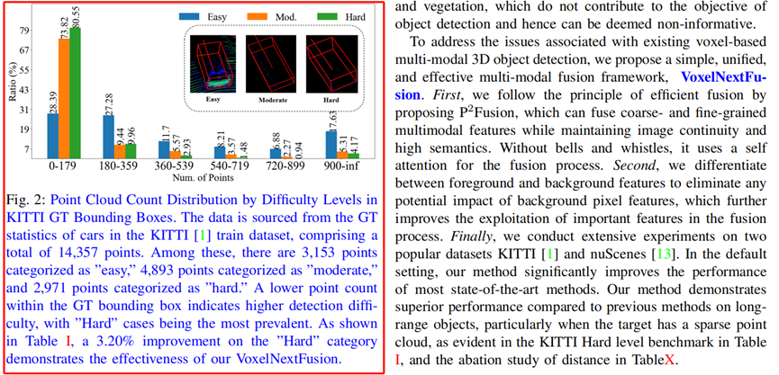

# KITTI 上 “easy”，“mod.”,"hard"数量分布



```python
import pathlib
import pickle

import numpy as np

# from ...ops.iou3d_nms import iou3d_nms_utils
# from ...utils import box_utils
import time
import copy
import random


db_info_path = '/data/zhanggl/sda/sda/szy/VirConv/data/kitti2/kitti_dbinfos_train.pkl'

with open(str(db_info_path), 'rb') as f:
    infos = pickle.load(f)
    # import pdb;pdb.set_trace()
    # if infos["Car"]
    car_count=0
    car_easy_count=0
    car_easy_count_0_59=0
    car_easy_count_60_119=0
    car_easy_count_120_179=0
    car_easy_count_180_239=0
    car_easy_count_240_299=0
    car_easy_count_300_359=0
    car_easy_count_360_419=0
    car_easy_count_420_479=0
    car_easy_count_480_539=0
    car_easy_count_540_599=0
    car_easy_count_600_659=0
    car_easy_count_660_719=0
    car_easy_count_720_779=0
    car_easy_count_780_839=0
    car_easy_count_840_899=0
    car_easy_count_900_959=0
    car_easy_count_960_inf=0
    car_mod_count=0
    car_mod_count_0_59=0
    car_mod_count_60_119=0
    car_mod_count_120_179=0
    car_mod_count_180_239=0
    car_mod_count_240_299=0
    car_mod_count_300_359=0
    car_mod_count_360_419=0
    car_mod_count_420_479=0
    car_mod_count_480_539=0
    car_mod_count_540_599=0
    car_mod_count_600_659=0
    car_mod_count_660_719=0
    car_mod_count_720_779=0
    car_mod_count_780_839=0
    car_mod_count_840_899=0
    car_mod_count_900_959=0
    car_mod_count_960_inf=0
    car_hard_count=0
    car_hard_count_0_59=0
    car_hard_count_60_119=0
    car_hard_count_120_179=0
    car_hard_count_180_239=0
    car_hard_count_240_299=0
    car_hard_count_300_359=0
    car_hard_count_360_419=0
    car_hard_count_420_479=0
    car_hard_count_480_539=0
    car_hard_count_540_599=0
    car_hard_count_600_659=0
    car_hard_count_660_719=0
    car_hard_count_720_779=0
    car_hard_count_780_839=0
    car_hard_count_840_899=0
    car_hard_count_900_959=0
    car_hard_count_960_inf=0
    for info in infos["Car"]:
        car_count+=1
        if info["difficulty"]==0:
            car_easy_count+=1
            if info["num_points_in_gt"]>=0 and info["num_points_in_gt"]<=59:
                car_easy_count_0_59+=1
            if info["num_points_in_gt"]>=60 and info["num_points_in_gt"]<=119:
                car_easy_count_60_119+=1
            if info["num_points_in_gt"]>=120 and info["num_points_in_gt"]<=179:
                car_easy_count_120_179+=1
            if info["num_points_in_gt"]>=180 and info["num_points_in_gt"]<=239:
                car_easy_count_180_239+=1            
            if info["num_points_in_gt"]>=240 and info["num_points_in_gt"]<=299:
                car_easy_count_240_299+=1
            if info["num_points_in_gt"]>=300 and info["num_points_in_gt"]<=359:
                car_easy_count_300_359+=1
            if info["num_points_in_gt"]>=360 and info["num_points_in_gt"]<=419:
                car_easy_count_360_419+=1
            if info["num_points_in_gt"]>=420 and info["num_points_in_gt"]<=479:
                car_easy_count_420_479+=1
            if info["num_points_in_gt"]>=480 and info["num_points_in_gt"]<=539:
                car_easy_count_480_539+=1
            if info["num_points_in_gt"]>=540 and info["num_points_in_gt"]<=599:
                car_easy_count_540_599+=1
            if info["num_points_in_gt"]>=600 and info["num_points_in_gt"]<=659:
                car_easy_count_600_659+=1            
            if info["num_points_in_gt"]>=660 and info["num_points_in_gt"]<=719:
                car_easy_count_660_719+=1            
            if info["num_points_in_gt"]>=720 and info["num_points_in_gt"]<=779:
                car_easy_count_720_779+=1            
            if info["num_points_in_gt"]>=780 and info["num_points_in_gt"]<=839:
                car_easy_count_780_839+=1            
            if info["num_points_in_gt"]>=840 and info["num_points_in_gt"]<=899:
                car_easy_count_840_899+=1            
            if info["num_points_in_gt"]>=900 and info["num_points_in_gt"]<=959:
                car_easy_count_900_959+=1
            if info["num_points_in_gt"]>=960:
                car_easy_count_960_inf+=1
        if info["difficulty"]==1:
            car_mod_count+=1
            if info["num_points_in_gt"]>=0 and info["num_points_in_gt"]<=59:
                car_mod_count_0_59+=1
            if info["num_points_in_gt"]>=60 and info["num_points_in_gt"]<=119:
                car_mod_count_60_119+=1
            if info["num_points_in_gt"]>=120 and info["num_points_in_gt"]<=179:
                car_mod_count_120_179+=1
            if info["num_points_in_gt"]>=180 and info["num_points_in_gt"]<=239:
                car_mod_count_180_239+=1            
            if info["num_points_in_gt"]>=240 and info["num_points_in_gt"]<=299:
                car_mod_count_240_299+=1
            if info["num_points_in_gt"]>=300 and info["num_points_in_gt"]<=359:
                car_mod_count_300_359+=1
            if info["num_points_in_gt"]>=360 and info["num_points_in_gt"]<=419:
                car_mod_count_360_419+=1
            if info["num_points_in_gt"]>=420 and info["num_points_in_gt"]<=479:
                car_mod_count_420_479+=1
            if info["num_points_in_gt"]>=480 and info["num_points_in_gt"]<=539:
                car_mod_count_480_539+=1
            if info["num_points_in_gt"]>=540 and info["num_points_in_gt"]<=599:
                car_mod_count_540_599+=1
            if info["num_points_in_gt"]>=600 and info["num_points_in_gt"]<=659:
                car_mod_count_600_659+=1            
            if info["num_points_in_gt"]>=660 and info["num_points_in_gt"]<=719:
                car_mod_count_660_719+=1            
            if info["num_points_in_gt"]>=720 and info["num_points_in_gt"]<=779:
                car_mod_count_720_779+=1            
            if info["num_points_in_gt"]>=780 and info["num_points_in_gt"]<=839:
                car_mod_count_780_839+=1            
            if info["num_points_in_gt"]>=840 and info["num_points_in_gt"]<=899:
                car_mod_count_840_899+=1            
            if info["num_points_in_gt"]>=900 and info["num_points_in_gt"]<=959:
                car_mod_count_900_959+=1
            if info["num_points_in_gt"]>=960:
                car_mod_count_960_inf+=1
        if info["difficulty"]==2:
            car_hard_count+=1
            if info["num_points_in_gt"]>=0 and info["num_points_in_gt"]<=59:
                car_hard_count_0_59+=1
            if info["num_points_in_gt"]>=60 and info["num_points_in_gt"]<=119:
                car_hard_count_60_119+=1
            if info["num_points_in_gt"]>=120 and info["num_points_in_gt"]<=179:
                car_hard_count_120_179+=1
            if info["num_points_in_gt"]>=180 and info["num_points_in_gt"]<=239:
                car_hard_count_180_239+=1            
            if info["num_points_in_gt"]>=240 and info["num_points_in_gt"]<=299:
                car_hard_count_240_299+=1
            if info["num_points_in_gt"]>=300 and info["num_points_in_gt"]<=359:
                car_hard_count_300_359+=1
            if info["num_points_in_gt"]>=360 and info["num_points_in_gt"]<=419:
                car_hard_count_360_419+=1
            if info["num_points_in_gt"]>=420 and info["num_points_in_gt"]<=479:
                car_hard_count_420_479+=1
            if info["num_points_in_gt"]>=480 and info["num_points_in_gt"]<=539:
                car_hard_count_480_539+=1
            if info["num_points_in_gt"]>=540 and info["num_points_in_gt"]<=599:
                car_hard_count_540_599+=1
            if info["num_points_in_gt"]>=600 and info["num_points_in_gt"]<=659:
                car_hard_count_600_659+=1            
            if info["num_points_in_gt"]>=660 and info["num_points_in_gt"]<=719:
                car_hard_count_660_719+=1            
            if info["num_points_in_gt"]>=720 and info["num_points_in_gt"]<=779:
                car_hard_count_720_779+=1            
            if info["num_points_in_gt"]>=780 and info["num_points_in_gt"]<=839:
                car_hard_count_780_839+=1            
            if info["num_points_in_gt"]>=840 and info["num_points_in_gt"]<=899:
                car_hard_count_840_899+=1            
            if info["num_points_in_gt"]>=900 and info["num_points_in_gt"]<=959:
                car_hard_count_900_959+=1
            if info["num_points_in_gt"]>=960:
                car_hard_count_960_inf+=1
        print("--------------------------------")
        print(info["num_points_in_gt"],info["difficulty"])
        print("----------------")
    print(
    car_count,
    "easy",
    car_easy_count,
    car_easy_count_0_59+
    car_easy_count_60_119+
    car_easy_count_120_179,
    car_easy_count_180_239+
    car_easy_count_240_299+
    car_easy_count_300_359,
    car_easy_count_360_419+
    car_easy_count_420_479+
    car_easy_count_480_539,
    car_easy_count_540_599+
    car_easy_count_600_659+
    car_easy_count_660_719,
    car_easy_count_720_779+
    car_easy_count_780_839+
    car_easy_count_840_899,
    car_easy_count_900_959+
    car_easy_count_960_inf,
    "mod",
    car_mod_count,
    car_mod_count_0_59+
    car_mod_count_60_119+
    car_mod_count_120_179,
    car_mod_count_180_239+
    car_mod_count_240_299+
    car_mod_count_300_359,
    car_mod_count_360_419+
    car_mod_count_420_479+
    car_mod_count_480_539,
    car_mod_count_540_599+
    car_mod_count_600_659+
    car_mod_count_660_719,
    car_mod_count_720_779+
    car_mod_count_780_839+
    car_mod_count_840_899,
    car_mod_count_900_959+
    car_mod_count_960_inf,
    "hard",
    car_hard_count,
    car_hard_count_0_59+
    car_hard_count_60_119+
    car_hard_count_120_179,
    car_hard_count_180_239+
    car_hard_count_240_299+
    car_hard_count_300_359,
    car_hard_count_360_419+
    car_hard_count_420_479+
    car_hard_count_480_539,
    car_hard_count_540_599+
    car_hard_count_600_659+
    car_hard_count_660_719,
    car_hard_count_720_779+
    car_hard_count_780_839+
    car_hard_count_840_899,
    car_hard_count_900_959+
    car_hard_count_960_inf,
    )

        # del info["name"]
        # del info["path"]
        # del info["gt_idx"]
        # del info["box3d_lidar"]
        # del info["bbox"]
        # del info["score"]


        # with open('infos.txt', 'a', encoding='utf-8') as f:
        #     f.write(str({"num_points_in_gt":info["num_points_in_gt"],"difficulty":info["difficulty"]}))
    # for cls in class_names:
    #     if cls in infos.keys():
    #         self.db_infos[cls].extend(infos[cls])
    # if self.use_van:
    #     if 'Van' in infos.keys():
    #         self.db_infos['Van'].extend(infos['Van'])


# infos是一个dict 具体结构如下
#
# 1: cls name : ['Pedestrian', 'Car', 'Cyclist', 'Van', 'Truck', 'Tram', 'Misc', 'Person_sitting']
# 2: gt instance  例如：当前文件有14357个car
# 3: ['name', 'path', 'image_idx', 'gt_idx', 'box3d_lidar', 'num_points_in_gt', 'difficulty', 'bbox', 'score']
# 4:
#  box3d_lidar: shape of [7]
#  num_points_in_gt: 点的个数
#  difficulty: 
#               0: easy 
#               1: mod. 
#               2: hard
#  bbox: 2D bbox
#  score: 置信度 -1 默认gt就是-1
```


> 更新: 2023-11-02 17:17:54  
> 原文: <https://3dcv.yuque.com/org-wiki-3dcv-mm1l0t/ysgfp9/cnqkgbcx8w4h3lpe>