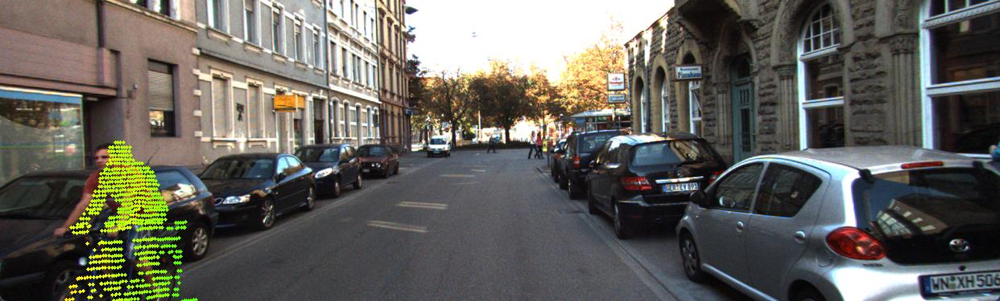
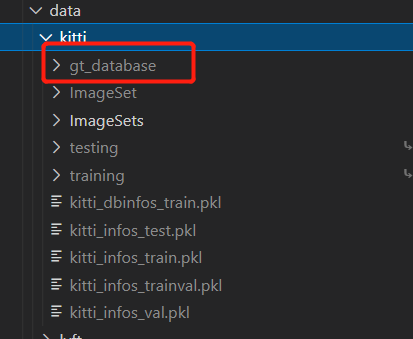
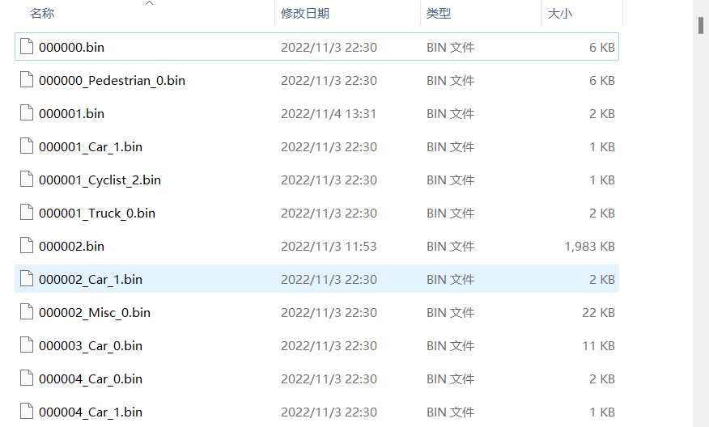
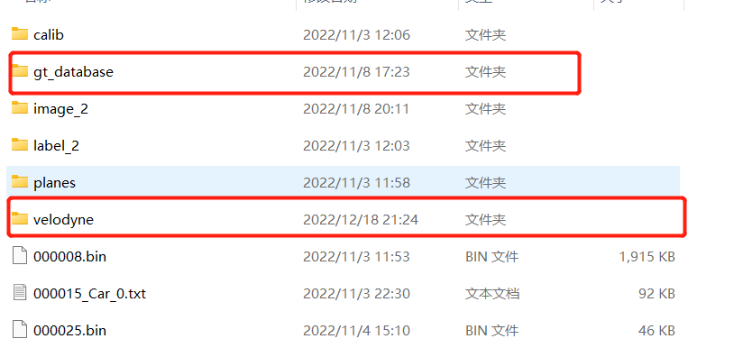

# KITTI数据集去掉背景点可视化（服务器没有显示器，使用本地电脑）

KITTI数据集去掉背景点可视化如下图

思路：首先要获取ground truths 3D边界框中被检测目标的点云数据，然后将这些数据投影到图片上。

1. 获取框中的点云数据

在划分KITTI 数据集时会生成一些.pkl文件和 gt\_database文件夹，在gt\_database文件夹中就包含了所需要的点云数据。

由于在生成gt\_database文件夹时，会将框内的点的坐标转化为局部坐标导致投影失败，在生成gt\_database文件夹之前首先对 kitti\_dataset.py (OpenPCDet/pcdet/datasets/kitti/kitti\_dataset.py) 这个文件处理一下。

gt\_points\[:, :3] -= gt\_boxes\[i, :3]  大概在代码中 257行，将这句注释掉。该句的主要作用是将第i个box内点转化为局部坐标。

执行`python -m pcdet.datasets.kitti.kitti_dataset create_kitti_infos tools/cfgs/dataset_configs/kitti_dataset.yaml` 生成所需要的 gt\_database文件夹，然后下载到本地进行可视化。

gt\_database文件夹包含每个目标的点云数据。

如果需要将分散的.bin文件合并可以使用 UBIN软件来实现。

2. 将点云数据投影到图片上

将点云数据投影到图片上，需要选取gt\_database中.bin文件重命名然后放在velodne文件夹下。

完成准备工作，使用可视化工具kitti\_object\_vis进行可视化，详见可视化工具kitti\_object\_vis部分内容。

> 更新: 2023-05-05 14:05:15  
> 原文: <https://3dcv.yuque.com/org-wiki-3dcv-mm1l0t/ysgfp9/bvu6y82t7zhkssu5_tr2x3k>