# python 制作柱状图 折线图

画图神器  
[https://gallery.pyecharts.org/#/Bar3D/bar3d_stack](https://gallery.pyecharts.org/#/Bar3D/bar3d_stack)   
  
1。柱状图

```python
import matplotlib.pyplot as plt

size_of_data = 17
size_of_legend = 17
size_of_others = 36
name_list = ['Car', 'Ped.', 'Cyc.']
# 'Camera+LiDAR','Camera+Radar','R+L'
# num_list = [1.5,0.6,7.8,6]
plt.figure(figsize=(19.20, 9.81))  # 分辨率大小 1920 * 981
plt.rc('font', family='Times New Roman')
plt.subplot(1, 2, 1)

plt.tick_params(axis='y', labelsize=size_of_others)
plt.ylim(40, 92)
plt.title("3D", fontsize=size_of_others)

# 3d的数据
PointPillars = [74.92, 44.5, 59.19]  # [Car, Ped, Cyc] # PointPillars
PointPillars_GCN = [75.35, 52.09, 61.97]  # PintPillars+RIFusion
SECOND = [76.91, 51.46, 64.85]  # SECOND
SECOND_GCN = [77.00, 57.15, 68.01]  # SECOND + RIFusion
PointRCNN = [79.01, 55.84, 68.73]  # PartA2
PointRCNN_GCN = [79.07, 55.93, 72.39]  # PartA2 + RIFusion

# num_list1 = [1,2,3,1]
x = list(range(len(PointPillars)))
print(x)

width = 0.14
color = ['#0099b477', '#0099b4ff', '#925e9f77', '#925e9fFF', '#42B54077', '#42B540FF'] # 依次6个颜色
cidx = 0
# plt.bar(x, PointPillars, width=width, label='PointPillars', fc='lightskyblue', edgecolor='lightskyblue', lw=0.05)
plt.bar(x, PointPillars, width=width, label='PointPillars', color=color[cidx], lw=0.05)
cidx += 1
for i, j in zip(x, PointPillars):
    plt.text(i, j + 0.01, "%.2f" % j, ha="center", va="bottom", fontsize=size_of_data, rotation=90)

for i in range(len(x)):
    x[i] = x[i] + width
plt.bar(x, PointPillars_GCN, width=width, label='RI-Fusion PointPillars', color=color[cidx], lw=0.1)
cidx += 1
for i, j in zip(x, PointPillars_GCN):
    plt.text(i, j + 0.01, "%.2f" % j, ha="center", va="bottom", fontsize=size_of_data, rotation=90)

for i in range(len(x)):
    x[i] = x[i] + width
plt.bar(x, SECOND, width=width, label='SECOND', color=color[cidx], lw=0.1)
cidx += 1
for i, j in zip(x, SECOND):
    plt.text(i, j + 0.01, "%.2f" % j, ha="center", va="bottom", fontsize=size_of_data, rotation=90)

for i in range(len(x)):
    x[i] = x[i] + width
plt.bar(x, SECOND_GCN, width=width, label='RI-Fusion SECOND', color=color[cidx], lw=0.1)
cidx += 1
for i, j in zip(x, SECOND_GCN):
    plt.text(i, j + 0.01, "%.2f" % j, ha="center", va="bottom", fontsize=size_of_data, rotation=90)

for i in range(len(x)):
    x[i] = x[i] + width
plt.bar(x, PointRCNN, width=width, label='PartA\u00b2', color=color[cidx], lw=0.1)
cidx += 1
for i, j in zip(x, PointRCNN):
    plt.text(i, j + 0.01, "%.2f" % j, ha="center", va="bottom", fontsize=size_of_data, rotation=90)

for i in range(len(x)):
    x[i] = x[i] + width
plt.bar(x, PointRCNN_GCN, width=width, label='RI-Fusion PartA\u00b2', color=color[cidx], lw=0.05)
cidx += 1
for i, j in zip(x, PointRCNN_GCN):
    plt.text(i, j + 0.01, "%.2f" % j, ha="center", va="bottom", fontsize=size_of_data, rotation=90)

print(x)
print(x + [1, 1 + width, 1 + 1 * width])
plt.xticks([0.34, 1.34, 2.34], name_list, fontsize=size_of_others)
# plt.bar(x+[2,2+2*width,2+4*width],height=0,tick_label=name_list)

plt.ylabel('Performance(AP)', fontsize=size_of_others)

plt.legend(loc='upper right', fontsize=size_of_legend)

plt.subplot(1, 2, 2)
plt.tick_params(axis='y', labelsize=size_of_others)
plt.ylim(40, 100)
plt.title("BEV", fontsize=size_of_others)
# bev的数据
PointPillars = [85.26, 52.53, 63.10]  # [Car, Ped, Cyc] # PointPillars
PointPillars_GCN = [86.30, 57.26, 64.25]  # PintPillars+RIFusion
SECOND = [87.12, 60.20, 68.93]  # SECOND
SECOND_GCN = [86.38, 61.91, 72.16]  # SECOND + RIFusion
PointRCNN = [88.02, 57.77, 71.55]  # PartA2
PointRCNN_GCN = [87.92, 58.69, 79.06]  # PartA2 + RIFusion

# num_list1 = [1,2,3,1]
x = list(range(len(PointPillars)))
print(x)

width = 0.14
cidx = 0
plt.bar(x, PointPillars, width=width, label='PointPillars', color=color[cidx], lw=0.05)
cidx += 1
for i, j in zip(x, PointPillars):
    plt.text(i, j + 0.01, "%.2f" % j, ha="center", va="bottom", fontsize=size_of_data, rotation=90)

for i in range(len(x)):
    x[i] = x[i] + width
plt.bar(x, PointPillars_GCN, width=width, label='RI-Fusion PointPillars', color=color[cidx], lw=0.1)
cidx += 1
for i, j in zip(x, PointPillars_GCN):
    plt.text(i, j + 0.01, "%.2f" % j, ha="center", va="bottom", fontsize=size_of_data, rotation=90)

for i in range(len(x)):
    x[i] = x[i] + width
plt.bar(x, SECOND, width=width, label='SECOND', color=color[cidx], lw=0.1)
cidx += 1
for i, j in zip(x, SECOND):
    plt.text(i, j + 0.01, "%.2f" % j, ha="center", va="bottom", fontsize=size_of_data, rotation=90)

for i in range(len(x)):
    x[i] = x[i] + width
plt.bar(x, SECOND_GCN, width=width, label='RI-Fusion SECOND', color=color[cidx], lw=0.1)
cidx += 1
for i, j in zip(x, SECOND_GCN):
    plt.text(i, j + 0.01, "%.2f" % j, ha="center", va="bottom", fontsize=size_of_data, rotation=90)

for i in range(len(x)):
    x[i] = x[i] + width
plt.bar(x, PointRCNN, width=width, label='PartA\u00b2', color=color[cidx], lw=0.1)
cidx += 1
for i, j in zip(x, PointRCNN):
    plt.text(i, j + 0.01, "%.2f" % j, ha="center", va="bottom", fontsize=size_of_data, rotation=90)

for i in range(len(x)):
    x[i] = x[i] + width
plt.bar(x, PointRCNN_GCN, width=width, label='RI-Fusion PartA\u00b2', color=color[cidx], lw=0.05)
cidx += 1
for i, j in zip(x, PointRCNN_GCN):
    plt.text(i, j + 0.01, "%.2f" % j, ha="center", va="bottom", fontsize=size_of_data, rotation=90)

print(x)
print(x + [1, 1 + width, 1 + 1 * width])
plt.xticks([0.34, 1.34, 2.34], name_list, fontsize=size_of_others)
# plt.bar(x+[2,2+2*width,2+4*width],height=0,tick_label=name_list)
# plt.ylabel('Performance(AP)',fontsize=55)
plt.legend(loc='upper right', fontsize=size_of_legend)

plt.savefig("BarChart.pdf")
plt.show()
```


2.折线图

```python
import matplotlib.pyplot as plt
from pylab import *  # 支持中文
import numpy as np

size_of_data = 17
size_of_legend = 22
size_of_others = 36
mpl.rcParams['font.sans-serif'] = ['Times New Roman']
plt.rc('font', family='Times New Roman')
plt.figure(figsize=(16.00, 9.81))  # 分辨率大小 1920 * 981
names = ['1/3', '1/2', '2/3', '3/4', '1']
x = range(len(names))
y1 = [75.21, 73.69, 75.35, 72.66, 64.84]  # car
y2 = [50.10, 50.87, 52.09, 50.10, 43.97]  # ped
y3 = [59.41, 60.76, 61.97, 59.85, 55.95]  # cyc
# plt.plot(x, y, 'ro-')
# plt.plot(x, y1, 'bo-')
plt.xlim(-0.3, 4.3)  # 限定横轴的范围
plt.ylim(38, 82)  # 限定纵轴的范围
plt.plot(x, y1, marker='o', ms=12, linewidth=4, label=u'Car', )
plt.plot(x, y2, marker='o', ms=12, linewidth=4, label=u'Pedestrian')
plt.plot(x, y3, marker='o', ms=12, linewidth=4, label=u'Cyclist')
plt.tick_params(axis='y', labelsize=size_of_others)
plt.tick_params(axis='x', labelsize=size_of_others)
plt.legend(loc='upper right', fontsize=size_of_legend)  # 让图例生效
plt.xticks(x, names, rotation=0)
plt.margins(0)
plt.subplots_adjust(bottom=0.15)
plt.xlabel(u"Crop Size", fontsize=size_of_others)  # X轴标签
plt.ylabel("3D AP(%)", fontsize=size_of_others)  # Y轴标签
plt.title(" ", fontsize=size_of_others)  # 标题

y = [50, 60, 70]
for yi in y:
    xbg = np.arange(-0.5, 100, 0.05)
    ybg = np.repeat(yi, len(xbg))
    plt.plot(xbg, ybg, '--k', linewidth=2)
ax = plt.gca()
ax.spines['right'].set_color('k')
ax.spines['top'].set_color('k')
ax.spines['bottom'].set_color('k')
ax.spines['left'].set_color('k')
ax.spines['right'].set_linewidth(3)
ax.spines['top'].set_linewidth(3)
ax.spines['bottom'].set_linewidth(3)
ax.spines['left'].set_linewidth(3)

plt.savefig("LineChart.pdf")
plt.show()
```


3.

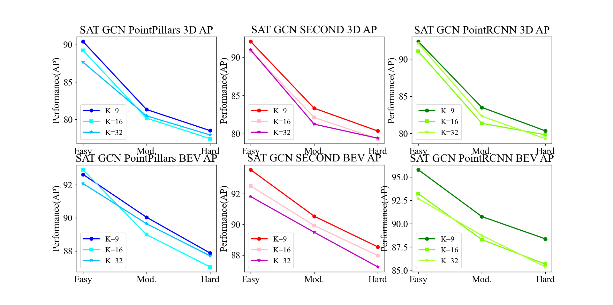

```python
import matplotlib.pyplot as plt
plt.rc('font',family='Times New Roman')

plt.subplot(2,3,1)

plt.title("SAT GCN PointPillars 3D AP",fontsize=20)
# 横坐标
x = ['Easy','Mod.','Hard']

PointPillars9_3D  =[ 90.42, 81.33, 78.51] 
PointPillars16_3D =[ 89.24, 80.17, 77.43]
PointPillars32_3D =[ 87.66 ,80.48 ,77.93]


plt.plot(x, PointPillars9_3D, linewidth=2, color="blue", marker="o",label="K=9")
plt.plot(x, PointPillars16_3D, linewidth=2, color="Aqua", marker="s",label="K=16")
plt.plot(x, PointPillars32_3D, linewidth=2, color="deepskyblue", marker="*",label="K=32")


plt.tick_params(axis='both', labelsize=17)
plt.ylabel('Performance(AP)',fontsize=17)
plt.legend(loc='lower left',fontsize=14)


plt.subplot(2,3,4)

plt.title("SAT GCN PointPillars BEV AP",fontsize=20)
# 横坐标
x = ['Easy','Mod.','Hard']


PointPillars9  =[  92.63, 90.04, 87.88] 
PointPillars16 =[  92.91, 88.99, 87.04]
PointPillars32 =[  92.08 ,89.65, 87.71]


plt.plot(x, PointPillars9, linewidth=2, color="blue", marker="o",label="K=9")
plt.plot(x, PointPillars16, linewidth=2, color="Aqua", marker="s",label="K=16")
plt.plot(x, PointPillars32, linewidth=2, color="deepskyblue", marker="*",label="K=32")


plt.tick_params(axis='both', labelsize=17)
plt.ylabel('Performance(AP)',fontsize=17)
plt.legend(loc='lower left',fontsize=14)


plt.subplot(2,3,2)

plt.title("SAT GCN SECOND 3D AP",fontsize=20)
# 横坐标
x = ['Easy','Mod.','Hard']

SECOND9  =[ 92.07, 83.32, 80.34] 
SECOND16 =[ 90.86 ,82.10 ,79.33]
SECOND32 =[ 90.97 ,81.23, 79.39]


plt.plot(x, SECOND9, linewidth=2, color="red", marker="o",label="K=9")
plt.plot(x, SECOND16, linewidth=2, color="pink", marker="s",label="K=16")
plt.plot(x, SECOND32, linewidth=2, color="m", marker="*",label="K=32")


plt.tick_params(axis='both', labelsize=17)
plt.ylabel('Performance(AP)',fontsize=17)
plt.legend(loc='lower left',fontsize=14)


plt.subplot(2,3,5)

plt.title("SAT GCN SECOND BEV AP",fontsize=20)
# 横坐标
x = ['Easy','Mod.','Hard']


SECOND9_BEV  =[  93.57, 90.54, 88.54] 
SECOND16_BEV =[  92.51 ,89.93, 87.97]
SECOND32_BEV =[  91.82, 89.49, 87.23]


plt.plot(x, SECOND9_BEV, linewidth=2, color="red", marker="o",label="K=9")
plt.plot(x, SECOND16_BEV, linewidth=2, color="pink", marker="s",label="K=16")
plt.plot(x, SECOND32_BEV, linewidth=2, color="m", marker="*",label="K=32")


plt.tick_params(axis='both', labelsize=17)
plt.ylabel('Performance(AP)',fontsize=17)
plt.legend(loc='lower left',fontsize=14)


plt.subplot(2,3,3)

plt.title("SAT GCN PointRCNN 3D AP",fontsize=20)
# 横坐标
x = ['Easy','Mod.','Hard']

PointRCNN9  =[ 92.37, 83.51 ,80.36] 
PointRCNN16 =[ 91.05 ,81.37, 79.83]
PointRCNN32 =[ 92.12 ,82.32 ,79.31]


plt.plot(x, PointRCNN9, linewidth=2, color="green", marker="o",label="K=9")
plt.plot(x, PointRCNN16, linewidth=2, color="lawngreen", marker="s",label="K=16")
plt.plot(x, PointRCNN32, linewidth=2, color="greenyellow", marker="*",label="K=32")


plt.tick_params(axis='both', labelsize=17)
plt.ylabel('Performance(AP)',fontsize=17)
plt.legend(loc='lower left',fontsize=14)


plt.subplot(2,3,6)

plt.title("SAT GCN PointRCNN BEV AP",fontsize=20)
# 横坐标
x = ['Easy','Mod.','Hard']


PointRCNN9_BEV  =[  95.77 ,90.76 ,88.38] 
PointRCNN16_BEV =[  93.21 ,88.30, 85.67]
PointRCNN32_BEV =[  92.67, 88.75 ,85.38]


plt.plot(x, PointRCNN9_BEV, linewidth=2, color="green", marker="o",label="K=9")
plt.plot(x, PointRCNN16_BEV, linewidth=2, color="lawngreen", marker="s",label="K=16")
plt.plot(x, PointRCNN32_BEV, linewidth=2, color="greenyellow", marker="*",label="K=32")


plt.tick_params(axis='both', labelsize=17)
plt.ylabel('Performance(AP)',fontsize=17)
plt.legend(loc='lower left',fontsize=14)


plt.show()
```


4.VP-Net文章采用的（没有截好图）

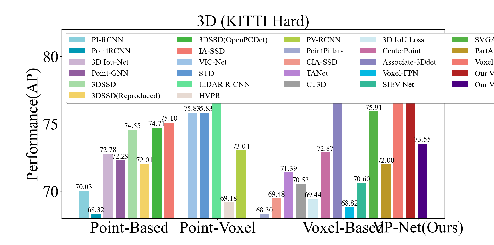

```python
import matplotlib.pyplot as plt

size_of_data = 17
size_of_legend = 17
size_of_others = 36
name_list = ['Point-Based', 'Point-Voxel', 'Voxel-Based','VP-Net(Ours)']
# 'Camera+LiDAR','Camera+Radar','R+L'
# num_list = [1.5,0.6,7.8,6]
plt.figure(figsize=(23.70, 9.81))  # 分辨率大小 1920 * 981
plt.rc('font', family='Times New Roman')

plt.tick_params(axis='y', labelsize=size_of_others)
plt.ylim(68, 82)
plt.title("3D (KITTI Hard)", fontsize=size_of_others)

COND = [70.03]  # PI-RCNN
COND_GCN = [68.32]  # PointRCNN
intRCNN = [72.78]  # 3D Iou-Net
intRCNN_GCN = [72.29]  # Point-GNN
intNet = [74.55] # 3DSSD
D = [72.01] #3DSSD(Reproduced)
PR = [74.71]# 3DSSD(OpenPCDet)
CNet = [75.10]# IA-SSD

PointPillars = [75.83]  # VIC-Net
PointPillars_GCN = [75.83]  # STD
ointRCNN = [76.82]  # PV-RCNN
SD = [69.18] #3DSSD(Reproduced)
ICNet = [73.04]# IA-SSD

SECOND = [68.30]  # PointPillars
SECOND_GCN = [69.48]  # CenterPoint
PointRCNN = [71.39]  # 3D Iou Loss
PointRCNN_GCN = [70.53]  # Associate-3Ddet
PointNet = [69.44] # Voxel-FPN
SSD = [72.87] #CIA-SSD
HVPR = [77.16]# CT3D
VICNet = [68.82]# TANet
VoxelFpn = [70.60]# SIEV-Net
SVGA = [75.91]# SVGA-Net
Part = [72.00]# PartA2
Voxel = [77.06]# Voxel RCNN
VPVoxel = [79.65]# Our VPNet(Voxel)
VPPillars = [73.55]# Our VPNet(Pillars)


# num_list1 = [1,2,3,1]
x = list(range(len(COND)))
print(x)

width = 0.07
color = ['#0099b477', '#0099b4ff', '#925e9f77', '#925e9fFF', '#42B54077', '#F3D266', '#42B540FF', '#F27970','#9DC3E7', '#5F97D2', '#63E398', '#E7DAD2', '#B1CE46'
         , '#A1A9D0', '#F0988C', '#B883D4', '#9E9E9E', '#CFEAF1', '#C76DA2', '#8983BF', '#05B9E2', '#32B897', '#54B345', '#BB9727'
         , '#F27970', '#B22222', '#4B0082'] # 依次6个颜色

cidx = 0

plt.bar(x, COND, width=width, label='PI-RCNN', color=color[cidx], lw=0.05)
cidx += 1
for i, j in zip(x, COND):
    plt.text(i, j + 0.01, "%.2f" % j, ha="center", va="bottom", fontsize=size_of_data, rotation=0)

for i in range(len(x)):
    x[i] = x[i] + 0.3*width

for i in range(len(x)):
    x[i] = x[i] + width
plt.bar(x, COND_GCN, width=width, label='PointRCNN', color=color[cidx], lw=0.1)
cidx += 1
for i, j in zip(x, COND_GCN):
    plt.text(i, j + 0.01, "%.2f" % j, ha="center", va="bottom", fontsize=size_of_data, rotation=0)

for i in range(len(x)):
    x[i] = x[i] + 0.3*width

for i in range(len(x)):
    x[i] = x[i] + width
plt.bar(x, intRCNN, width=width, label='3D Iou-Net', color=color[cidx], lw=0.1)
cidx += 1
for i, j in zip(x, intRCNN):
    plt.text(i, j + 0.01, "%.2f" % j, ha="center", va="bottom", fontsize=size_of_data, rotation=0)

for i in range(len(x)):
    x[i] = x[i] + 0.3*width

for i in range(len(x)):
    x[i] = x[i] + width
plt.bar(x, intRCNN_GCN, width=width, label='Point-GNN', color=color[cidx], lw=0.1)
cidx += 1
for i, j in zip(x, intRCNN_GCN):
    plt.text(i, j + 0.01, "%.2f" % j, ha="center", va="bottom", fontsize=size_of_data, rotation=0)

for i in range(len(x)):
    x[i] = x[i] + 0.3*width

for i in range(len(x)):
    x[i] = x[i] + width
plt.bar(x, intNet, width=width, label='3DSSD', color=color[cidx], lw=0.1)
cidx += 1
for i, j in zip(x, intNet):
    plt.text(i, j + 0.01, "%.2f" % j, ha="center", va="bottom", fontsize=size_of_data, rotation=0)

for i in range(len(x)):
    x[i] = x[i] + 0.3*width

for i in range(len(x)):
    x[i] = x[i] + width
plt.bar(x, D, width=width, label='3DSSD(Reproduced)', color=color[cidx], lw=0.1)
cidx += 1
for i, j in zip(x, D):
    plt.text(i, j + 0.01, "%.2f" % j, ha="center", va="bottom", fontsize=size_of_data, rotation=0)

for i in range(len(x)):
    x[i] = x[i] + 0.3*width

for i in range(len(x)):
    x[i] = x[i] + width
plt.bar(x, PR, width=width, label='3DSSD(OpenPCDet)', color=color[cidx], lw=0.1)
cidx += 1
for i, j in zip(x, PR):
    plt.text(i, j + 0.01, "%.2f" % j, ha="center", va="bottom", fontsize=size_of_data, rotation=0)

for i in range(len(x)):
    x[i] = x[i] + 0.3*width

for i in range(len(x)):
    x[i] = x[i] + width
plt.bar(x, CNet, width=width, label='IA-SSD', color=color[cidx], lw=0.1)
cidx += 1
for i, j in zip(x, CNet):
    plt.text(i, j + 0.01, "%.2f" % j, ha="center", va="bottom", fontsize=size_of_data, rotation=0)

for i in range(len(x)):
    x[i] = x[i] + 1.5*width


for i in range(len(x)):
    x[i] = x[i] + width
plt.bar(x, PointPillars, width=width, label='VIC-Net', color=color[cidx], lw=0.1)
cidx += 1
for i, j in zip(x, PointPillars):
    plt.text(i, j + 0.01, "%.2f" % j, ha="center", va="bottom", fontsize=size_of_data, rotation=0)

for i in range(len(x)):
    x[i] = x[i] + 0.3*width

for i in range(len(x)):
    x[i] = x[i] + width
plt.bar(x, PointPillars_GCN, width=width, label='STD', color=color[cidx], lw=0.1)
cidx += 1
for i, j in zip(x, PointPillars_GCN):
    plt.text(i, j + 0.01, "%.2f" % j, ha="center", va="bottom", fontsize=size_of_data, rotation=0)

for i in range(len(x)):
    x[i] = x[i] + 0.3*width

for i in range(len(x)):
    x[i] = x[i] + width
plt.bar(x, ointRCNN, width=width, label='LiDAR R-CNN', color=color[cidx], lw=0.1)
cidx += 1
for i, j in zip(x, ointRCNN):
    plt.text(i, j + 0.01, "%.2f" % j, ha="center", va="bottom", fontsize=size_of_data, rotation=0)

for i in range(len(x)):
    x[i] = x[i] + 0.3*width

for i in range(len(x)):
    x[i] = x[i] + width
plt.bar(x, SD , width=width, label='HVPR', color=color[cidx], lw=0.1)
cidx += 1
for i, j in zip(x, SD ):
    plt.text(i, j + 0.01, "%.2f" % j, ha="center", va="bottom", fontsize=size_of_data, rotation=0)

for i in range(len(x)):
    x[i] = x[i] + 0.3*width

for i in range(len(x)):
    x[i] = x[i] + width
plt.bar(x, ICNet, width=width, label='PV-RCNN', color=color[cidx], lw=0.1)
cidx += 1
for i, j in zip(x, ICNet):
    plt.text(i, j + 0.01, "%.2f" % j, ha="center", va="bottom", fontsize=size_of_data, rotation=0)

for i in range(len(x)):
    x[i] = x[i] + 1.5*width

for i in range(len(x)):
    x[i] = x[i] + width
plt.bar(x, SECOND, width=width, label='PointPillars', color=color[cidx], lw=0.1)
cidx += 1
for i, j in zip(x, SECOND):
    plt.text(i, j + 0.01, "%.2f" % j, ha="center", va="bottom", fontsize=size_of_data, rotation=0)

for i in range(len(x)):
    x[i] = x[i] + 0.3*width

for i in range(len(x)):
    x[i] = x[i] + width
plt.bar(x, SECOND_GCN, width=width, label='CIA-SSD', color=color[cidx], lw=0.1)
cidx += 1
for i, j in zip(x, SECOND_GCN):
    plt.text(i, j + 0.01, "%.2f" % j, ha="center", va="bottom", fontsize=size_of_data, rotation=0)

for i in range(len(x)):
    x[i] = x[i] + 0.3*width

for i in range(len(x)):
    x[i] = x[i] + width
plt.bar(x, PointRCNN, width=width, label='TANet', color=color[cidx], lw=0.1)
cidx += 1
for i, j in zip(x, PointRCNN):
    plt.text(i, j + 0.01, "%.2f" % j, ha="center", va="bottom", fontsize=size_of_data, rotation=0)

for i in range(len(x)):
    x[i] = x[i] + 0.3*width

for i in range(len(x)):
    x[i] = x[i] + width
plt.bar(x, PointRCNN_GCN, width=width, label='CT3D', color=color[cidx], lw=0.1)
cidx += 1
for i, j in zip(x, PointRCNN_GCN):
    plt.text(i, j + 0.01, "%.2f" % j, ha="center", va="bottom", fontsize=size_of_data, rotation=0)

for i in range(len(x)):
    x[i] = x[i] + 0.3*width

for i in range(len(x)):
    x[i] = x[i] + width
plt.bar(x, PointNet, width=width, label='3D IoU Loss', color=color[cidx], lw=0.1)
cidx += 1
for i, j in zip(x, PointNet):
    plt.text(i, j + 0.01, "%.2f" % j, ha="center", va="bottom", fontsize=size_of_data, rotation=0)

for i in range(len(x)):
    x[i] = x[i] + 0.3*width

for i in range(len(x)):
    x[i] = x[i] + width
plt.bar(x, SSD, width=width, label='CenterPoint', color=color[cidx], lw=0.1)
cidx += 1
for i, j in zip(x, SSD):
    plt.text(i, j + 0.01, "%.2f" % j, ha="center", va="bottom", fontsize=size_of_data, rotation=0)

for i in range(len(x)):
    x[i] = x[i] + 0.3*width

for i in range(len(x)):
    x[i] = x[i] + width
plt.bar(x, HVPR, width=width, label='Associate-3Ddet', color=color[cidx], lw=0.1)
cidx += 1
for i, j in zip(x, HVPR):
    plt.text(i, j + 0.01, "%.2f" % j, ha="center", va="bottom", fontsize=size_of_data, rotation=0)

for i in range(len(x)):
    x[i] = x[i] + 0.3*width

for i in range(len(x)):
    x[i] = x[i] + width
plt.bar(x, VICNet, width=width, label='Voxel-FPN', color=color[cidx], lw=0.1)
cidx += 1
for i, j in zip(x, VICNet):
    plt.text(i, j + 0.01, "%.2f" % j, ha="center", va="bottom", fontsize=size_of_data, rotation=0)

for i in range(len(x)):
    x[i] = x[i] + 0.3*width

for i in range(len(x)):
    x[i] = x[i] + width
plt.bar(x, VoxelFpn, width=width, label='SIEV-Net', color=color[cidx], lw=0.1)
cidx += 1
for i, j in zip(x, VoxelFpn):
    plt.text(i, j + 0.01, "%.2f" % j, ha="center", va="bottom", fontsize=size_of_data, rotation=0)

for i in range(len(x)):
    x[i] = x[i] + 0.3*width

for i in range(len(x)):
    x[i] = x[i] + width
plt.bar(x, SVGA, width=width, label='SVGA-Net', color=color[cidx], lw=0.1)
cidx += 1
for i, j in zip(x, SVGA):
    plt.text(i, j + 0.01, "%.2f" % j, ha="center", va="bottom", fontsize=size_of_data, rotation=0)

for i in range(len(x)):
    x[i] = x[i] + 0.3*width

for i in range(len(x)):
    x[i] = x[i] + width
plt.bar(x, Part, width=width, label='PartA2\u00b2', color=color[cidx], lw=0.1)
cidx += 1
for i, j in zip(x, Part):
    plt.text(i, j + 0.01, "%.2f" % j, ha="center", va="bottom", fontsize=size_of_data, rotation=0)

for i in range(len(x)):
    x[i] = x[i] + 0.3*width

for i in range(len(x)):
    x[i] = x[i] + width
plt.bar(x, Voxel, width=width, label='Voxel RCNN', color=color[cidx], lw=0.1)
cidx += 1
for i, j in zip(x, Voxel):
    plt.text(i, j + 0.01, "%.2f" % j, ha="center", va="bottom", fontsize=size_of_data, rotation=0)

for i in range(len(x)):
    x[i] = x[i] + 0.3*width

for i in range(len(x)):
    x[i] = x[i] + width
plt.bar(x, VPVoxel, width=width, label='Our VP-Net(Voxel)', color=color[cidx], lw=0.1)
cidx += 1
for i, j in zip(x, VPVoxel):
    plt.text(i, j + 0.01, "%.2f" % j, ha="center", va="bottom", fontsize=size_of_data, rotation=0)

for i in range(len(x)):
    x[i] = x[i] + 0.3*width

for i in range(len(x)):
    x[i] = x[i] + width
plt.bar(x, VPPillars, width=width, label='Our VP-Net(Pillar)', color=color[cidx], lw=0.1)
cidx += 1
for i, j in zip(x, VPPillars):
    plt.text(i, j + 0.01, "%.2f" % j, ha="center", va="bottom", fontsize=size_of_data, rotation=0)

print(x)
print(x + [1, 1 + width, 1 + 1 * width])
plt.xticks([0.34, 1.00, 1.94,2.50], name_list, fontsize=size_of_others,color="black")
# plt.bar(x+[2,2+2*width,2+4*width],height=0,tick_label=name_list)

plt.ylabel('Performance(AP)', fontsize=size_of_others)

# plt.legend(loc='upper right', fontsize=size_of_legend)

plt.legend(loc="upper left", ncol=5, shadow=True, fancybox=True,fontsize=18)


# plt.savefig("Bar.pdf")
plt.show()
```


5.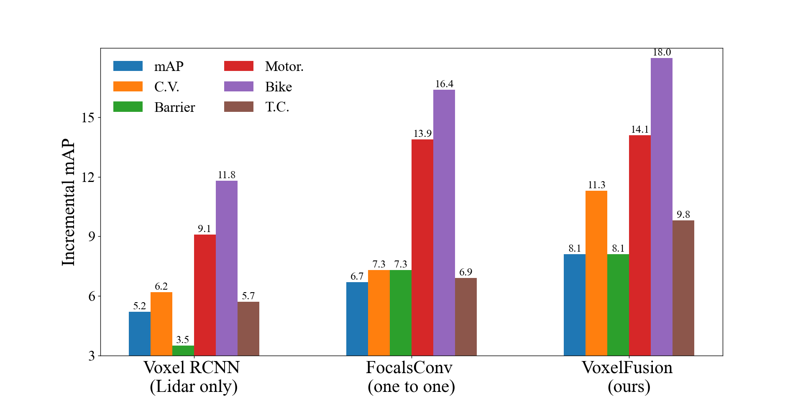

```python
import numpy as np
import matplotlib.pyplot as plt
plt.rc('font',family='Times New Roman')
# 数据
plt.ylim(3,18.5)

# scenes = ['70 scenes (0.1)','175 scenes (0.25)','700 scenes (full)']
AP1 = [ 5.2, 6.7, 8.1] 
AP2 = [ 6.2, 7.3, 11.3] 
AP3 = [ 3.5, 7.3, 8.1] 
AP4 = [ 9.1, 13.9, 14.1] 
AP5 = [ 11.8, 16.4, 18.0] 
AP6 = [ 5.7, 6.9, 9.8] 
bar_width = 0.1
x = np.arange(3)
# 绘图 x 表示 从那里开始
plt.bar(x, AP1, bar_width,label="mAP")
plt.bar(x+bar_width, AP2, bar_width, align="center",label="C.V.")
plt.bar(x+2*bar_width, AP3, bar_width, align="center",label="Barrier")
plt.bar(x+3*bar_width, AP4, bar_width, align="center",label="Motor.")
plt.bar(x+4*bar_width, AP5, bar_width, align="center",label="Bike")
plt.bar(x+5*bar_width, AP6, bar_width, align="center",label="T.C.")
plt.rc('font',family='Times New Roman')
# 展示图片
plt.tick_params(axis='both', labelsize=20)
plt.ylabel('Incremental mAP',fontsize=25)
plt.yticks([])
a = [0.25,1.25,2.25]
labels = ['Voxel RCNN \n(Lidar only)','FocalsConv \n(one to one)','VoxelFusion \n(ours)']
b=np.arange(3,18,3)
plt.xticks(a,labels,rotation = 0,fontsize=25,font="Times New Roman")
plt.yticks(b,rotation = 0, fontsize=20,font="Times New Roman")
plt.legend(loc='upper left',fontsize=20,ncol=2,frameon=False,shadow=False)
for x,y in zip(a, AP1):
    print(x,y)
    plt.text(x-2.5*bar_width,y,y,ha="center", va="bottom", fontsize=15,rotation=360) 
for x,y in zip(a, AP2):
    print(x,y)
    plt.text(x-1.5*bar_width,y,y,ha="center", va="bottom", fontsize=15,rotation=360) 
for x,y in zip(a, AP3):
    print(x,y)
    plt.text(x-0.5*bar_width,y,y,ha="center", va="bottom", fontsize=15,rotation=360) 
for x,y in zip(a, AP4):
    print(x,y)
    plt.text(x+0.5*bar_width,y,y,ha="center", va="bottom", fontsize=15,rotation=360) 
for x,y in zip(a, AP5):
    print(x,y)
    plt.text(x+1.5*bar_width,y,y,ha="center", va="bottom", fontsize=15,rotation=360) 
for x,y in zip(a, AP6):
    print(x,y)
    plt.text(x+2.5*bar_width,y,y,ha="center", va="bottom", fontsize=15,rotation=360) 


plt.show()
```


6.PR 曲线图 from KBS SAT-GCN

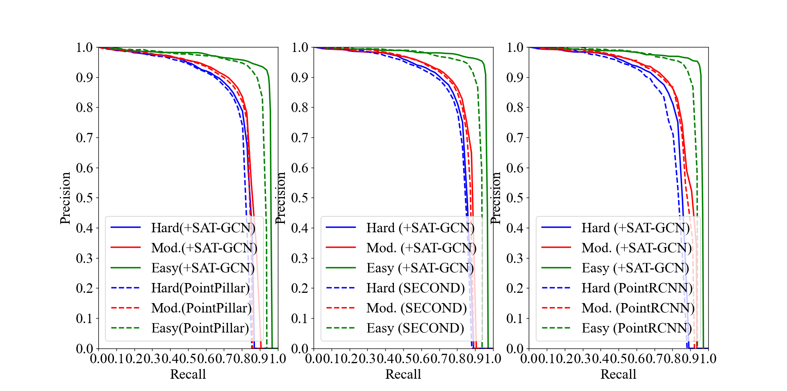

```python
import os

import cv2
import numpy as np
import time
import open3d as o3d
from data.kitti_Dataset import Kitti_Dataset


from pathlib import Path
import argparse
parser = argparse.ArgumentParser()
parser.add_argument('--index', type=str, default=None, help='index for the label data', required=True)
args = parser.parse_args()

# 根据偏航角计算旋转矩阵（逆时针旋转）
def rot_y(rotation_y):
    cos = np.cos(rotation_y)
    sin = np.sin(rotation_y)
    R = np.array([[cos, 0, sin], [0, 1, 0], [-sin, 0, cos]])
    return R


def draw_3dframeworks(vis,points):

    position = points
    points_box = np.transpose(position)

    lines_box = np.array([[0, 1], [1, 2], [0, 3], [2, 3], [4, 5], [4, 7], [5, 6], [6, 7],
                          [0, 4], [1, 5], [2, 6], [3, 7], [0, 5], [1, 4]])
    colors = np.array([[1., 0., 1.] for j in range(len(lines_box))])
    line_set = o3d.geometry.LineSet()

    line_set.points = o3d.utility.Vector3dVector(points_box)
    line_set.lines = o3d.utility.Vector2iVector(lines_box)
    line_set.colors = o3d.utility.Vector3dVector(colors)


    render_option.line_width = 50.0
    vis.update_geometry(line_set)
    render_option.background_color = np.asarray([1, 1, 1])
    # vis.get_render_option().load_from_json('renderoption_1.json')
    render_option.point_size = 1
    #param = o3d.io.read_pinhole_camera_parameters('BV.json')


    print(render_option)
    ctr = vis.get_view_control()

    vis.add_geometry(line_set)
    #ctr.convert_from_pinhole_camera_parameters(param)
    vis.update_geometry(line_set)
    vis.update_renderer()

if __name__ == "__main__":
    dir_path ="data/object"
    # dir_path = Path(args.path_dataset)
    index = args.index
    index = int(index)
    # split = "kitti"
    split = "training"
    dataset = Kitti_Dataset(dir_path, split=split)

    vis = o3d.visualization.Visualizer()
    vis.create_window(width=771, height=867)

    obj = dataset.get_labels(index)
    img3_d = dataset.get_rgb(index)
    calib1 = dataset.get_calib(index)
    pc = dataset.get_pcs(index)
    print(img3_d.shape)
    point_cloud = o3d.geometry.PointCloud()

    point_cloud.points = o3d.utility.Vector3dVector(pc)
    point_cloud.paint_uniform_color([0, 0/255, 0/255])
    vis.add_geometry(point_cloud)
    render_option = vis.get_render_option()
    render_option.line_width = 40

    for obj_index in range(len(obj)):
        if obj[obj_index].name == "Car" or obj[obj_index].name == "Pedestrian" or obj[obj_index].name == "Cyclist":
            # 阈值设置 ioc 
            # 如果需要显示自己的trainninglabel结果，需要取消这样的注释，并取消object3d.py最后一行的注释
            if (obj[obj_index].name == "Car" and obj[obj_index].ioc >= 0.7) or  obj[obj_index].ioc > 0.5:
                R = rot_y(obj[obj_index].rotation_y)
                h, w, l = obj[obj_index].dimensions[0], obj[obj_index].dimensions[1], obj[obj_index].dimensions[2]
                x = [l / 2, l / 2, -l / 2, -l / 2, l / 2, l / 2, -l / 2, -l / 2]
                y = [0, 0, 0, 0, -h, -h, -h, -h]
                # y = [h / 2, h / 2, h / 2, h / 2, -h / 2, -h / 2, -h / 2, -h / 2]
                z = [w / 2, -w / 2, -w / 2, w / 2, w / 2, -w / 2, -w / 2, w / 2]
                # 得到目标物体经过旋转之后的实际尺寸（得到其在相机坐标系下的实际尺寸）
                corner_3d = np.vstack([x, y, z])
                corner_3d = np.dot(R, corner_3d)

                # 将该物体移动到相机坐标系下的原点处（涉及到坐标的移动，直接相加就行）
                corner_3d[0, :] += obj[obj_index].location[0]
                corner_3d[1, :] += obj[obj_index].location[1]
                corner_3d[2, :] += obj[obj_index].location[2]
                corner_3d = np.vstack((corner_3d, np.zeros((1, corner_3d.shape[-1]))))
                corner_3d[-1][-1] = 1


                inv_Tr = np.zeros_like(calib1.Tr_velo_to_cam)
                inv_Tr[0:3, 0:3] = np.transpose(calib1.Tr_velo_to_cam[0:3, 0:3])
                inv_Tr[0:3, 3] = np.dot(-np.transpose(calib1.Tr_velo_to_cam[0:3, 0:3]), calib1.Tr_velo_to_cam[0:3, 3])

                Y = np.dot(inv_Tr, corner_3d)

                draw_3dframeworks(vis, Y)

    vis.run()
```


7.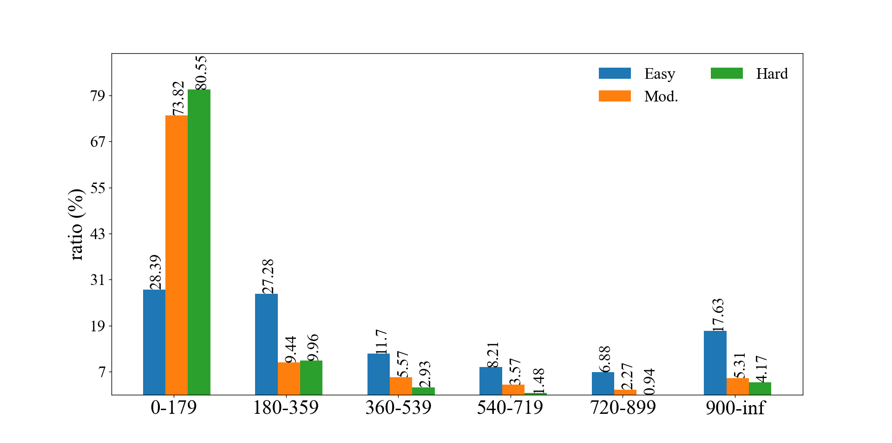

```python
import numpy as np
import matplotlib.pyplot as plt
plt.rc('font',family='Times New Roman')
# 数据
plt.ylim(1,90)


easy = [ 28.39,27.28,11.70,  8.21, 6.88, 17.63] 
mod  = [ 73.82,9.44,  5.57,  3.57, 2.27, 5.31 ] 
hard = [ 80.55,9.96,  2.93,  1.48, 0.94, 4.17 ] 

bar_width = 0.2
x = np.arange(6)
# 绘图 x 表示 从那里开始
plt.bar(x, easy, bar_width,label="Easy")
plt.bar(x+bar_width, mod, bar_width, align="center",label="Mod.")
plt.bar(x+2*bar_width, hard, bar_width, align="center",label="Hard")
plt.rc('font',family='Times New Roman')
# 展示图片
plt.tick_params(axis='both', labelsize=20)
plt.ylabel('ratio (%)',fontsize=25)
plt.yticks([])
a = [0.175,1.175,2.175,3.175,4.175,5.175]
labels = ['0-179','180-359','360-539','540-719','720-899','900-inf']
b=np.arange(7,84,12)
plt.xticks(a,labels,rotation = 0,fontsize=25,font="Times New Roman")
plt.yticks(b,rotation = 0, fontsize=20,font="Times New Roman")
plt.legend(loc='upper right',fontsize=20,ncol=2,frameon=False,shadow=False)
for x,y in zip(a, easy):
    print(x,y)
    plt.text(x-0.75*bar_width,y,y,ha="center", va="bottom", fontsize=20,rotation=90) 
for x,y in zip(a, mod):
    print(x,y)
    plt.text(x+0.25*bar_width,y,y,ha="center", va="bottom", fontsize=20,rotation=90) 
for x,y in zip(a, hard):
    print(x,y)
    plt.text(x+1.25*bar_width,y,y,ha="center", va="bottom", fontsize=20,rotation=90) 


plt.show()
```


8.综述，性能对比[@宋子盈](undefined/songziying-u6civ)

[附件: dian.ipynb](./attachments/clD20ZqTCpAhm0w6/dian.ipynb)[附件: zhu.ipynb](./attachments/clD20ZqTCpAhm0w6/zhu.ipynb)

240311  综述内的两部分图修改过非常多的版本，之前放的是老版本的，现在arxiv上挂出去的图的代码来自上面的文件。代码都整理过，比较整齐，每张子图写一个格子，涉及到fps的显卡换算。拉到本地直接能用。drawio的文件传不到这上面来（压缩了也不行）。

柱状图6子图+折线图6子图，最后使用drawio将所有子图组织在一起。没将所有子图直接使用py生成的原因有2:保持图像清晰度并尽可能缩小图像的空间占用，overleaf对于较大的图插入进去后会有奇奇怪怪的错误；以及修改和操控起来比较方便。

所有子图如下：

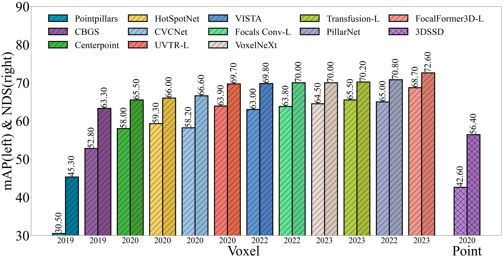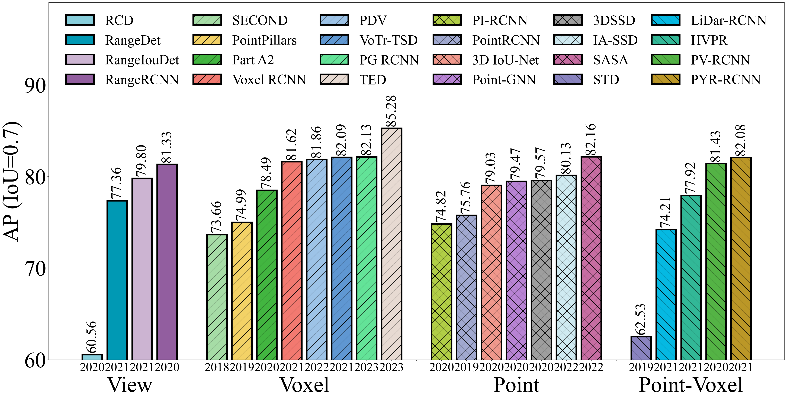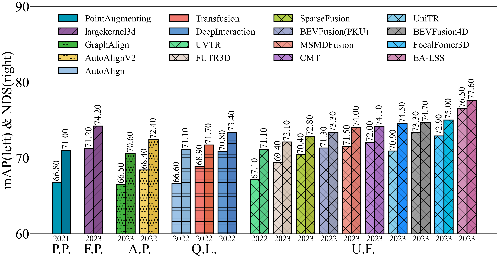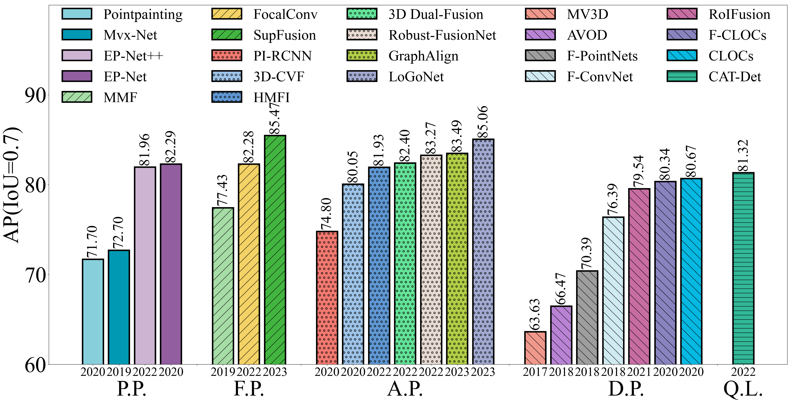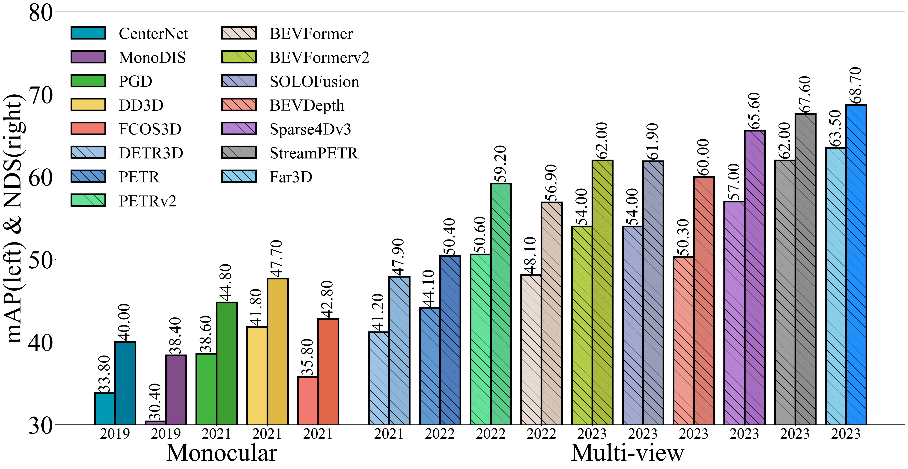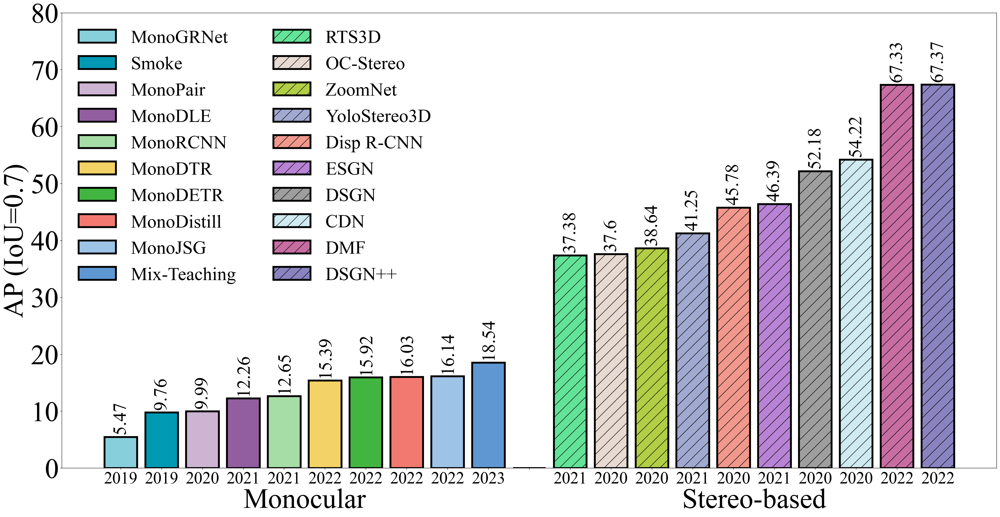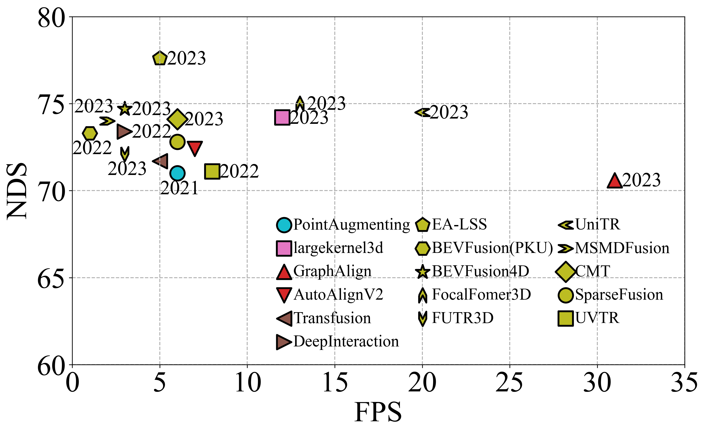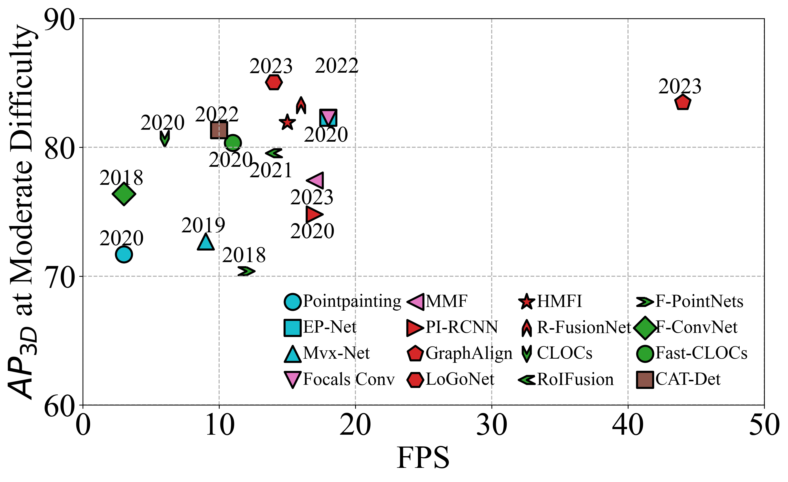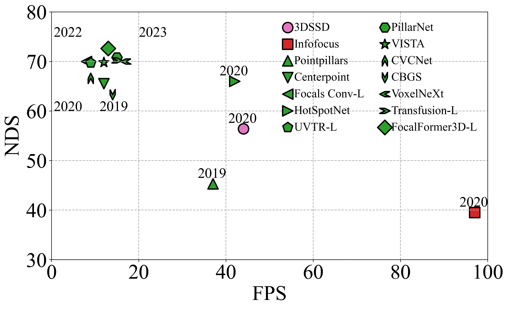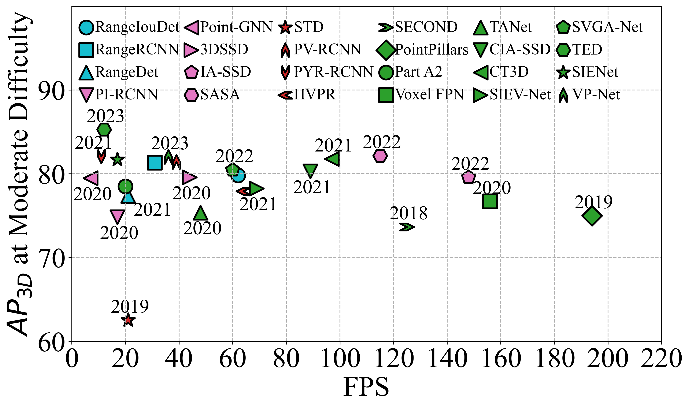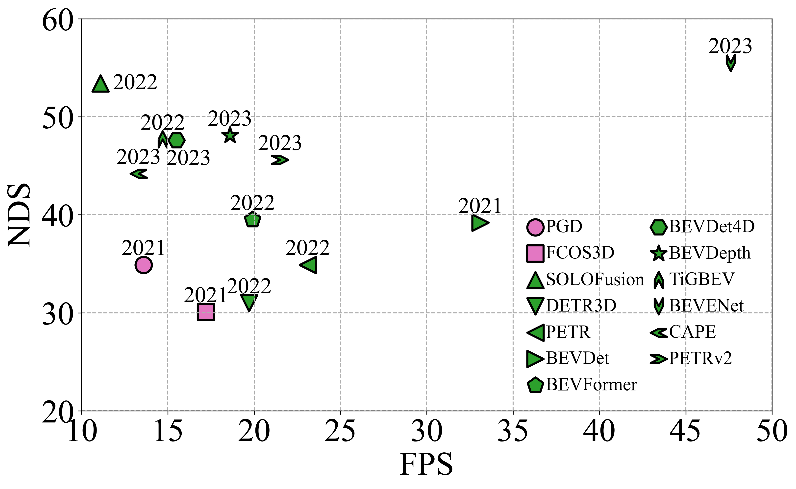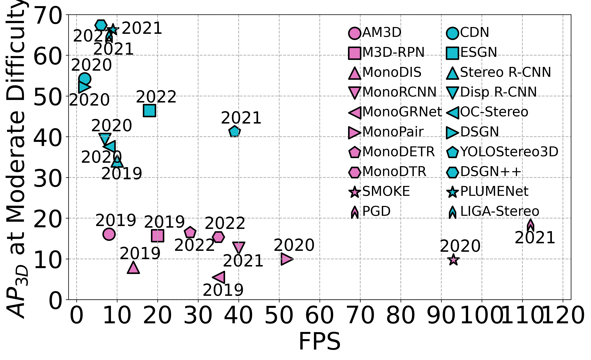


9. eccv，动机图（也许是旧版）[@刘林](undefined/liulin-5zsmd)

[附件: dongji1.ipynb](./attachments/clD20ZqTCpAhm0w6/dongji1.ipynb)[附件: dongji3.ipynb](./attachments/clD20ZqTCpAhm0w6/dongji3.ipynb)[附件: dongji2.ipynb](./attachments/clD20ZqTCpAhm0w6/dongji2.ipynb)

三张图的高度是同尺寸的，拼在一起的时候无需考虑字体大小之类的，都比较和谐，要改的话记得一起改掉。

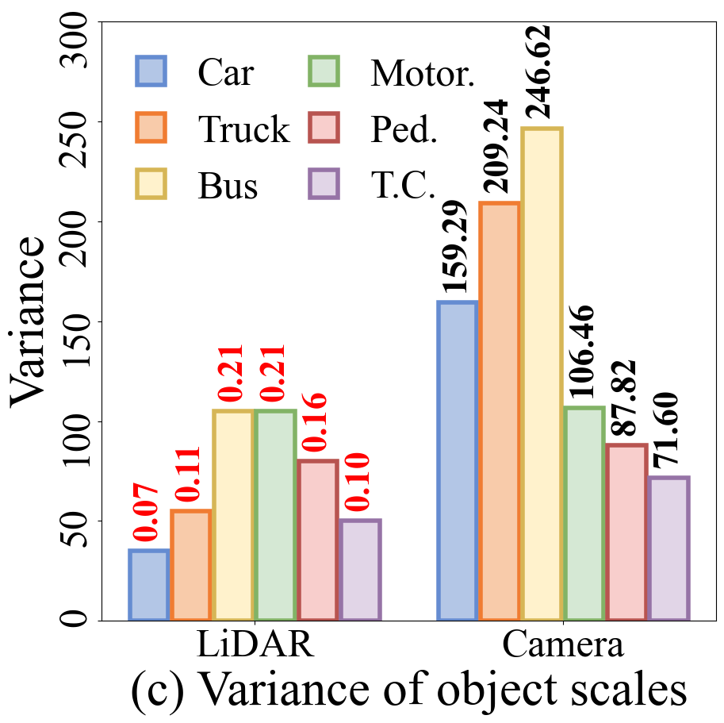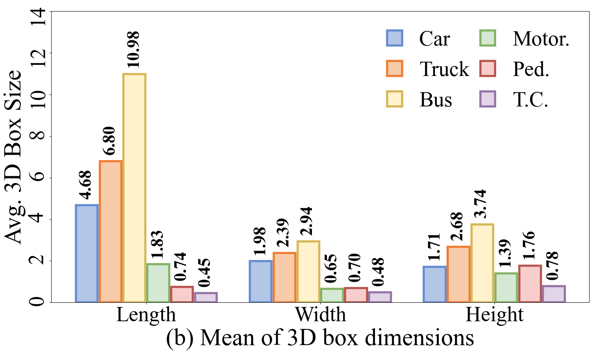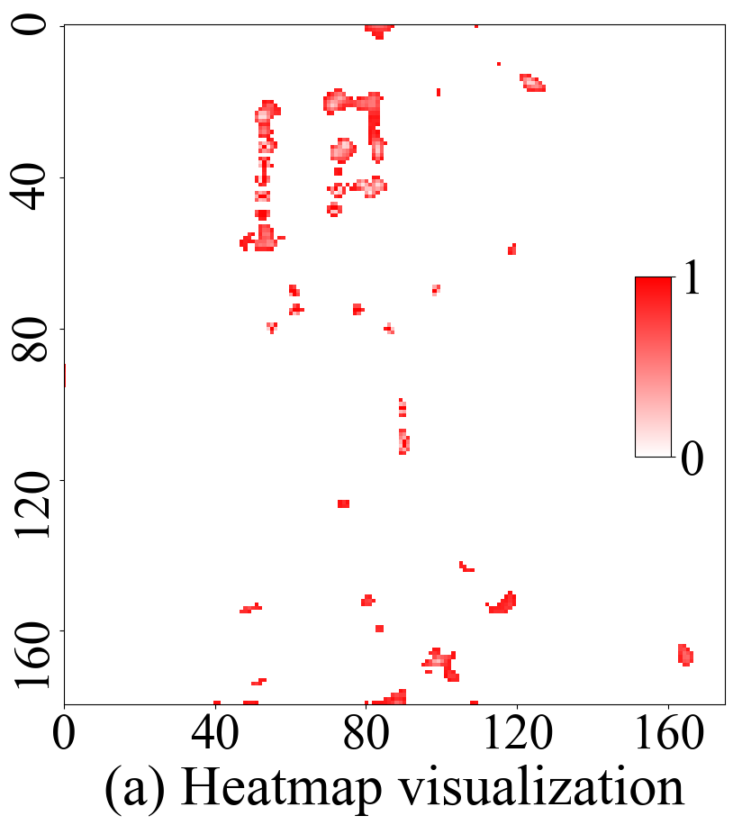


10. 杨磊 车路协同统计图

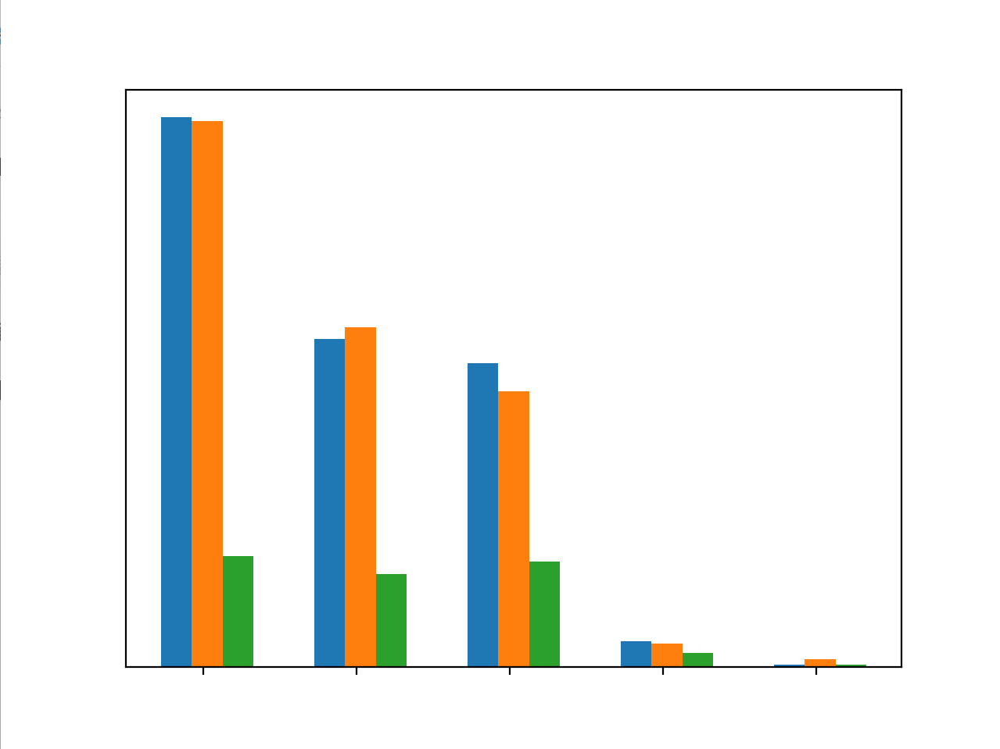

```plain
import numpy as np
import matplotlib.pyplot as plt
plt.rc('font',family='Times New Roman')
# 数据
# plt.ylim(1,90)


easy = [ 32861, 19639, 18184,  1566, 137] 
mod  = [ 32637, 20312, 16503,  1411, 507] 
hard = [ 6665,  5582,   6331,  880,  159] 

bar_width = 0.2
x = np.arange(5)
# 绘图 x 表示 从那里开始
plt.bar(x, easy, bar_width,label="Coop")
plt.bar(x+bar_width, mod, bar_width, align="center",label="Infra")
plt.bar(x+2*bar_width, hard, bar_width, align="center",label="Veh")
plt.rc('font',family='Times New Roman')
# 展示图片
plt.tick_params(axis='both', labelsize=20)
# plt.ylabel('ratio (%)',fontsize=25)
plt.yticks([])
a = [0.175,1.175,2.175,3.175,4.175]
# labels = ['0-179','180-359','360-539','540-719','720-899','900-inf']
labels = ['','','','','']
b=np.arange(7,84,12)
plt.xticks(a,labels,rotation = 0,fontsize=25,font="Times New Roman")
# plt.yticks(b,rotation = 0, fontsize=20,font="Times New Roman")
# plt.legend(loc='upper right',fontsize=20,ncol=1,frameon=False,shadow=False)
# for x,y in zip(a, easy):
#     print(x,y)
#     plt.text(x-0.75*bar_width,y,y,ha="center", va="bottom", fontsize=20,rotation=90) 
# for x,y in zip(a, mod):
#     print(x,y)
#     plt.text(x+0.25*bar_width,y,y,ha="center", va="bottom", fontsize=20,rotation=90) 
# for x,y in zip(a, hard):
#     print(x,y)
#     plt.text(x+1.25*bar_width,y,y,ha="center", va="bottom", fontsize=20,rotation=90) 


plt.show()
```

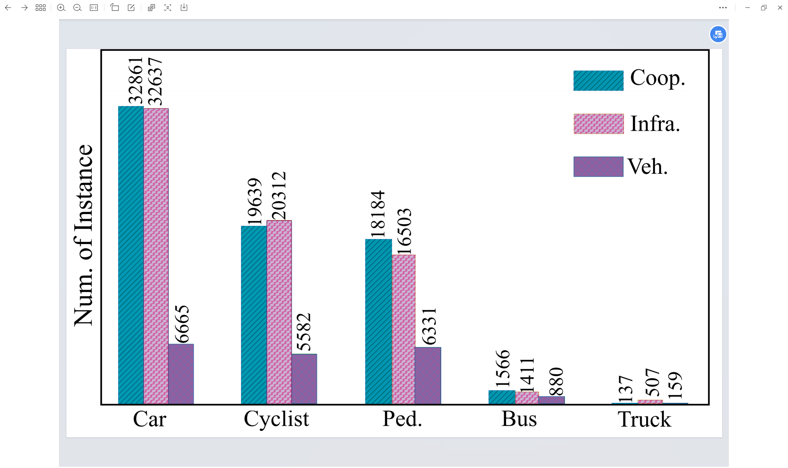


> 更新: 2024-07-21 18:42:05  
> 原文: <https://3dcv.yuque.com/org-wiki-3dcv-mm1l0t/ysgfp9/egmrelwpxsexxdzg_gebru3>