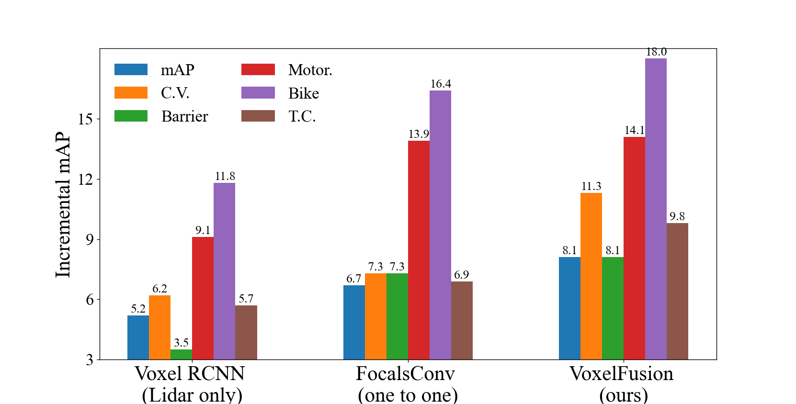
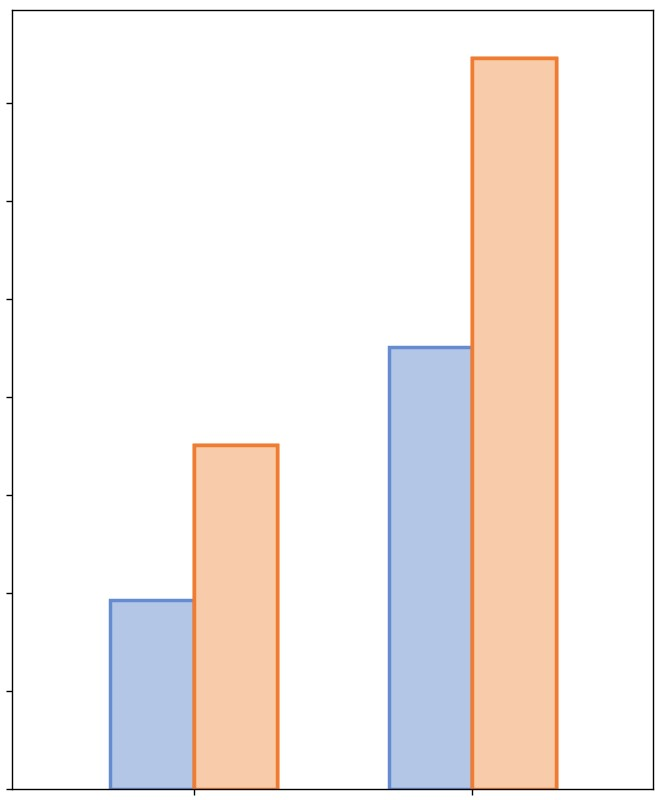

# 可视化柱状对比精度图 副本

效果如下  
  
代码：

```plain

import numpy as np
import matplotlib.pyplot as plt
plt.rc('font',family='Times New Roman')
# 数据
plt.ylim(3,18.5)

# scenes = ['70 scenes (0.1)','175 scenes (0.25)','700 scenes (full)']
AP1 = [ 5.2, 6.7, 8.1] 
AP2 = [ 6.2, 7.3, 11.3] 
AP3 = [ 3.5, 7.3, 8.1] 
AP4 = [ 9.1, 13.9, 14.1] 
AP5 = [ 11.8, 16.4, 18.0] 
AP6 = [ 5.7, 6.9, 9.8] 
bar_width = 0.1
x = np.arange(3)
# 绘图 x 表示 从那里开始
plt.bar(x, AP1, bar_width,label="mAP")
plt.bar(x+bar_width, AP2, bar_width, align="center",label="C.V.")
plt.bar(x+2*bar_width, AP3, bar_width, align="center",label="Barrier")
plt.bar(x+3*bar_width, AP4, bar_width, align="center",label="Motor.")
plt.bar(x+4*bar_width, AP5, bar_width, align="center",label="Bike")
plt.bar(x+5*bar_width, AP6, bar_width, align="center",label="T.C.")
plt.rc('font',family='Times New Roman')
# 展示图片
plt.tick_params(axis='both', labelsize=20)
plt.ylabel('Incremental mAP',fontsize=25)
plt.yticks([])
a = [0.25,1.25,2.25]
labels = ['Voxel RCNN \n(Lidar only)','FocalsConv \n(one to one)','VoxelFusion \n(ours)']
b=np.arange(3,18,3)
plt.xticks(a,labels,rotation = 0,fontsize=25,font="Times New Roman")
plt.yticks(b,rotation = 0, fontsize=20,font="Times New Roman")
plt.legend(loc='upper left',fontsize=20,ncol=2,frameon=False,shadow=False)
for x,y in zip(a, AP1):
    print(x,y)
    plt.text(x-2.5*bar_width,y,y,ha="center", va="bottom", fontsize=15,rotation=360) 
for x,y in zip(a, AP2):
    print(x,y)
    plt.text(x-1.5*bar_width,y,y,ha="center", va="bottom", fontsize=15,rotation=360) 
for x,y in zip(a, AP3):
    print(x,y)
    plt.text(x-0.5*bar_width,y,y,ha="center", va="bottom", fontsize=15,rotation=360) 
for x,y in zip(a, AP4):
    print(x,y)
    plt.text(x+0.5*bar_width,y,y,ha="center", va="bottom", fontsize=15,rotation=360) 
for x,y in zip(a, AP5):
    print(x,y)
    plt.text(x+1.5*bar_width,y,y,ha="center", va="bottom", fontsize=15,rotation=360) 
for x,y in zip(a, AP6):
    print(x,y)
    plt.text(x+2.5*bar_width,y,y,ha="center", va="bottom", fontsize=15,rotation=360) 


plt.show()

```


另一版本代码：

```plain
import numpy as np
import matplotlib.pyplot as plt

# 字体
font_size = 10

# 数据
categories = ['', '']
baseline1 = [3.85, 9.02]
ours = [7.02, 14.92]

# 颜色设置
color1 = [179 / 255, 198 / 255, 230 / 255]
color2 = [248 / 255, 203 / 255, 170 / 255]
color1_edge = '#658cd1'
color2_edge = '#f07c32'

# 设置柱体宽度
bar_width = 0.3

# 生成 x 轴坐标
x = np.arange(len(categories))

# 绘制柱状图
offset = 0
plt.figure(figsize=(10, 10))

plt.bar(x + offset, baseline1, width=bar_width, color=color1, edgecolor=color1_edge, linewidth=2, label='Snow')
plt.bar(x + bar_width + offset, ours, width=bar_width, color=color2, edgecolor=color2_edge, linewidth=2, label='Rain')
plt.bar(x + bar_width + 2*offset, ours, width=bar_width, color=color2, edgecolor=color2_edge, linewidth=2, label='Fog')
plt.bar(x + bar_width + 3*offset, ours, width=bar_width, color=color2, edgecolor=color2_edge, linewidth=2, label='Glare')

# # 添加数值标签
# for i, value in enumerate(baseline1):
#     plt.text(i + offset, value, str(value), ha='center', va='bottom', fontsize=14)
# for i, value in enumerate(ours):
#     plt.text(i + bar_width + offset, value, str(value), ha='center', va='bottom', fontsize=14)

# 设置 x 轴标签和标题
plt.xlim(-0.5, 1.8)
plt.ylim(0, 15.9)
# plt.xlabel('Scenes')
plt.ylabel('', fontsize=17)
# plt.legend(fontsize=16, loc='upper left')
# plt.title('Performance',fontsize=23)

# 设置 x 轴刻度标签
plt.xticks(x + bar_width / 2, categories, fontsize=20)
plt.yticks(fontsize=17)
# 显示图形
plt.savefig('bar_chart.png', dpi=350, bbox_inches='tight')
# plt.savefig('bar_chart.pdf', dpi=300, bbox_inches='tight')

plt.show()
```

效果图：




> 更新: 2023-12-27 16:38:25  
> 原文: <https://3dcv.yuque.com/org-wiki-3dcv-mm1l0t/ysgfp9/wih4g3awf8mkcger>