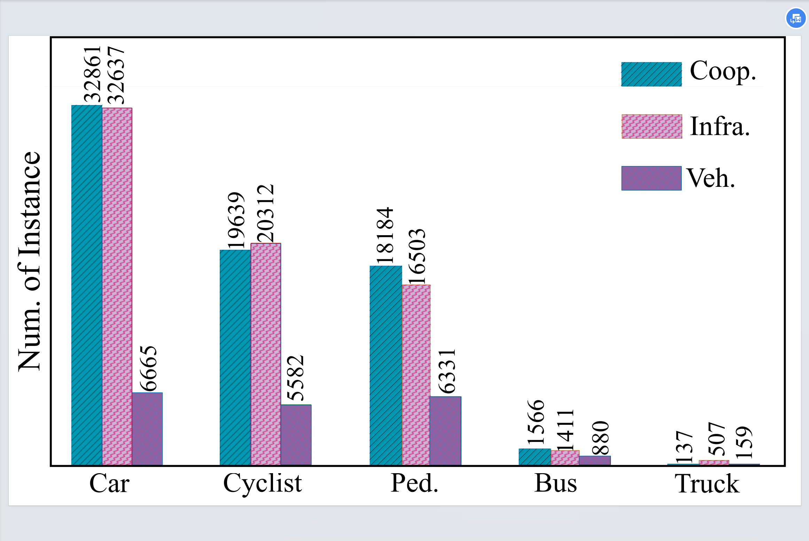

# 杨磊车路协同数据集类别统计



```plain
# This is a sample Python script.

# Press Shift+F10 to execute it or replace it with your code.
# Press Double Shift to search everywhere for classes, files, tool windows, actions, and settings.
import os

data_dir = 'F:\\label_batch1'
data_type = ['label_coop','label_infra','label_veh']
data_type_chooose = data_type[2]
dir_list_1th = os.listdir(data_dir)
#print(dir_list)
cls_dict = {}

for dir_1th in dir_list_1th:
    abs_dir_1th = os.path.join(data_dir,dir_1th + '\\' + data_type_chooose)
    dir_list_2th = os.listdir(abs_dir_1th)
    if len(dir_list_2th) == 0:
        continue
    for dir_2th in dir_list_2th:
        abs_dir_2th = os.path.join(abs_dir_1th,dir_2th)
        #print(abs_dir_2th)
        with open(abs_dir_2th, "r", encoding='utf-8') as f:
            data = f.readlines()
            for label in data:
                cls_label = label.split(' ')[0]
                if cls_label not in cls_dict.keys():
                    cls_dict[cls_label] = 1
                else:
                    cls_dict[cls_label] = cls_dict[cls_label] + 1
print(cls_dict)
```


> 更新: 2024-07-21 22:03:38  
> 原文: <https://3dcv.yuque.com/org-wiki-3dcv-mm1l0t/ysgfp9/vv9sdto3av3gqn85>