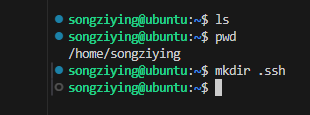
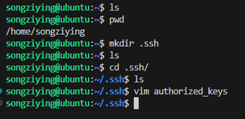
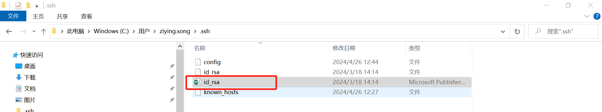
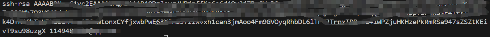

# ssh 设置登录vscode

1.新建  .ssh文件夹



2.vim authorized_keys  



复制一下内容，一般在C盘用户下



用记事本打开，复制内容到authorized_keys 中




3.如果在本地电脑没有.ssh怎么办

```plain
ssh-keygen -t rsa 
```

[https://blog.csdn.net/savet/article/details/131683156](https://blog.csdn.net/savet/article/details/131683156)


> 更新: 2024-06-07 15:15:06  
> 原文: <https://3dcv.yuque.com/org-wiki-3dcv-mm1l0t/ysgfp9/nzxlltv2r03vfhoe>