# 可视化工具kitti_object_vis（服务器没有显示器，使用本地电脑）

[代码](https://gitee.com/Raiden_cn/kitti-visualization-tool)

# 安装环境（本地）

按照readme里安装环境

`conda create -n kitti_vis python=3.7 `

`# vtk does not support python 3.8`

`conda activate kitti_vis`

`pip install opencv-python pillow scipy matplotlib`

`conda install mayavi -c conda-forge`

# 使用说明

## 目录结构

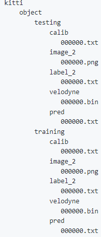

calib 、image\_2、label\_2、velodyne就是第二章介绍的目录

pred里存放的是模型预测的文件

把运行`test.py`生成的txt文件放进去就可以

## 使用介绍

### 1 修改目录 main方法下的-d  default 参数

大约在896行，修改为自己的目录

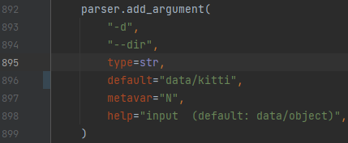

### 2 修改划分 split 参数

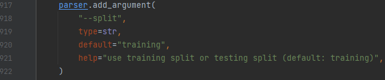

### 3 基本参数

\--vis 显示图片 默认为False（如果不加就不弹窗，建议把默认设置为True）

-i --ind 索引 默认为0

-p --pred 显示预测结果 也就是pred文件夹下的标签

### 4 显示参数

4种show参数

`--show_lidar_on_image`投影点云到图片

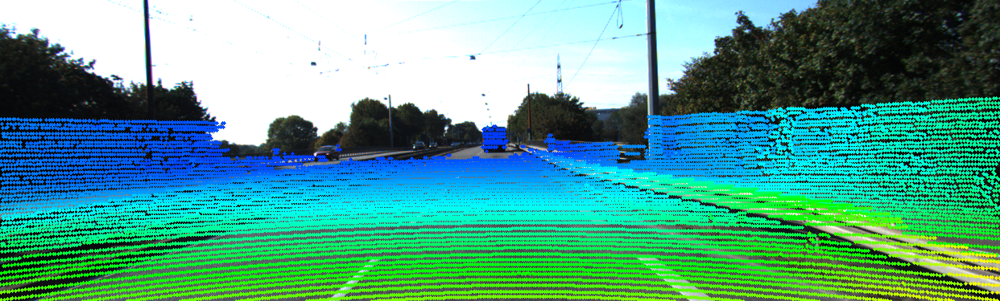

`  --show_lidar_with_depth`

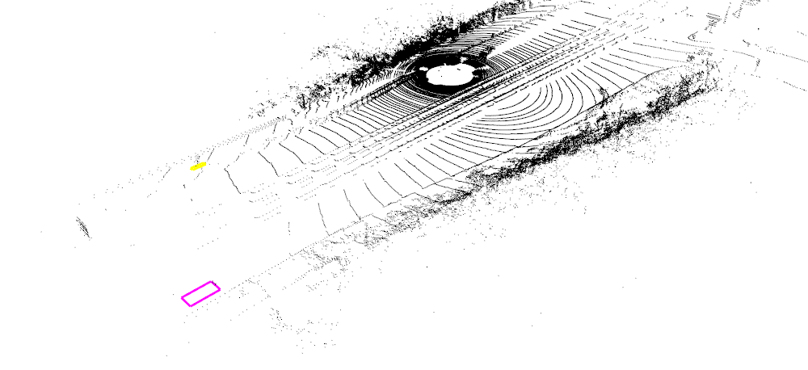

左键-----------旋转

Ctrl + 左键----固定旋转

滚轮-----------调整高度

右键-----------微调高度

鼠标中键-------拖动视角

`  --show_image_with_boxes`

**带有boundingbox的image**

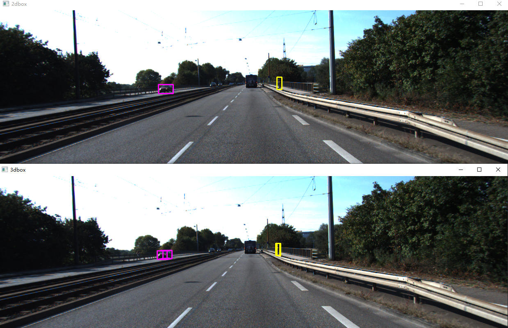

`  --show_lidar_topview_with_boxes`

\*\*   鸟瞰图\*\*

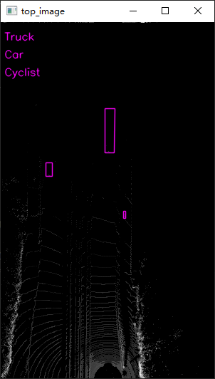

例如，我们需要 显示上述4种图，索引47

`python kitti_object.py --show_lidar_on_image --show_lidar_with_depth --show_image_with_boxes --show_lidar_topview_with_boxes --vis -i 47`

### 5 BBox 形状修改

修改 `viz_util.py` 文件中的这部分

以下两个plot3d 代表着生成3dbox的四个柱子和盖子 如果需要只显示BEV视角BBox请注掉

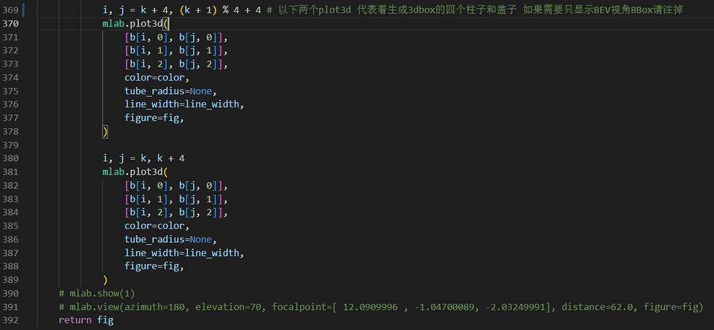

例：

注释后

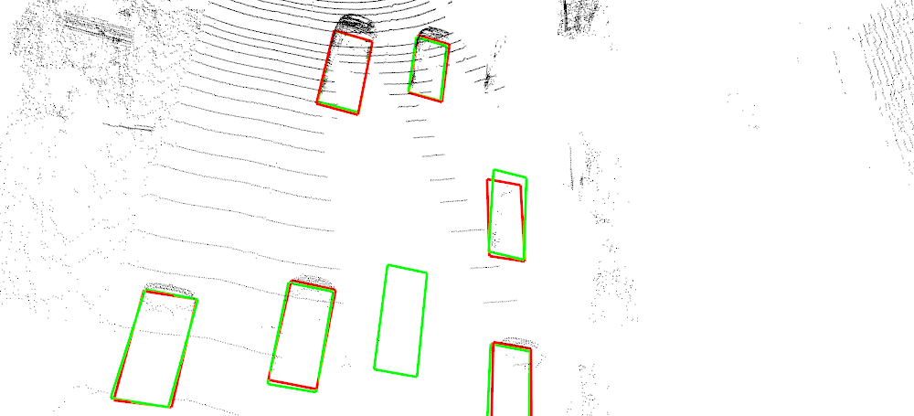

注释前

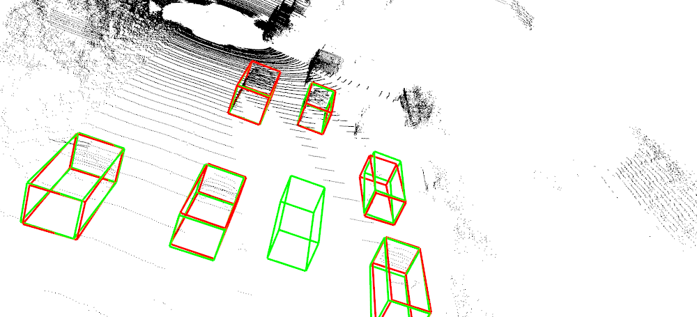

### 6 关于颜色

由于每个框的代码部分不一样，没有整理统一的颜色变量

但添加了注释 使用ide搜索一下找到相应的颜色部分进行修改

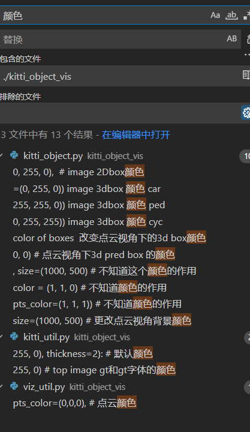

# mmdet3D

# OpenPCDet

> 更新: 2023-05-05 14:04:09  
> 原文: <https://3dcv.yuque.com/org-wiki-3dcv-mm1l0t/ysgfp9/yrktqx_zx872w>