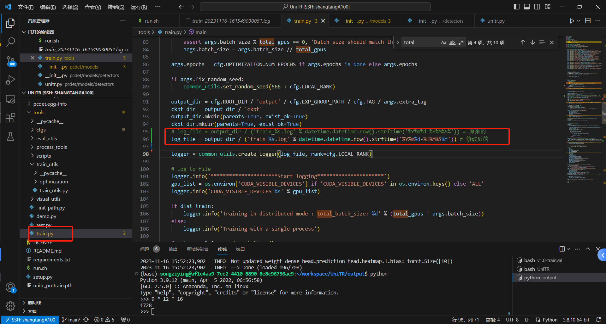
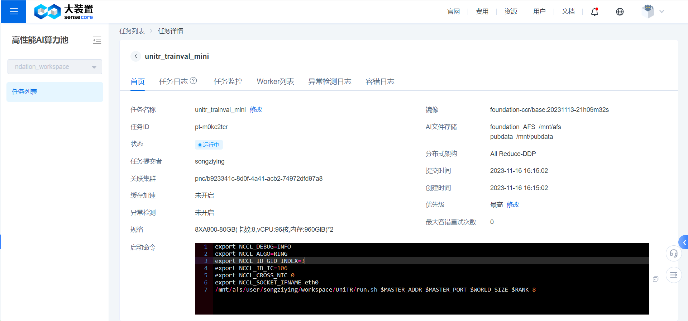
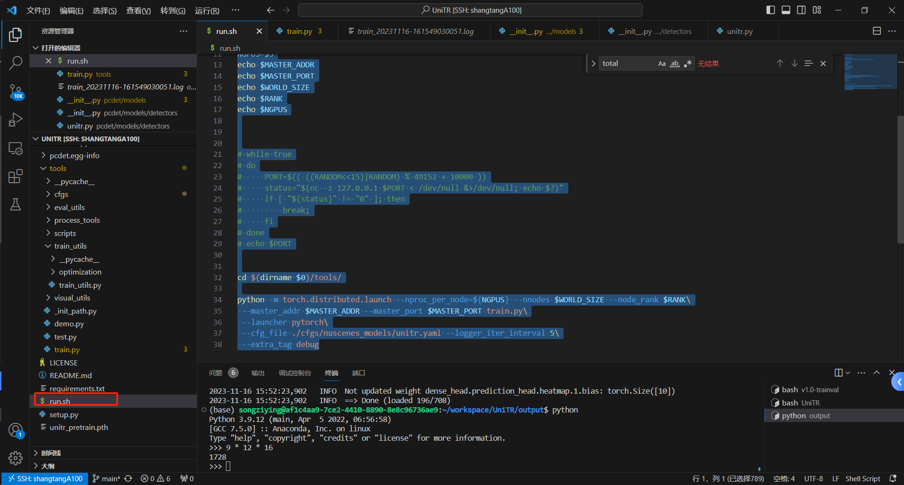
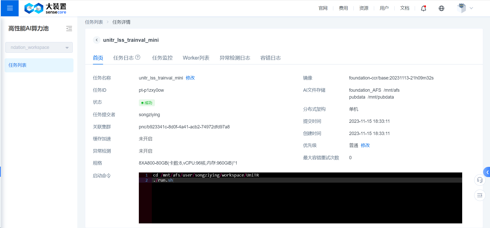

# 商汤多机多卡使用（目前只能训练不能eval）

```plain
    log_file = output_dir / ('train_%s.log' % datetime.datetime.now().strftime('%Y%m%d-%H%M%S%f'))
```

（以上代码为了解决商汤多机多卡训练并发存在的问题和单机多卡无关）



```plain
export NCCL_DEBUG=INFO
export NCCL_ALGO=RING
export NCCL_IB_GID_INDEX=3
export NCCL_IB_TC=106
export NCCL_CROSS_NIC=0
export NCCL_SOCKET_IFNAME=eth0
/mnt/afs/user/songziying/workspace/UniTR/run.sh $MASTER_ADDR $MASTER_PORT $WORLD_SIZE $RANK 8
```



```plain
#!/usr/bin/bash


source activate
conda deactivate
conda activate /mnt/afs/user/songziying/.conda/envs/unitr_env

MASTER_ADDR=$1
MASTER_PORT=$2
WORLD_SIZE=$3
RANK=$4
NGPUS=$5
echo $MASTER_ADDR
echo $MASTER_PORT
echo $WORLD_SIZE
echo $RANK
echo $NGPUS

cd $(dirname $0)/tools/

python -m torch.distributed.launch --nproc_per_node=${NGPUS} --nnodes $WORLD_SIZE --node_rank $RANK\
 --master_addr $MASTER_ADDR --master_port $MASTER_PORT train.py\
 --launcher pytorch\
 --cfg_file ./cfgs/nuscenes_models/unitr.yaml --logger_iter_interval 5\
 --extra_tag debug
```




**商汤****<font style="color:#DF2A3F;">单机</font>****多卡使用(****<font style="color:rgb(38, 38, 38);">可以训练可以eval</font>****)**

```plain
cd /mnt/afs/user/songziying/workspace/UniTR
./run.sh
```



```plain
#!/usr/bin/bash


source activate
conda deactivate


conda activate /mnt/afs/user/songziying/.conda/envs/unitr_env
cd /mnt/afs/user/songziying/workspace/UniTR/tools
# python -m pcdet.datasets.nuscenes.nuscenes_dataset --func create_nuscenes_infos     --cfg_file tools/cfgs/dataset_configs/nuscenes_dataset.yaml     --version v1.0-trainval     --with_cam     --with_cam_gt 
CUDA_VISIBLE_DEVICES=0,1,2,3,4,5,6,7 bash scripts/dist_train.sh 8 --cfg_file ./cfgs/nuscenes_models/unitr+lss.yaml --sync_bn --pretrained_model ../unitr_pretrain.pth --logger_iter_interval 1000 --extra_tag unitr+lss_trainval_full_raw
# CUDA_VISIBLE_DEVICES=0 bash scripts/dist_train.sh 1 --cfg_file ./cfgs/nuscenes_models/unitr.yaml --sync_bn --pretrained_model ../unitr_pretrain.pth --logger_iter_interval 1000 --extra_tag unitr_test
# CUDA_VISIBLE_DEVICES=0,1,2,3,4,5,6,7 bash scripts/dist_test.sh 8 --cfg_file ./cfgs/nuscenes_models/unitr+lss.yaml --batch_size 1 ../unitr_pretrain.pth --logger_iter_interval 1000 --extra_tag unitr+lss_trainval_full_baseline --launcher pytorch --ckpt_dir ../output/cfgs/nuscenes_models/unitr+lss/unitr+lss_trainval_full_baseline/ckpt --infer_time --save_to_file --eval_all

```


> 更新: 2023-11-27 20:32:38  
> 原文: <https://3dcv.yuque.com/org-wiki-3dcv-mm1l0t/ysgfp9/iygqrp53zl9vq47o>