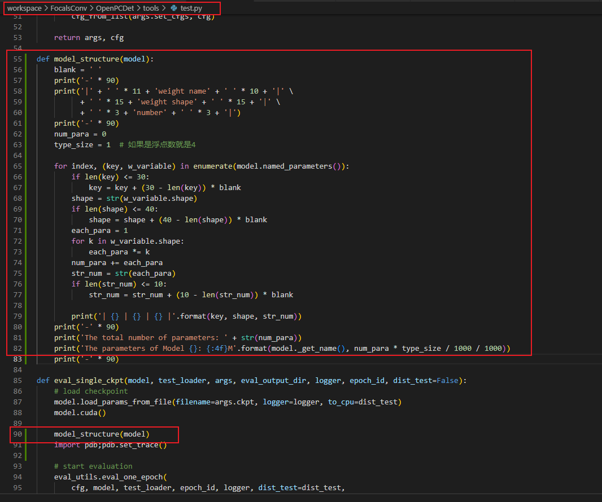

# 如何计算模型的参数量（下面是FPS）

模型参数量和计算量是什么


计算量是指网络模型需要计算的运算次数，参数量是指网络模型自带的参数数量多少

计算量对应时间复杂度，参数量对应于空间复杂度

计算量决定了网络执行时间的长短，参数量决定了占用显存的量


为什么要统计模型参数量和计算量


好的网络模型不仅要求精度准，还要要求模型的参数量和计算量不大，才能有利于部署

统计模型的参数量和计算量可以用于不同网络模型之间的对比分析

有的模型虽然参数量相同，但是可能因为连接方式和结构等不同而导致计算量不同


代码实现

```plain
'''方法1，自定义函数 参考自 https://blog.csdn.net/qq_33757398/article/details/109210240'''
def model_structure(model):
    blank = ' '
    print('-' * 90)
    print('|' + ' ' * 11 + 'weight name' + ' ' * 10 + '|' \
          + ' ' * 15 + 'weight shape' + ' ' * 15 + '|' \
          + ' ' * 3 + 'number' + ' ' * 3 + '|')
    print('-' * 90)
    num_para = 0
    type_size = 1  # 如果是浮点数就是4

    for index, (key, w_variable) in enumerate(model.named_parameters()):
        if len(key) <= 30:
            key = key + (30 - len(key)) * blank
        shape = str(w_variable.shape)
        if len(shape) <= 40:
            shape = shape + (40 - len(shape)) * blank
        each_para = 1
        for k in w_variable.shape:
            each_para *= k
        num_para += each_para
        str_num = str(each_para)
        if len(str_num) <= 10:
            str_num = str_num + (10 - len(str_num)) * blank

        print('| {} | {} | {} |'.format(key, shape, str_num))
    print('-' * 90)
    print('The total number of parameters: ' + str(num_para))
    print('The parameters of Model {}: {:4f}M'.format(model._get_name(), num_para * type_size / 1000 / 1000))
    print('-' * 90)

model_structure(net)
```

用法在test.py 文件中加入上面代码，格式如下




参考网址 [https://blog.csdn.net/qq_33952811/article/details/124276599](https://blog.csdn.net/qq_33952811/article/details/124276599)


**如何计算FPS**

Openpcdet测试：

正常跑test.py跑完所有的val集或test集,注意设置batchsize=1，观察infer_time，然后用1000ms除infer_time

MMDET3D测试：

tools/analysis_tools/benchmark.py用于测试，终端会自动输出FPS


> 更新: 2023-11-13 18:59:58  
> 原文: <https://3dcv.yuque.com/org-wiki-3dcv-mm1l0t/ysgfp9/ueo22eolwbfx4qin_gx1wm5>