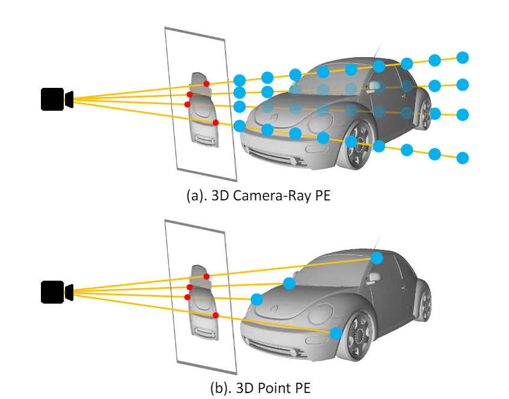
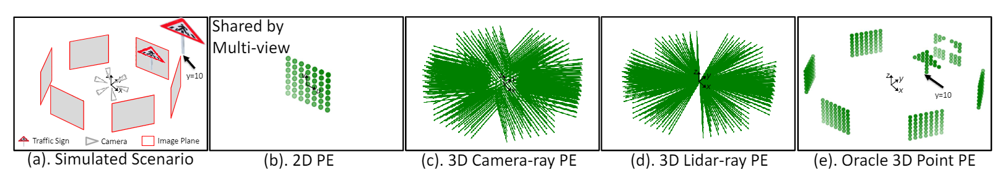
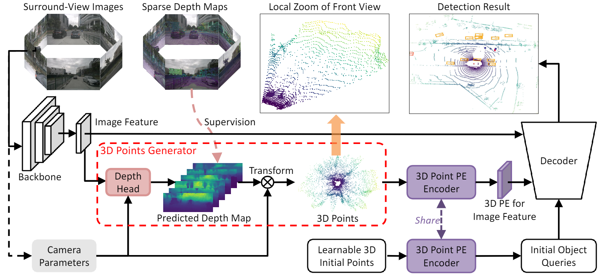
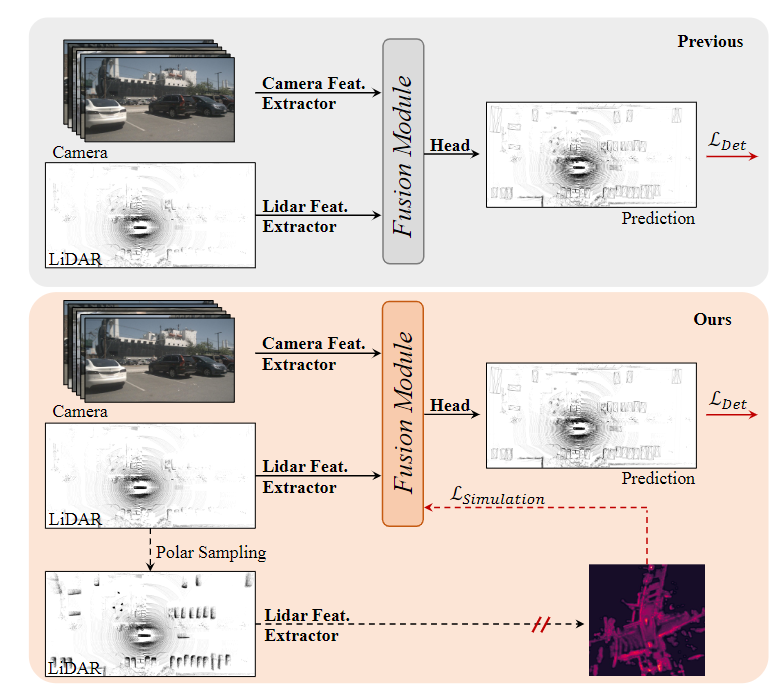

# ICCV 2023 3DOD

仅检索标题中的3DOD关键字(可能包含室内) 共38篇

[3DPPE: 3D Point Positional Encoding for Transformer-based Multi-Camera 3D Object Detection](https://openaccess.thecvf.com/content/ICCV2023/html/Shu_3DPPE_3D_Point_Positional_Encoding_for_Transformer-based_Multi-Camera_3D_Object_ICCV_2023_paper.html)

后墨AI，悉尼大学

Base on PETR 提出了一种新射线的位置编码方式。

[NeRF-Det: Learning Geometry-Aware Volumetric Representation for Multi-View 3D Object Detection](https://openaccess.thecvf.com/content/ICCV2023/html/Xu_NeRF-Det_Learning_Geometry-Aware_Volumetric_Representation_for_Multi-View_3D_Object_Detection_ICCV_2023_paper.html)

加州大学，meta

室内3D检测，用NeRF辅助3DOD。

[A Fast Unified System for 3D Object Detection and Tracking](https://openaccess.thecvf.com/content/ICCV2023/html/Heitzinger_A_Fast_Unified_System_for_3D_Object_Detection_and_Tracking_ICCV_2023_paper.html)

维也纳工业大学

移动端，室内3DOD

[A Simple Vision Transformer for Weakly Semi-supervised 3D Object Detection](https://openaccess.thecvf.com/content/ICCV2023/html/Zhang_A_Simple_Vision_Transformer_for_Weakly_Semi-supervised_3D_Object_Detection_ICCV_2023_paper.html)

华科，百度

弱半监督 KITTI数据集

[Exploring Object-Centric Temporal Modeling for Efficient Multi-View 3D Object Detection](https://openaccess.thecvf.com/content/ICCV2023/html/Wang_Exploring_Object-Centric_Temporal_Modeling_for_Efficient_Multi-View_3D_Object_Detection_ICCV_2023_paper.html)

BIT, 旷世

BEV时序检测

[Predict to Detect: Prediction-guided 3D Object Detection using Sequential Images](https://openaccess.thecvf.com/content/ICCV2023/html/Kim_Predict_to_Detect_Prediction-guided_3D_Object_Detection_using_Sequential_Images_ICCV_2023_paper.html)

KAIST

用BEV时序做检测。BEV Query由前n帧的BEV feat来初始化。提出了一种Object Query初始化，类似Transfusion。

[SupFusion: Supervised LiDAR-Camera Fusion for 3D Object Detection](https://openaccess.thecvf.com/content/ICCV2023/html/Qin_SupFusion_Supervised_LiDAR-Camera_Fusion_for_3D_Object_Detection_ICCV_2023_paper.html)

港中文广

设计了一种辅助loss用于高质量融合，Polar Sampling是数据增强，密集化稀疏的3D物体。

[CoIn: Contrastive Instance Feature Mining for Outdoor 3D Object Detection with Very Limited Annotations](https://openaccess.thecvf.com/content/ICCV2023/html/Xia_CoIn_Contrastive_Instance_Feature_Mining_for_Outdoor_3D_Object_Detection_ICCV_2023_paper.html)

[ObjectFusion: Multi-modal 3D Object Detection with Object-Centric Fusion](https://openaccess.thecvf.com/content/ICCV2023/html/Cai_ObjectFusion_Multi-modal_3D_Object_Detection_with_Object-Centric_Fusion_ICCV_2023_paper.html)

[GPA-3D: Geometry-aware Prototype Alignment for Unsupervised Domain Adaptive 3D Object Detection from Point Clouds](https://openaccess.thecvf.com/content/ICCV2023/html/Li_GPA-3D_Geometry-aware_Prototype_Alignment_for_Unsupervised_Domain_Adaptive_3D_Object_ICCV_2023_paper.html)

[KECOR: Kernel Coding Rate Maximization for Active 3D Object Detection](https://openaccess.thecvf.com/content/ICCV2023/html/Luo_KECOR_Kernel_Coding_Rate_Maximization_for_Active_3D_Object_Detection_ICCV_2023_paper.html)

[Representation Disparity-aware Distillation for 3D Object Detection](https://openaccess.thecvf.com/content/ICCV2023/html/Li_Representation_Disparity-aware_Distillation_for_3D_Object_Detection_ICCV_2023_paper.html)

[SA-BEV: Generating Semantic-Aware Bird's-Eye-View Feature for Multi-view 3D Object Detection](https://openaccess.thecvf.com/content/ICCV2023/html/Zhang_SA-BEV_Generating_Semantic-Aware_Birds-Eye-View_Feature_for_Multi-view_3D_Object_Detection_ICCV_2023_paper.html)

[PG-RCNN: Semantic Surface Point Generation for 3D Object Detection](https://openaccess.thecvf.com/content/ICCV2023/html/Koo_PG-RCNN_Semantic_Surface_Point_Generation_for_3D_Object_Detection_ICCV_2023_paper.html)

[Cross Modal Transformer: Towards Fast and Robust 3D Object Detection](https://openaccess.thecvf.com/content/ICCV2023/html/Yan_Cross_Modal_Transformer_Towards_Fast_and_Robust_3D_Object_Detection_ICCV_2023_paper.html)

[SparseFusion: Fusing Multi-Modal Sparse Representations for Multi-Sensor 3D Object Detection](https://openaccess.thecvf.com/content/ICCV2023/html/Xie_SparseFusion_Fusing_Multi-Modal_Sparse_Representations_for_Multi-Sensor_3D_Object_Detection_ICCV_2023_paper.html)

[DetZero: Rethinking Offboard 3D Object Detection with Long-term Sequential Point Clouds](https://openaccess.thecvf.com/content/ICCV2023/html/Ma_DetZero_Rethinking_Offboard_3D_Object_Detection_with_Long-term_Sequential_Point_ICCV_2023_paper.html)

[Learning from Noisy Data for Semi-Supervised 3D Object Detection](https://openaccess.thecvf.com/content/ICCV2023/html/Chen_Learning_from_Noisy_Data_for_Semi-Supervised_3D_Object_Detection_ICCV_2023_paper.html)

[MonoDETR: Depth-guided Transformer for Monocular 3D Object Detection](https://openaccess.thecvf.com/content/ICCV2023/html/Zhang_MonoDETR_Depth-guided_Transformer_for_Monocular_3D_Object_Detection_ICCV_2023_paper.html)

[MonoNeRD: NeRF-like Representations for Monocular 3D Object Detection](https://openaccess.thecvf.com/content/ICCV2023/html/Xu_MonoNeRD_NeRF-like_Representations_for_Monocular_3D_Object_Detection_ICCV_2023_paper.html)

[Monocular 3D Object Detection with Bounding Box Denoising in 3D by Perceiver](https://openaccess.thecvf.com/content/ICCV2023/html/Liu_Monocular_3D_Object_Detection_with_Bounding_Box_Denoising_in_3D_ICCV_2023_paper.html)

[PARTNER: Level up the Polar Representation for LiDAR 3D Object Detection](https://openaccess.thecvf.com/content/ICCV2023/html/Nie_PARTNER_Level_up_the_Polar_Representation_for_LiDAR_3D_Object_ICCV_2023_paper.html)

[Pixel-Aligned Recurrent Queries for Multi-View 3D Object Detection](https://openaccess.thecvf.com/content/ICCV2023/html/Xie_Pixel-Aligned_Recurrent_Queries_for_Multi-View_3D_Object_Detection_ICCV_2023_paper.html)

[Clusterformer: Cluster-based Transformer for 3D Object Detection in Point Clouds](https://openaccess.thecvf.com/content/ICCV2023/html/Pei_Clusterformer_Cluster-based_Transformer_for_3D_Object_Detection_in_Point_Clouds_ICCV_2023_paper.html)

[Revisiting Domain-Adaptive 3D Object Detection by Reliable, Diverse and Class-balanced Pseudo-Labeling](https://openaccess.thecvf.com/content/ICCV2023/html/Chen_Revisiting_Domain-Adaptive_3D_Object_Detection_by_Reliable_Diverse_and_Class-balanced_ICCV_2023_paper.html)

[Once Detected, Never Lost: Surpassing Human Performance in Offline LiDAR based 3D Object Detection](https://openaccess.thecvf.com/content/ICCV2023/html/Fan_Once_Detected_Never_Lost_Surpassing_Human_Performance_in_Offline_LiDAR_ICCV_2023_paper.html)

[GraphAlign: Enhancing Accurate Feature Alignment by Graph matching for Multi-Modal 3D Object Detection](https://openaccess.thecvf.com/content/ICCV2023/html/Song_GraphAlign_Enhancing_Accurate_Feature_Alignment_by_Graph_matching_for_Multi-Modal_ICCV_2023_paper.html)

[UpCycling: Semi-supervised 3D Object Detection without Sharing Raw-level Unlabeled Scenes](https://openaccess.thecvf.com/content/ICCV2023/html/Hwang_UpCycling_Semi-supervised_3D_Object_Detection_without_Sharing_Raw-level_Unlabeled_Scenes_ICCV_2023_paper.html)

[Ada3D : Exploiting the Spatial Redundancy with Adaptive Inference for Efficient 3D Object Detection](https://openaccess.thecvf.com/content/ICCV2023/html/Zhao_Ada3D__Exploiting_the_Spatial_Redundancy_with_Adaptive_Inference_for_ICCV_2023_paper.html)

[QD-BEV : Quantization-aware View-guided Distillation for Multi-view 3D Object Detection](https://openaccess.thecvf.com/content/ICCV2023/html/Zhang_QD-BEV__Quantization-aware_View-guided_Distillation_for_Multi-view_3D_Object_Detection_ICCV_2023_paper.html)

[ImGeoNet: Image-induced Geometry-aware Voxel Representation for Multi-view 3D Object Detection](https://openaccess.thecvf.com/content/ICCV2023/html/Tu_ImGeoNet_Image-induced_Geometry-aware_Voxel_Representation_for_Multi-view_3D_Object_Detection_ICCV_2023_paper.html)

[FocalFormer3D: Focusing on Hard Instance for 3D Object Detection](https://openaccess.thecvf.com/content/ICCV2023/html/Chen_FocalFormer3D_Focusing_on_Hard_Instance_for_3D_Object_Detection_ICCV_2023_paper.html)

[Not Every Side Is Equal: Localization Uncertainty Estimation for Semi-Supervised 3D Object Detection](https://openaccess.thecvf.com/content/ICCV2023/html/Wang_Not_Every_Side_Is_Equal_Localization_Uncertainty_Estimation_for_Semi-Supervised_ICCV_2023_paper.html)

[Towards Fair and Comprehensive Comparisons for Image-Based 3D Object Detection](https://openaccess.thecvf.com/content/ICCV2023/html/Ma_Towards_Fair_and_Comprehensive_Comparisons_for_Image-Based_3D_Object_Detection_ICCV_2023_paper.html)

[DistillBEV: Boosting Multi-Camera 3D Object Detection with Cross-Modal Knowledge Distillation](https://openaccess.thecvf.com/content/ICCV2023/html/Wang_DistillBEV_Boosting_Multi-Camera_3D_Object_Detection_with_Cross-Modal_Knowledge_Distillation_ICCV_2023_paper.html)

[Towards Universal LiDAR-Based 3D Object Detection by Multi-Domain Knowledge Transfer](https://openaccess.thecvf.com/content/ICCV2023/html/Wu_Towards_Universal_LiDAR-Based_3D_Object_Detection_by_Multi-Domain_Knowledge_Transfer_ICCV_2023_paper.html)

[SparseBEV: High-Performance Sparse 3D Object Detection from Multi-Camera Videos](https://openaccess.thecvf.com/content/ICCV2023/html/Liu_SparseBEV_High-Performance_Sparse_3D_Object_Detection_from_Multi-Camera_Videos_ICCV_2023_paper.html)

[Efficient Transformer-based 3D Object Detection with Dynamic Token Halting](https://openaccess.thecvf.com/content/ICCV2023/html/Ye_Efficient_Transformer-based_3D_Object_Detection_with_Dynamic_Token_Halting_ICCV_2023_paper.html)

> 更新: 2023-10-20 15:36:53  
> 原文: <https://3dcv.yuque.com/org-wiki-3dcv-mm1l0t/lvap8y/me1sagrpcq11mgpb>